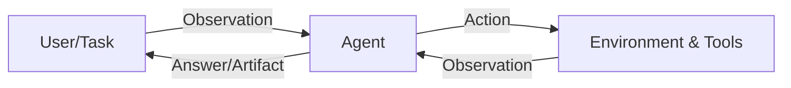
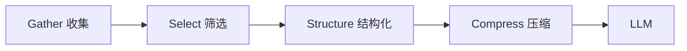
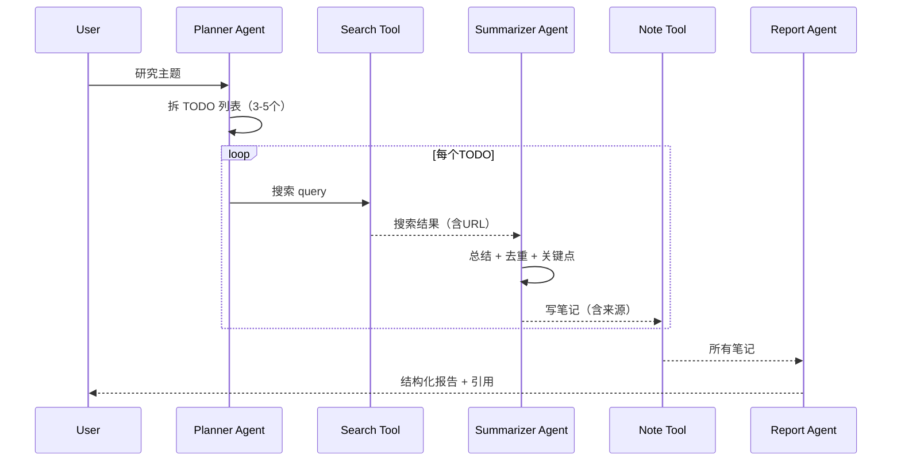

# 从零开始构建智能体（Hello-Agents 课程通俗笔记）

> 目标：把 Datawhale《从零开始构建智能体 / Hello-Agents》这套课程“从概念到落地”讲清楚，让你能**自己动手搭一个可用的 Agent**，并理解记忆、RAG、上下文工程、协议（MCP/A2A/ANP）、评估与 Agentic-RL 等进阶主题。  
> 课程原站点：<https://hello-agents.datawhale.cc/#/>（同内容镜像：<https://datawhalechina.github.io/hello-agents/#/>）  
> 对应 GitHub 仓库（Markdown 源）：<https://github.com/datawhalechina/hello-agents>

---

## 目录（建议按这个学习）

1. [先建立一张脑图：Agent 到底是什么](#1-先建立一张脑图agent-到底是什么)
2. [你要“从零构建”的到底是哪几块](#2-你要从零构建的到底是哪几块)
3. [第一部分：基础打底（Agent 与 LLM）](#3-第一部分基础打底agent-与-llm)
4. [第二部分：经典范式（ReAct / Plan-and-Solve / Reflection）](#4-第二部分经典范式react--plan-and-solve--reflection)
5. [第三部分：工程化与高级能力（框架、记忆/RAG、上下文、协议、RL、评估）](#5-第三部分工程化与高级能力框架记忆rag上下文协议rl评估)
6. [第四部分：综合案例（旅行助手 / 深度研究 / 赛博小镇）](#6-第四部分综合案例旅行助手--深度研究--赛博小镇)
7. [第五部分：毕业设计怎么做](#7-第五部分毕业设计怎么做)
8. [附录：术语表、模板、检查清单](#8-附录术语表模板检查清单)

---

## 1. 先建立一张脑图：Agent 到底是什么

一句话：**智能体（Agent）= 能在环境里“感知 → 思考 → 行动 → 获得反馈 → 再思考”的系统**。  
大语言模型（LLM）常常扮演 Agent 的“大脑”，但 Agent **不等于** LLM：Agent 还要能用工具、能记忆、能规划、能纠错、能协作。

### 1.1 Agent-环境交互循环（最核心的那张图）


你可以把 Agent 拆成四个“器官”：

- **Sensors（传感器）**：收集信息（用户输入、工具返回、网页内容、文件内容……）
- **Brain（推理/决策）**：决定下一步做什么（LLM + 规则/模型/策略）
- **Actuators（执行器）**：执行动作（调用工具、写文件、发请求、控制软件……）
- **Environment（环境）**：世界本身 + 工具系统 + 外部服务（搜索、数据库、代码仓库、第三方 API）

用 Mermaid 再画一遍（方便你记忆）：



### 1.2 传统 Agent vs LLM Agent：差别在哪里

课程把传统智能体分为：简单反射、基于模型、目标驱动、效用驱动、学习型等（第1章）。  
LLM Agent 的突破点是：**“推理能力 + 自然语言接口 + 工具调用”**合到一起后，能用很少的工程成本覆盖大量任务。

对比表（课程表1.1）：


---

## 2. 你要“从零构建”的到底是哪几块

如果把 Agent 当成一个产品/系统，而不是一个 Demo，它至少包含以下模块：

```mermaid
flowchart TB
  subgraph Core["Agent 核心循环"]
    P[Planner/Reasoner\n(LLM + Prompt/Context)] --> D[Decision]
    D --> T[Tool Use]
    T --> O[Observation]
    O --> P
  end

  subgraph Capabilities["能力模块（可插拔）"]
    M[Memory] --- R[RAG/Knowledge]
    C[Context Engineering] --- G[Guardrails]
    E[Evaluation] --- RL[Agentic-RL]
    X[Protocols: MCP/A2A/ANP]
  end

  Core --- Capabilities
```

**课程主线其实是**：  
1）先把 Agent 最小闭环跑通（ReAct）→ 2）学会把它工程化（框架/工具抽象）→ 3）再加“长期可用”的能力（记忆、上下文、协议、评估）→ 4）用三个案例把它做成产品形态。

---

## 3. 第一部分：基础打底（Agent 与 LLM）

> 对应课程：第1章、第2章、第3章  
> 在线阅读入口见侧边栏：<https://hello-agents.datawhale.cc/#/>

### 3.1 第1章：初识智能体（把“分类”和“设计方法”学到手）

**你需要带走的 3 个结论：**

1. **Agent 不一定要“很聪明”，但必须“能闭环”**：感知→行动→反馈→修正。
2. 设计 Agent 先用 **PEAS** 描述任务：Performance/Environment/Actuators/Sensors（第1章有旅行助手例子）。
3. 现实系统往往是 **Hybrid（反应 + 规划）**：简单任务走捷径，复杂任务再规划。

PEAS 例子（课程表1.2）：


### 3.2 第2章：发展史（为什么今天 LLM Agent 变“可行”）

这章的作用是建立“技术路线感”：

- **符号主义/专家系统**：规则强、可解释，但难扩展（知识获取瓶颈、易脆弱）
- **对话系统早期尝试（ELIZA）**：能聊天但不理解世界
- 后续才发展到“统计学习/深度学习/Transformer”，最终走到今天 LLM 的规模化与泛化能力

演进阶梯图（课程图2.1）：


### 3.3 第3章：LLM 基础（你不需要背，但要会用）

你不必把 Transformer 推导一遍，但要理解 4 件事：

1. **LLM 是概率生成器**：输出不是“正确答案”，而是“更可能的 token 序列”
2. **上下文窗口是硬约束**：长任务一定会遇到“塞不下/越塞越乱”
3. **LLM 会幻觉**：所以需要工具、检索、验证、评估
4. **注意力机制让“检索+生成”变容易**：这就是 RAG、上下文工程的基础

Transformer 架构图（课程图3.4）：


---

## 4. 第二部分：经典范式（ReAct / Plan-and-Solve / Reflection）

> 对应课程：第4章（智能体经典范式构建）  
> 这一章非常关键：它让你从“会调提示词”进化为“会写智能体循环”。

### 4.1 先记住一句话：范式就是“组织思考与行动的流程模板”

**同一个工具系统，换不同范式，就像同一批积木换不同拼法**：

- ReAct：边想边做，最通用
- Plan-and-Solve：先写计划再执行，适合任务可分解、执行可验证的场景
- Reflection：做完会自检并改进，适合输出质量要求高的场景（报告、代码、方案）

### 4.2 ReAct（Reason + Act）：最小可用 Agent 闭环

课程给的 ReAct 核心循环图（图4.1）：


你可以把 ReAct 想象成“工作日志”：

```text
Thought: 我现在需要什么信息？
Action: 用什么工具拿信息？
Observation: 工具返回了什么？
Thought: 这些信息够了吗？不够就再来一轮
Finish: 给出最终答案/产物
```

#### 4.2.1 从零实现 ReAct，你至少要写 3 个抽象

结合第4章的代码结构，最小闭环是：

1. **LLM Client**：统一调用 OpenAI 兼容接口（课程示例是 `HelloAgentsLLM`）
2. **ToolExecutor / ToolRegistry**：注册工具、按名称调用工具
3. **ReActAgent**：维护轨迹（Thought/Action/Observation），循环直到 Finish

最小伪代码（把课程思想压缩成“能抄走”的骨架）：

```python
class Tool:
    name: str
    description: str
    def run(self, tool_input: str) -> str: ...

class ToolRegistry:
    def list(self) -> str: ...  # 把 name+description 拼成给LLM看的工具列表
    def call(self, name: str, tool_input: str) -> str: ...

class ReActAgent:
    def __init__(self, llm, tools: ToolRegistry, system_prompt: str):
        self.llm = llm
        self.tools = tools
        self.system_prompt = system_prompt

    def run(self, user_query: str) -> str:
        trajectory = []
        while True:
            prompt = build_react_prompt(
                system_prompt=self.system_prompt,
                tools=self.tools.list(),
                user_query=user_query,
                trajectory=trajectory,
            )
            text = self.llm.think(prompt)
            thought, action = parse_thought_action(text)
            if action.name == "Finish":
                return action.input
            obs = self.tools.call(action.name, action.input)
            trajectory.append({"thought": thought, "action": action, "observation": obs})
```

#### 4.2.2 ReAct 最容易踩的 4 个坑（工程角度）

1. **输出不按格式**：解析失败 → 需要更强约束（JSON schema、正则兜底、重试）
2. **工具描述写得烂**：LLM 不知道何时用什么工具 → 工具描述是“路标”
3. **死循环**：一直 Search/一直反思 → 需要 max_steps、重复检测、失败策略
4. **工具错误难恢复**：API 超时/参数错 → 需要异常捕获 + 让 LLM“修正参数再试”

### 4.3 Plan-and-Solve：把任务拆开再做

把 ReAct 的“边想边做”改成“两段式”：

1. **Planning**：生成一个行动计划（步骤、工具、验证点）
2. **Solving/Execution**：按计划逐步执行，必要时小范围调整

适用场景：

- 任务有明显阶段（如：调研→对比→结论→输出）
- 每一步输出都能验证（例如检索到的资料是否覆盖关键点）

一个可复用的“计划格式”建议：

```json
{
  "goal": "…",
  "steps": [
    {"id": 1, "tool": "Search", "input": "...", "expected": "…"},
    {"id": 2, "tool": "Calculator", "input": "...", "expected": "…"}
  ],
  "stop_condition": "…"
}
```

### 4.4 Reflection：让 Agent 会自我改稿/改代码

Reflection 不神秘，就是把“自检”显式变成一个阶段：

1. 先产出初稿（Answer v1）
2. 再用一个“审稿/批判”提示词生成问题清单
3. 再根据清单修订（Answer v2）
4. 必要时循环 1-2 次（不要无限循环）

---

## 5. 第三部分：工程化与高级能力（框架、记忆/RAG、上下文、协议、RL、评估）

这一部分让你从“写得出来”走向“能长期维护、能扩展、能上线”。

### 5.1 第6章：框架开发实践（为什么要用框架）

你会遇到的真实问题：

- 你写了 10 个 Agent，每个都要接 10 个工具 → 工具管理、日志、状态会变复杂
- 多智能体协作时，需要编排对话与轮次
- 需要可观测（callbacks/trace），否则 Debug 地狱

课程对比了典型框架（AutoGen / AgentScope / CAMEL / LangGraph）。  
对比表（表6.1）：


### 5.2 第7章：构建你的 Agent 框架（HelloAgents 的设计哲学）

课程核心思想之一：**万物皆为工具（Tool）**  
记忆、RAG、协议、甚至训练/评估……都可以抽象成 Tool，这样 Agent 核心循环保持简单。

你可以理解为：

- Agent：只负责“决定何时用什么工具”
- Tool：负责“做事”
- Registry/Executor：负责“管理与调用”

### 5.3 第8章：记忆与检索（Memory + RAG）

> 关键：解决 **“无状态遗忘”** 与 **“知识静态/过期/不专业”** 两大问题。

#### 5.3.1 先看一张总架构图


#### 5.3.2 把“记忆”拆成 4 种（更像人类）

课程借鉴认知科学：感觉记忆、工作记忆、长期记忆（语义/情景）等（图8.1）。


工程上你可以这样落地（不必一口吃成胖子）：

1. **Working Memory（会话内短期）**：把最近 N 轮对话保存到内存/SQLite
2. **Episodic Memory（事件）**：把“发生了什么”按时间线存下来（可复盘）
3. **Semantic Memory（知识）**：把“用户偏好/事实/规则”抽成结构化知识（图谱/向量）
4. **Perceptual Memory（多模态）**：图片/音频等（先不做也行）

#### 5.3.3 RAG 不是“塞一堆文档”——关键是“检索→构建上下文→生成”

你要关心 3 个问题：

- 文档怎么切（chunking）
- 检索怎么做（向量/关键词/混合；HyDE/MQE 等）
- 检索结果怎么塞进上下文（合并、去重、截断、引用）

### 5.4 第9章：上下文工程（Context Engineering）

课程强调：**Prompt Engineering 只是上下文工程的一小部分**。  
上下文工程的目标是：在有限窗口里，把“真正有用的信息”以“模型最吃得下”的结构提供给它。

关键概念：

- **context rot（上下文腐蚀）**：信息越塞越多，但有效信息密度下降
- **注意力预算**：长任务要学会“取舍”
- **渐进式披露**：先给关键约束，细节按需补充
- **压缩整合（compaction）**：把历史对话/中间产物变成结构化笔记

配图（课程图9.1）：


一个非常实用的上下文构建流程（把课程的 GSSC 思路抽象出来）：



### 5.5 第10章：通信协议（MCP / A2A / ANP）

一句话：**协议解决“连接与互操作”**——让你的 Agent 能标准化地接入工具/服务，也能与其他 Agent 协作。

#### 5.5.1 三种协议各管什么

- **MCP（Model Context Protocol）**：Agent ↔ 工具/资源（最实用、生态相对成熟）
- **A2A（Agent-to-Agent Protocol）**：Agent ↔ Agent 点对点协作（像团队对话）
- **ANP（Agent Network Protocol）**：面向大规模网络的服务发现与连接（生态早期）

课程对比表（表10.1）：


#### 5.5.2 MCP：为什么说它像“智能体的 USB-C”

课程用一个非常形象的比喻：MCP 统一了不同工具/服务的连接方式（第10章 10.2.1）。

MCP 架构（课程图10.1）：


你需要记住 MCP 的三类能力（课程表10.2）：

- **Tools**：能执行动作（主动）
- **Resources**：能提供数据（被动）
- **Prompts**：提供模板（指导）


#### 5.5.3 MCP vs Function Calling：别纠结，按“复用与生态”选

课程给了对比表（表10.3）：  


通俗总结：

- Function Calling：更像“你在一个平台里写死函数签名”
- MCP：更像“工具/服务自己提供标准接口，你的 Agent 来发现并使用”

### 5.6 第11章：Agentic-RL（让 Agent 在多步交互中变强）

你不需要立刻去训模型，但要知道它在解决什么：

- 单步偏好优化（比如 DPO）擅长“回答风格”
- **Agentic RL** 更关心“多步决策质量”（规划、工具使用、纠错、记忆等）

课程图11.2 把 Agent 能力拆成 6 块（非常适合当 checklist）：


### 5.7 第12章：性能评估（没有评估就没有迭代）

课程的核心观点：**智能体评估难，但必须做**，原因是输出不确定、目标多维、成本高。  
它给了很多 benchmark 例子（工具调用、通用能力、多智能体等），你至少要学会：

- 给系统定义“可测目标”（成功率、成本、时延、引用正确率、工具调用正确率）
- 用基准/自建集回归测试（版本迭代最重要）

评估体系结构图（课程图12.1）：


---

## 6. 第四部分：综合案例（旅行助手 / 深度研究 / 赛博小镇）

这一部分的价值：把你前面学的“模块”拼成“产品”。

### 6.1 第13章：智能旅行助手（前后端 + Agent 服务）

架构图（课程图13.1）：


你应该重点观察：

- 前端如何把“规划过程”做成可视化、可编辑
- 后端如何把“请求→Agent→结果”变成稳定的 API（含校验、错误处理）
- Pydantic 在“结构化输出”上的价值（比纯文本可靠）

### 6.2 第14章：自动化深度研究智能体（TODO 驱动研究范式）

这是我最建议复刻的案例之一：它把 Plan-and-Solve/Reflection/检索/笔记/引用串起来了。

技术架构（课程图14.1）：


研究流程（课程图14.5）：


把它抽象成一个通用模板（你可以套任何“调研型任务”）：



### 6.3 第15章：构建赛博小镇（多智能体 + 记忆 + 游戏化）

它解决的是“长期交互 + 多角色 + 一致性”：

- NPC 需要角色设定（system prompt）
- NPC 需要记忆（工作记忆/情景记忆/语义记忆）
- 还要处理“并发/批量生成/成本”

NPC 工作流程（课程图15.5）：


---

## 7. 第五部分：毕业设计怎么做

> 对应课程：第16章（毕业设计）  
> 本质：用一个“可复现、可评审、可演示”的开源项目证明你掌握了 Agent 的系统能力。

### 7.1 选题建议（优先选“闭环可测”的）

推荐题型（从易到难）：

1. **工具增强型助理**：明确输入输出、能评估（如：文档问答 + 引用校验）
2. **工作流型 Agent**：Plan-and-Solve + 工具链（如：周报生成、数据分析报告）
3. **多智能体协作**：角色分工 + 编排（如：研究员/撰写员/审稿员）
4. **长期记忆型产品**：个性化/持续学习（如：学习助理、私人知识库）

### 7.2 一个毕业设计的最小达标清单

- [ ] 能跑（README 一条命令跑起来）
- [ ] 有可观测（日志/trace/中间步骤可见）
- [ ] 有评估（至少 1 个可回归的测试集/脚本）
- [ ] 有边界（失败怎么办，超时怎么办，成本怎么控）
- [ ] 有 Demo（截图/视频/在线体验）

---

## 8. 附录：术语表、模板、检查清单

### 8.1 术语表（够用版）

| 术语 | 一句话解释 |
|---|---|
| Agent | 在环境里能自主完成任务的“闭环系统” |
| Tool | Agent 的“手脚”，封装外部能力（搜索、计算、DB…） |
| ReAct | Thought→Action→Observation 循环的范式 |
| Plan-and-Solve | 先计划、再执行的范式 |
| Reflection | 输出后自检、再修订的范式 |
| Memory | 让 Agent 记住历史与偏好，解决无状态问题 |
| RAG | 检索外部知识 → 作为上下文增强生成 |
| Context Engineering | 用结构化/筛选/压缩在有限窗口里提供高质量上下文 |
| MCP | 标准化 Agent 与工具/资源/提示词的协议 |
| A2A | Agent-to-Agent 的协作协议 |
| ANP | 面向大规模 Agent 网络的发现/连接协议（早期） |
| Agentic-RL | 针对多步决策与工具使用能力的强化学习路线 |

### 8.2 你可以直接复用的 Prompt 模板（精简版）

#### 8.2.1 ReAct 系统提示词（模板）

```text
你是一个可以调用工具的智能体。
可用工具：
{tools}

请严格按以下格式输出：
Thought: ...
Action: ToolName[tool_input]  或 Finish[final_answer]
```

#### 8.2.2 Reflection 审稿提示词（模板）

```text
你是严格的审稿人。请检查下面的回答是否：
1) 事实有依据（最好可引用）
2) 逻辑完整无跳步
3) 结构清晰、可执行
4) 遗漏关键边界条件/失败处理

请输出：
- Issues: 用列表列出问题
- FixPlan: 按优先级给出修订计划
```

### 8.3 最小工程检查清单（上线前自检）

- [ ] 是否限制最大步数（max_steps）防止死循环？
- [ ] 是否有超时与重试策略（工具调用/LLM 调用）？
- [ ] 工具描述是否“何时用/输入输出/限制”写清楚？
- [ ] 是否把中间轨迹保存（便于 Debug 与评估）？
- [ ] 是否有缓存（搜索/检索/Embedding）以控成本？
- [ ] 是否有评估脚本做回归测试？

---

## 参考链接（课程原文）

- 课程主页：<https://hello-agents.datawhale.cc/#/>  
- GitHub 仓库：<https://github.com/datawhalechina/hello-agents>  
- 侧边栏目录：<https://raw.githubusercontent.com/datawhalechina/hello-agents/main/docs/_sidebar.md>  
- 第4章（经典范式）：<https://raw.githubusercontent.com/datawhalechina/hello-agents/main/docs/chapter4/%E7%AC%AC%E5%9B%9B%E7%AB%A0%20%E6%99%BA%E8%83%BD%E4%BD%93%E7%BB%8F%E5%85%B8%E8%8C%83%E5%BC%8F%E6%9E%84%E5%BB%BA.md>  
- 第8章（记忆与检索）：<https://raw.githubusercontent.com/datawhalechina/hello-agents/main/docs/chapter8/%E7%AC%AC%E5%85%AB%E7%AB%A0%20%E8%AE%B0%E5%BF%86%E4%B8%8E%E6%A3%80%E7%B4%A2.md>  
- 第10章（通信协议）：<https://raw.githubusercontent.com/datawhalechina/hello-agents/main/docs/chapter10/%E7%AC%AC%E5%8D%81%E7%AB%A0%20%E6%99%BA%E8%83%BD%E4%BD%93%E9%80%9A%E4%BF%A1%E5%8D%8F%E8%AE%AE.md>  
- 第14章（深度研究案例）：<https://raw.githubusercontent.com/datawhalechina/hello-agents/main/docs/chapter14/%E7%AC%AC%E5%8D%81%E5%9B%9B%E7%AB%A0%20%E8%87%AA%E5%8A%A8%E5%8C%96%E6%B7%B1%E5%BA%A6%E7%A0%94%E7%A9%B6%E6%99%BA%E8%83%BD%E4%BD%93.md>

