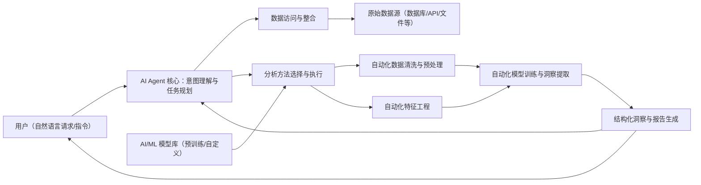

欢迎来到本课程的第一章第一节。本节聚焦“理解 AI Agent 与自动化数据分析”这一核心主题。在数据爆炸的时代，如何高效、准确地从海量数据中提取有价值的洞察，成为企业决策的关键能力。AI Agent 的兴起，为自动化数据分析带来了新的实践路径。

## 什么是 AI Agent？

广义上，AI Agent 是指能够**感知环境**、进行**推理**、做出**决策**并采取**行动**，以实现特定目标的智能实体。相较于传统脚本或固定流程程序，Agent 更强调“基于目标的自主性”：在目标与约束给定后，它能够在一定范围内自行规划步骤并执行。

AI Agent 通常具备以下核心特征：

- **感知（Perception）**：从环境中获取信息，例如读取数据、接收用户输入或监控系统状态。
- **推理（Reasoning）**：基于感知到的信息与知识/模型，进行逻辑思考和问题求解。
- **决策（Decision-making）**：基于推理结果，选择下一步行动方案。
- **行动（Action）**：执行所选行动，从而影响环境或推进目标达成。
- **学习（Learning，可选）**：从经验或反馈中更新策略与模型，持续优化效果。

在数据分析语境中，AI Agent 可以理解为：一个面向数据任务的智能系统，能够围绕“数据处理 → 分析 → 洞察输出”的目标，响应自然语言请求或预定义指令并执行相应流程。

## 自动化数据分析的本质

自动化数据分析是指利用软件工具与技术，以尽量少的人工干预，自动执行**数据收集、清洗、转换、分析、建模、可视化/报告生成**等任务的过程。其核心目标是提高效率、降低成本、减少人为错误，并缩短从数据到决策的周期。

相较于由人类分析师主导、手工串联的流程，自动化数据分析通常带来：

- **加速处理速度**：在短时间内处理更大规模数据。
- **提高一致性**：降低人为操作的不确定性，使流程更可复用、可审计。
- **实现规模化**：更容易扩展到更多数据源、更多业务场景。
- **支持（准）实时洞察**：在数据产生的同时进行分析，提供更及时反馈。

## AI Agent 如何赋能自动化数据分析？

AI Agent 是推动“更高自动化程度的数据分析”的关键驱动力之一：它把一系列被动执行的脚本与流水线，提升为能够理解意图、自主规划并动态调整的智能流程。

关键环节通常包括：

- **自然语言理解（NLU）与意图识别**：理解用户的自然语言请求（例如“分析上季度销售额增长趋势，并找出主要驱动因素”），并转化为可执行的任务结构。
- **数据访问与整合**：自动连接多种数据源（数据库、API、文件等），并拉取/合并所需数据。
- **任务规划与执行**：根据目标与数据可用性，规划并执行步骤，例如：
  - 数据清洗与预处理（缺失值、异常值、格式转换等）
  - 特征工程（构造更有意义的特征）
  - 模型选择与训练（回归、分类、聚类等，视目标而定）
  - 洞察提取（解释结果，定位趋势、模式与异常）
  - 结果解释与报告生成（图表、摘要、建议等）
- **持续优化与学习（可选）**：引入反馈机制，改进策略、提示词、模型或规则，提升稳定性与质量。

一个简化的工作流可表示为：

- 用户目标（自然语言/指令）
- 意图识别与任务分解
- 数据获取与预处理
- 分析/建模与验证
- 洞察总结与报告输出
- 反馈与迭代优化

通过这种方式，AI Agent 有机会缩短从数据到洞察的路径，并提升分析的可复用性与交付速度。需要注意的是，不同行业、数据质量与组织流程差异很大，效率提升幅度应以具体场景的评估结果为准。

## 自动化数据分析的战略意义

在企业中引入 AI Agent 与自动化数据分析，不仅是技术升级，也可能推动流程与组织协作方式的调整，例如：

- **提升业务效率**：减少重复性、耗时的手工步骤，让分析师更聚焦在问题定义与业务决策。
- **降低使用门槛**：让非专业用户通过自然语言获取所需洞察，推动数据驱动文化。
- **增强响应速度**：更快识别风险与机会，支持更频繁的策略迭代。
- **发现隐藏模式**：在高维复杂数据中发现人类难以手动定位的关联与异常。

## 总结

本节介绍了 AI Agent 的基本定义、自动化数据分析的核心目标，以及 AI Agent 作为关键驱动力如何赋能自动化数据分析。接下来的课程将更具体地学习如何利用 Next.js 与 Nest.js 构建一个 AI Agent 应用，并把它落到自动化数据分析的实践中。
