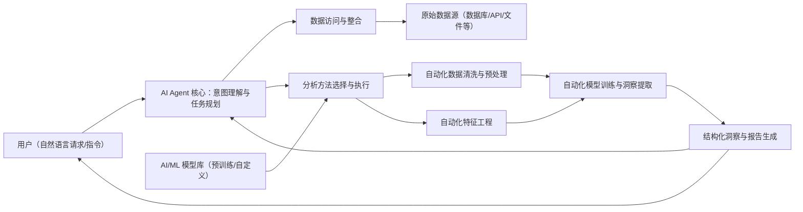

在本课程的第一节中，我们梳理了 AI Agent 在数据分析中的整体概念。本节将进一步拆解 AI Agent 的核心能力，并给出可落地的实施最佳实践，帮助你在真实业务中更稳定、更安全地发挥其价值。

需要强调的是：AI Agent 更像是一套“以目标为中心的自动化系统”，它的能力上限取决于数据质量、工具权限、评估机制与治理体系。理解能力边界与实施策略，是构建可用、可控 AI 数据分析应用的前提。

## AI Agent 的核心能力

AI Agent 往往围绕“意图理解 → 数据获取 → 分析执行 → 输出洞察 → 反馈迭代”的链路工作。不同实现形态（LLM + 工具调用、Workflow Agent、多智能体等）在细节上会有差异，但关键能力通常包括：

### 自然语言理解与交互（Natural Language Understanding & Interaction）

- **能力描述**：理解用户以自然语言提出的数据查询与分析请求（例如“分析上季度销售额下降原因”“识别客户流失的潜在模式”），并将其转化为结构化任务与可执行步骤。
- **实践意义**：降低数据分析门槛，让更多非技术角色能直接发起分析需求，同时提升需求沟通效率。

### 智能数据访问与集成（Intelligent Data Access & Integration）

- **能力描述**：连接并访问多种异构数据源（数据库、数据湖、API、文件系统等），完成数据抽取与整合；必要时执行清洗、标准化、口径对齐与关联（ETL/ELT 只是常见形态之一）。
- **实践意义**：缓解数据孤岛与手工预处理成本，提高分析覆盖面与数据可用性。

### 自动化分析与洞察生成（Automated Analysis & Insight Generation）

- **能力描述**：根据目标选择合适的分析方法并执行（统计分析、规则、机器学习等），输出趋势、异常、归因线索与可解释结论，并组织为可读报告或图表摘要。
- **实践意义**：缩短从数据到洞察的交付时间，提升分析的可复用性与响应速度。实际效果高度依赖场景复杂度、数据质量与评估闭环。

### 任务规划与执行（Task Planning & Execution）

- **能力描述**：将高层请求分解为可执行的子任务，安排依赖顺序，调度工具调用（查询、计算、绘图、写入报告等），并在执行中做重试、回退与异常处理。
- **实践意义**：把“抽象指令”自动落到“可执行流程”，支持更复杂、更长链路的数据任务。

### 持续学习与适应（Continuous Learning & Adaptability，可选）

- **能力描述**：引入反馈机制（人工审核、用户评分、离线评估），持续优化提示词、规则、检索知识库或模型策略；是否“训练模型参数”取决于你的系统形态与成本约束。
- **实践意义**：让系统在真实使用中逐步稳定，减少重复错误，提高一致性与可控性。

一个简化的 AI Agent 数据分析工作流示意图：

## AI Agent 实施的最佳实践

要充分发挥 AI Agent 的潜力，除了能力理解，更关键的是工程化落地：把“可用”变成“可长期运行、可评估、可治理”。

### 构建坚实的数据基础（Building a Solid Data Foundation）

- **实践**：建立稳定的数据口径与数据字典；用管道化方式完成清洗、标准化与校验；对关键数据表设置质量监控（缺失率、重复率、异常波动、延迟等）。
- **重要性**：数据质量问题会直接放大到洞察质量上；越自动化，越需要把基础做扎实。

### 定义清晰的成功指标（Defining Clear Success Metrics）

- **实践**：定义可量化指标并持续跟踪，例如任务完成率、关键结论的可验证性、响应时延、成本（token/计算/人力复核成本）、用户采纳率、以及业务侧结果指标（节省工时、缩短决策周期等）。
- **重要性**：没有指标就无法判断“变好”还是“变差”，也无法指导优化优先级。

### 聚焦战略性使用场景（Focusing on Strategic Use Cases）

- **实践**：从高影响力、低风险、易验证的场景切入（数据质量监控、异常检测、报表自动化、探索性分析辅助等），先做出稳定闭环，再逐步扩展复杂场景。
- **重要性**：更快验证价值，降低初期风险与组织阻力。

### 建立持续学习与优化机制（Establishing Continuous Learning & Optimization Mechanisms）

- **实践**：引入“人类反馈循环”（审阅/纠错/标注）；建立评估集与回归测试；制定模型/规则/知识库更新策略，并在上线前后做对比评估。
- **重要性**：减少幻觉与不一致输出，提高系统长期稳定性。

### 强化治理与监控（Strengthening Governance & Monitoring）

- **实践**：最小权限原则（只给必要数据与工具权限）；对关键动作（写库、发通知、触发交易等）设置审批或双重确认；记录可审计日志（输入、工具调用、输出、版本）；建立故障回滚与应急预案。
- **重要性**：在可控范围内释放自动化能力，避免“自动化地犯错”。

### 明确人机协作角色（Clarifying Human–AI Collaboration Roles）

- **实践**：将 AI Agent 定位为分析助手/自动化执行者：让它承担重复、时间敏感、标准化的任务（例行报表、数据检查、初步归因线索），而关键解释、策略选择与对外沟通由人类把关。
- **重要性**：最大化人类与 AI 的互补优势，让系统输出更可靠、更可用。

## 总结

本节从能力与实践两侧梳理了 AI Agent 落地自动化数据分析的关键点：既要理解“能做什么”，也要把“如何稳定地做”工程化落地。接下来的课程将具体学习如何使用 Next.js 与 Nest.js 构建一个 AI Agent 应用，并把这些能力与最佳实践应用到真实的数据分析流程中。
