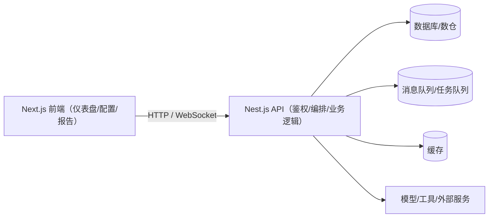
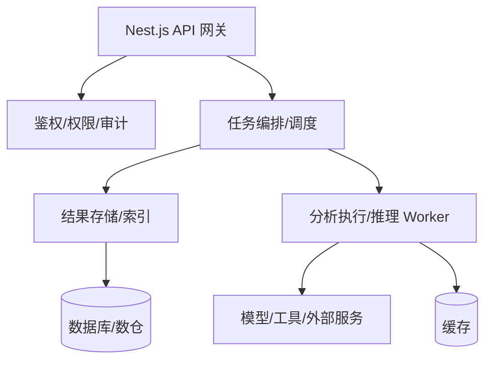
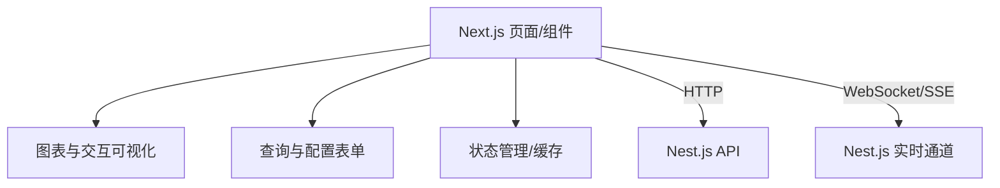

本节聚焦 Next.js 与 Nest.js 在“自动化数据分析 AI Agent 应用”中的分工与协同方式。一个可落地的 AI 数据分析产品，通常需要后端承接数据与分析执行，前端承接交互与呈现；Next.js + Nest.js 是一种常见、工程化程度较高的全栈组合。

## 1. 全栈架构概览

在 AI 数据分析应用中，通常会同时面对三类挑战：数据源异构、分析链路复杂、交互与可视化要求高。以职责拆分的方式组合框架，可以让系统更可维护、可扩展：

- **Nest.js（后端）**：核心业务逻辑、数据访问与治理、分析任务编排、模型/工具集成、对外 API。
- **Next.js（前端）**：用户界面、数据可视化、交互式分析体验、与后端 API 的集成。

一个常见的高层架构如下：

## 2. Nest.js 在 AI 数据分析中的角色

Nest.js 是一个用于构建 Node.js 服务端应用的框架（TypeScript 友好、模块化、依赖注入），适合承接复杂业务与中台能力。在 AI 数据分析场景中，Nest.js 常见职责包括：

### 2.1 API 服务层（接入、鉴权、编排）

- **数据接入与转换（Data Ingestion & Transformation）**：提供 API/任务入口，接入数据库、消息队列、文件上传或第三方系统数据；完成必要的校验、字段标准化与口径对齐。规模较大的 ETL/ELT 往往会放在独立的数据管道里，Nest.js 负责“入口编排与治理”会更常见。
- **模型/工具集成与推理（Model Integration & Inference）**：对接外部模型服务、内部推理服务或工具链（SQL 执行、检索、计算、绘图等），向前端暴露稳定的 API，返回结构化的分析结果。
- **业务逻辑与工作流管理（Workflow Management）**：把高层分析需求拆解为可执行步骤，处理依赖顺序、重试、超时、异常与回滚等工程细节。

### 2.2 数据持久化与管理

- **数据库交互（Database Interaction）**：通过 TypeORM、Prisma、Mongoose 等访问关系型或非关系型数据库，存储原始数据索引、分析结果、用户配置、任务记录与审计日志等。
- **缓存（Data Caching）**：接入 Redis 等缓存系统，缓存高频查询结果、预计算指标或推理结果，降低延迟与后端压力。

### 2.3 可扩展性与实时性

- **微服务/任务拆分（Microservices / Worker）**：Nest.js 提供微服务与消息模式的支持，便于将数据摄取、分析执行、结果存储等拆分为可水平扩展的服务或 worker。
- **实时数据处理（Real-time）**：通过 WebSocket 或消息队列，把任务状态、增量结果推送到前端，支撑实时仪表盘与进度反馈。

一个更聚焦的后端职责图：

## 3. Next.js 在 AI 数据分析中的角色

Next.js 是基于 React 的应用框架，强调路由、渲染策略与工程化能力。在 AI 数据分析场景中，它通常承担“交互与呈现”的主角色：

### 3.1 交互式用户界面（Interactive UI）

- **仪表盘与报告（Dashboards & Reports）**：展示洞察、图表与可解释结论，支持多视图、多维筛选与对比。
- **用户输入与配置（Input & Configuration）**：让用户提交问题、选择数据源/时间范围、调整分析参数、管理 Agent 行为与权限。
- **实时更新（Real-time Updates）**：通过 WebSocket/SSE 等方式接收任务进度与增量结果，提升使用体验。

### 3.2 数据可视化（Visualization）

- **可视化库集成**：集成 Chart.js、Recharts、Highcharts、D3.js 等生态库，将模型输出与统计结果转为可读图形。
- **交互能力**：支持缩放、刷选、悬停提示、钻取等交互，帮助用户进一步探索数据。

### 3.3 性能与工程化（Performance & DX）

- **SSR / SSG**：可用于报告页、公开说明页或可预计算内容的加速与缓存；对多数需要登录的内部仪表盘，SEO 通常不是核心目标，但首屏体验与缓存策略依然重要。
- **代码分割与按需加载**：减少初始加载体积，尤其在可视化组件多、依赖重的场景。
- **API Routes（可选）**：可作为轻量 BFF（Backend for Frontend）或代理层，统一鉴权、聚合后端接口、隐藏后端细节；复杂业务仍建议落在 Nest.js。

一个典型的前端职责图：

## 4. Next.js 与 Nest.js 的协同与优势

两者协同的主要价值在于“清晰分工 + 端到端类型与工程化”：

- **职责分离（Separation of Concerns）**：Nest.js 聚焦后端服务与分析执行，Next.js 聚焦体验与呈现，便于并行开发与独立演进。
- **端到端 TypeScript 体验（End-to-End TypeScript）**：前后端共享 DTO/类型定义可减少接口误差，提升可维护性。
- **可扩展性（Scalability）**：后端可拆 worker/微服务水平扩展，前端可按页面与组件粒度做性能优化。
- **部署适配（Deployment）**：后端可部署在容器/集群，前端可走 CDN/边缘渲染；具体方式取决于成本、合规与性能目标。

## 总结

Next.js 与 Nest.js 分别在前端交互呈现与后端业务编排上发挥优势：Nest.js 负责数据接入、分析任务编排、模型/工具集成与结果治理；Next.js 负责仪表盘、报告、用户配置与实时交互体验。两者通过 API/实时通道协作，构成一套更易维护、可扩展的自动化数据分析 AI Agent 全栈架构。后续章节将围绕这一架构逐步落地具体实现。
