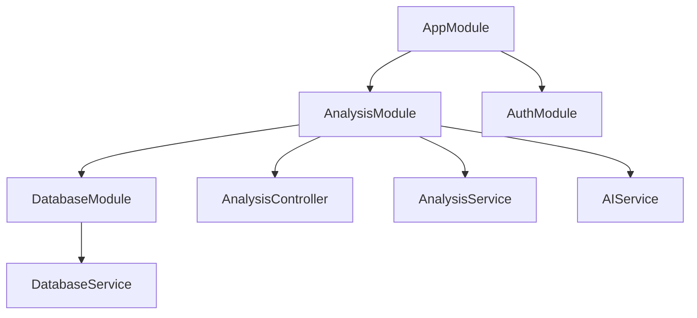

# Nest.js 项目初始化与模块化架构

本节将介绍如何使用 Nest.js 构建一个结构清晰、可扩展的后端服务，作为自动化数据分析 AI Agent 应用的核心执行层。Nest.js 的模块化设计与依赖注入机制，适合承接“数据接入 → 任务编排 → 分析执行 → 结果结构化输出”的复杂链路。

## 2.1.1 什么是 Nest.js？

Nest.js 是一个用于构建 Node.js 服务端应用的框架，默认以 TypeScript 为主要开发语言，并提供完善的工程化能力（模块化、依赖注入、测试友好等）。它底层可以运行在 Express 或 Fastify 之上，在此基础上提供更高层的抽象，并借鉴了 Angular 的架构思想。

为什么 Nest.js 适合作为 AI 数据分析后端的基础框架？

- **结构化与模块化**：Nest.js 鼓励用模块组织系统边界，便于管理数据链路、分析流程、模型/工具集成等复杂能力。
- **TypeScript 支持**：强类型有助于减少接口与数据结构变更带来的运行时风险，提升可维护性。
- **依赖注入（DI）**：降低组件耦合度，便于替换实现（例如测试时替换外部模型服务、数据库实现）。
- **性能与可选运行时**：可选择 Express 或 Fastify 作为运行时；在高并发场景下，Fastify 通常更具性能优势（效果取决于具体业务与实现）。
- **生态系统**：社区活跃，常用能力（认证、WebSocket、数据库集成等）有成熟方案可选。

## 2.1.2 Nest.js 的模块化架构

Nest.js 的核心是模块化设计：应用由多个模块（Module）组成；模块内部组织控制器（Controller）与提供者（Provider），并通过依赖注入连接起来。

### 模块（Modules）

- 用 `@Module()` 装饰器定义
- 用于组织应用结构，将相关功能组件（Controller、Provider 等）聚合
- 应用至少有一个根模块 `AppModule`
- 模块可以导入其他模块，也可以导出自己的 Provider 供外部使用

在 AI 数据分析场景中，可以按职责拆分模块，例如：数据接入、模型/工具调用、分析编排、报告生成、监控审计等。

### 控制器（Controllers）

- 用 `@Controller()` 装饰器定义
- 负责接收请求并返回响应（例如 `/analysis`、`/insights`）
- 一般不承载复杂业务逻辑，而是把逻辑委托给 Provider

### 提供者（Providers）

Provider 是一个通用概念，常见形态包括 Service、Repository、Factory 等：

- 用 `@Injectable()` 装饰器定义
- 封装业务逻辑（数据操作、模型/工具调用、结果结构化等）
- 通过依赖注入被 Controller 或其他 Provider 使用

### 依赖注入（Dependency Injection, DI）

- DI 系统管理 Provider 的创建与生命周期
- 当某个类声明依赖时，Nest.js 会自动注入依赖实例
- 有利于测试与维护：可以在测试中替换依赖实现（mock）

下面用一个简化的模块关系图说明组件组织方式：



## 2.1.3 实践：创建第一个模块、控制器和服务

下面在 `backend` 中创建 `analysis` 模块，用于承接数据分析相关的请求。

### 1）创建模块

```bash
nest g module analysis
```

生成 `src/analysis/analysis.module.ts`：

```ts
import { Module } from '@nestjs/common';

@Module({})
export class AnalysisModule {}
```

### 2）创建控制器

```bash
nest g controller analysis --no-spec
```

生成 `src/analysis/analysis.controller.ts`：

```ts
import { Controller, Get } from '@nestjs/common';

@Controller('analysis')
export class AnalysisController {
  @Get()
  getHello(): string {
    return 'Hello from Analysis!';
  }
}
```

将控制器注册到模块中：(自动)

```ts
import { Module } from '@nestjs/common';
import { AnalysisController } from './analysis.controller';

@Module({
  controllers: [AnalysisController],
})
export class AnalysisModule {}
```

### 3）把模块接入根模块（自动）

在 `src/app.module.ts` 中导入 `AnalysisModule`：

```ts
import { Module } from '@nestjs/common';
import { AppController } from './app.controller';
import { AppService } from './app.service';
import { AnalysisModule } from './analysis/analysis.module';

@Module({
  imports: [AnalysisModule],
  controllers: [AppController],
  providers: [AppService],
})
export class AppModule {}
```

此时访问 `http://localhost:3001/analysis` 应该能看到 `Hello from Analysis!`。

### 4）添加服务（Service）

控制器通常把业务逻辑委托给服务。创建一个 service：

```bash
nest g service analysis --no-spec
```

生成 `src/analysis/analysis.service.ts`：

```ts
import { Injectable } from '@nestjs/common';

@Injectable()
export class AnalysisService {
  getAnalysisResult(): string {
    return 'This is a detailed analysis result from the AnalysisService.';
  }
}
```

在模块中注册服务：（自动）

```ts
import { Module } from '@nestjs/common';
import { AnalysisController } from './analysis.controller';
import { AnalysisService } from './analysis.service';

@Module({
  controllers: [AnalysisController],
  providers: [AnalysisService],
})
export class AnalysisModule {}
```

在控制器中注入并使用服务：

```ts
import { Controller, Get } from '@nestjs/common';
import { AnalysisService } from './analysis.service';

@Controller('analysis')
export class AnalysisController {
  constructor(private readonly analysisService: AnalysisService) {}

  @Get()
  getAnalysis(): string {
    return this.analysisService.getAnalysisResult();
  }

  @Get('status')
  getStatus(): string {
    return 'Analysis service is up and running!';
  }
}
```

访问：
- `http://localhost:3000/analysis` → `This is a detailed analysis result from the AnalysisService.`
- `http://localhost:3000/analysis/status` → `Analysis service is up and running!`

这体现了依赖注入的价值：Controller 只负责编排与路由，业务逻辑集中在 Service 中。

## 2.1.4 模块化架构如何赋能 AI 数据分析应用

模块化架构对 AI 数据分析应用的价值，通常体现在以下方面：

- **职责分离（Separation of Concerns）**：可以拆出 `DataIngestionModule`（数据接入）、`AIModelModule`（模型/工具调用）、`AnalysisReportModule`（报告生成）、`MonitoringModule`（监控审计）等，使代码更清晰。
- **可扩展性（Scalability）**：新增数据源或分析能力时，优先通过新增模块/扩展模块来演进，降低对全局的影响；未来也更容易把部分模块拆成独立服务或 worker。
- **可测试性（Testability）**：依赖注入使得测试时替换依赖更容易，有利于对关键逻辑做单元测试与集成测试。
- **团队协作（Team Collaboration）**：按模块边界并行开发，减少冲突，提高协作效率。

## 总结

本节完成了以下内容：

- 理解 Nest.js 的定位与优势，以及它在 AI 数据分析后端中的适用性
- 掌握 Nest.js 模块化架构的核心概念：模块、控制器、提供者与依赖注入
- 通过 `AnalysisModule` 的实践，串起“模块 → 控制器 → 服务”的基本结构

在下一节中，我们将讨论如何为 Nest.js 应用搭建数据基础，包括数据库集成与 ORM 工具的使用。
