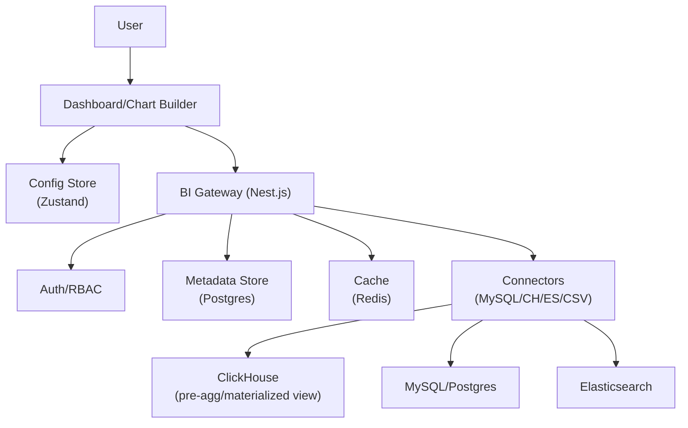

# BI 项目面试复盘（背景/选型/架构/难点/成果）

## 1. 项目简介

**一句话**：打造可插拔的数据可视化与分析平台，打通“数据连接 → 查询建模 → 图表配置 → 仪表盘发布”，让业务从原始数据到决策洞察的周期缩短为分钟级。

**核心能力**：
- 数据连接器：MySQL/Postgres/ClickHouse/Elasticsearch/CSV/Parquet
- 查询构建器：SQL/KQL 可视化编辑、参数化查询、预设维度度量
- 图表引擎：折线/柱状/饼图/漏斗/旭日/地图/热力/表格/Pivot
- 仪表盘：拖拽布局、组件联动、筛选器、分享/导出/快照
- 权限与治理：多租户、角色/资源权限、指标口径管理

## 2. 背景与业务痛点

- 异构数据源割裂：业务数据分散在 OLTP/OLAP/日志/搜索系统中，分析链路复杂
- 指标口径不统一：同一指标随人变动，跨团队对齐成本高
- 查询与渲染性能瓶颈：大表聚合慢、图表高并发下卡顿
- 配置复杂不可复用：图表/仪表盘配置分散，难以复用与版本化
- 权限与数据安全：多租户场景下需要细粒度到行级权限与脱敏

## 3. 技术选型

- 前端：React 18 + TypeScript，Vite 构建，Zustand 管理横切状态（数据源/图表/筛选器）
- 可视化：ECharts + Vega-Lite（满足标准图形语法 + 自定义样式），Canvas/WebGL 适配
- 表格：虚拟滚动表格（百万行场景），支持列分组、聚合与导出
- 后端：Nest.js（模块化/DI），数据连接器网关（支持 Pool/限流/熔断）
- 存储：ClickHouse（明细与预聚合）、Postgres（元数据与权限）、Redis（缓存）
- 接口：REST/GraphQL，SSE 流式传输大查询结果，WebSocket 组件联动
- 构建与交付：Monorepo 管理可视化组件库与仪表盘应用，Docker 多阶段构建

## 4. 总体架构

## 5. 关键难点与解决方案（STAR）

- 难点一：KQL/SQL 可视化构建器的安全与可维护性
  - Situation：业务用户需要通过拖拽/选择维度度量生成查询；同时必须防止注入与口径偏差
  - Task：提供所见即所得的查询构建器，自动生成安全 SQL/KQL，并对指标口径统一治理
  - Action：
    - 设计查询 AST（Select/Where/Group/Order/Limit）与字段白名单，只允许受控字段与操作
    - 指标字典（维度/度量/口径说明）统一管理，生成查询时强制引用字典定义
    - 参数化查询与占位符绑定，后端仅接收绑定值，阻断注入路径
  - Result：查询错误率下降，指标口径统一；新增报表无需手写 SQL

- 难点二：大表聚合与高并发渲染性能
  - Situation：明细表千万级，用户需要分钟级刷新趋势与分布图；前端在多图并发时卡顿
  - Task：将 P99 查询延迟控制在 < 500ms；图表渲染在并发下保持流畅
  - Action：
    - 后端：ClickHouse 物化视图做预聚合（time bucket/维度切片），冷热数据分层
    - 查询预算与熔断：超出时间/行数/内存预算直接降级采样或返回缓存
    - 前端：表格/图表虚拟化、增量渲染（SSE 流式）、WebWorker 计算组件联动
  - Result：标准仪表盘 P99 < 500ms；多图并发渲染帧率稳定在 55–60fps

- 难点三：图表拖拽配置与可复用的 Schema
  - Situation：图表配置易碎且难以复用（主题/映射/交互/数据绑定）
  - Task：建立统一的 Chart Schema，支持拖拽配置、版本化与复用
  - Action：
    - 以 Vega-Lite 语法为基，扩展主题/交互/联动字段，形成统一 Schema
    - 提供可视化编辑器（字段绑定/编码通道/颜色/尺度/交互），自动生成 Schema
    - 版本管理与快照：Schema 存储支持版本化与快照回滚
  - Result：图表配置可复用率提升，跨项目移植成本显著降低

- 难点四：多租户与细粒度权限
  - Situation：同一套仪表盘在不同租户下需要行级/列级权限与脱敏
  - Task：实现 RBAC + RLS（Row-Level Security）+ 列级脱敏策略
  - Action：
    - RBAC：角色-资源-操作三元组；接口侧 Guard 校验权限
    - RLS：在数据源连接层注入租户/用户过滤条件，确保后端从源头裁剪
    - 脱敏：字段级策略（mask/hash）、导出权限控制
  - Result：权限与安全通过审计，支持跨租户交付

## 6. 性能与工程化策略

- 查询侧：预聚合/物化视图、参数化与缓存（LRU/Redis）、并发预算与熔断
- 前端侧：虚拟滚动/窗口化、SSE 流式增量、WebWorker/OffscreenCanvas
- 构建侧：Monorepo 拆包（可视化库/仪表盘应用），按需加载与手动分包
- 监控与稳定性：APM/日志/慢查询分析、错误率与崩溃率追踪、熔断告警

## 7. 交付成果与数据指标

- 交付物：数据连接器 6+、图表类型 12+、仪表盘模板 10+、权限策略 4 类
- 指标提升：
  - 查询 P99：< 500ms（标准维度聚合）
  - 仪表盘首屏：TTFB 下降 35%，渲染帧率稳定 55–60fps
  - 报表复用：Schema 复用率提升至 70%+

## 8. 面试话术模板

- 30 秒电梯陈述：
  - “我在 BI 项目中主导了查询构建器与图表引擎落地，通过限制 AST 与指标字典统一口径，避免注入并稳定可复用；后端结合 ClickHouse 预聚合与查询预算，前端采用虚拟化与流式增量渲染，把标准仪表盘 P99 控制在 500ms 内。”
- 3 分钟展开（STAR）：
  - S：数据源异构、指标不统一、性能瓶颈
  - T：统一查询与口径、提速渲染、权限合规
  - A：查询 AST、安全参数、预聚合、SSE 流式、虚拟化、RLS
  - R：性能/复用/安全三位一体，支撑跨租户交付

## 9. 调试与运维（简要）

- 调试：后端启用慢查询日志与预算告警；前端帧率与长任务（Long Task）监控
- 部署：Docker 化 + Nginx 反向代理；按租户隔离数据连接；灰度发布与回滚快照
- 稳定性：健康检查/重试策略/熔断恢复；预聚合定时任务与失败告警
