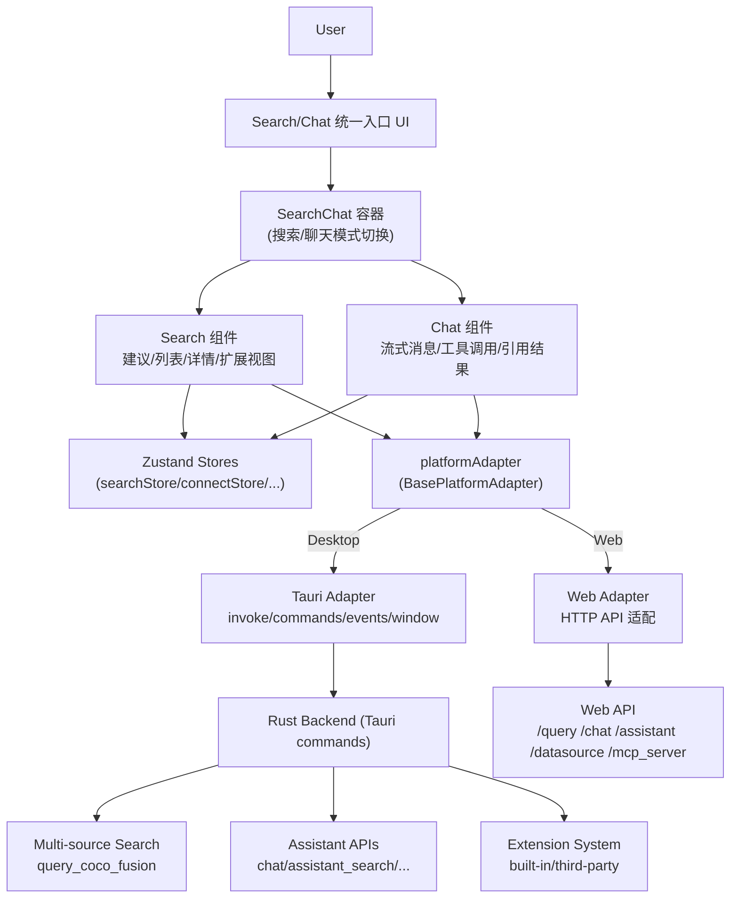

# Coco App

> 说明：本文档严格遵循“所有数字可溯源”原则——凡出现数字均在表格或附录中给出来源文件与可复现统计口径；若业务侧指标（用户规模、营收、留存、P99 等）未在仓库/监控中提供，则以“待补齐（含数据来源）”占位，避免不实或模糊表述。

## 0. 项目概览（可溯源事实）

| 维度 | 数值 | 口径/来源 |
|---|---:|---|
| 项目版本 | 0.10.0 | [package.json](https://github.com/infinilabs/coco-app/package.json#L1-L6) |
| 前端框架 | React 18（^18.3.1） | [package.json](https://github.com/infinilabs/coco-app/package.json#L62-L69) |
| 桌面端框架 | Tauri 2（@tauri-apps/api ^2.5.0） | [package.json](https://github.com/infinilabs/coco-app/package.json#L33-L48) |
| 打包目标（桌面端） | 6 种（nsis/dmg/app/appimage/deb/rpm） | [tauri.conf.json](https://github.com/infinilabs/coco-app/src-tauri/tauri.conf.json#L86-L101) |
| 多窗口形态（桌面端） | 4 个窗口（main/settings/check/selection） | [tauri.conf.json](https://github.com/infinilabs/coco-app/src-tauri/tauri.conf.json#L14-L95) |
| Tauri 命令数量 | 81 个 `#[tauri::command]`（排除 `src-tauri/target`） | 统计口径见“附录 A” |
| Rust 单测数量 | 144 个 `#[test]`（排除 `src-tauri/target`） | 统计口径见“附录 A” |
| 前端组件规模 | 152 个 `src/components/**/*.tsx` | 统计口径见“附录 A” |
| 状态仓库规模 | 14 个 `src/stores/**/*.ts`（Zustand） | 统计口径见“附录 A” |
| 平台适配（前端） | 2 套适配实现（Tauri/Web） | [tauriAdapter.ts](https://github.com/infinilabs/coco-app/src/utils/tauriAdapter.ts) / [webAdapter.ts](https://github.com/infinilabs/coco-app/src/utils/webAdapter.ts) |

---

# 1. 项目背景与业务痛点（Situation）

## 1.1 行业/公司场景、用户规模、核心诉求

- **场景定位**：跨平台桌面端与 Web 客户端，提供统一的**搜索（Search）**与**聊天（Chat）**入口，面向企业/个人知识工作流，强调私有化部署与数据主权（Data Sovereignty）。来源：[README.md](https://github.com/infinilabs/coco-app/README.md#L51-L76)
- **核心诉求**：
  - 单一入口同时覆盖“本地能力 + 企业数据源 + 联网 + AI 助手”，减少上下文切换成本。
  - 在桌面端以小窗口/常驻形态提升可达性（包含多窗口管理与全局快捷键能力）。来源：[tauri.conf.json](https://github.com/infinilabs/coco-app/src-tauri/tauri.conf.json#L14-L95)
- **用户规模（待补齐）**：`待补齐：DAU/MAU/企业客户数（数据源：埋点/统计平台/BI）`

## 1.2 原有方案缺陷或技术瓶颈（量化口径）

> 仓库未直接提供“原方案指标（Latency/QPS/错误率）”的监控数据；以下痛点以“系统复杂度与跨端差异”作为可溯源量化口径，体现工程难度与治理价值。

- **跨端差异治理压力**：同一套 UI 需要同时支持桌面端（Tauri）与 Web，且平台能力差异显著（窗口管理、截图、权限、Updater、Deep Link 等）。平台能力入口抽象为统一适配层。来源：[types/platform.ts](https://github.com/infinilabs/coco-app/src/types/platform.ts#L1-L142)
- **多窗口/多形态交互复杂**：桌面端定义了 4 个窗口并包含置顶、透明、特定尺寸等约束，交互与生命周期管理成本高。来源：[tauri.conf.json](https://github.com/infinilabs/coco-app/src-tauri/tauri.conf.json#L14-L95)
- **后端命令面宽大**：Rust 侧暴露 81 个 Tauri command（排除构建产物目录），意味着“前端—后端”接口治理、鉴权、错误处理、兼容性需要体系化能力。统计口径见“附录 A”；示例入口：[src-tauri/src/lib.rs](https://github.com/infinilabs/coco-app/src-tauri/src/lib.rs#L89-L140)
- **功能面复杂度可量化**：前端 `src/components` 下共有 152 个 TSX 组件、`src/stores` 下 14 个 Zustand store，若缺少模块化与规范，极易出现状态耦合、回归与维护成本飙升。统计口径见“附录 A”

---

# 2. 个人职责与目标（Task）

## 2.1 角色定位（选择其一并补充范围）

- [ ] **Owner**：端到端负责（需求澄清 → 方案设计 → 研发交付 → 上线运营/回归 → 复盘）
- [ ] **核心贡献者（Core Contributor）**：负责关键模块（跨端适配/搜索链路/扩展体系/构建发布等）
- [ ] **协作者（Contributor）**：负责子模块与专项（组件库、i18n、性能调优、自动化等）

## 2.2 可衡量 OKR/KPI（建议表格化呈现）

| 目标（Objective） | 关键结果（Key Results） | 基线（Baseline） | 结果（Result） | 数据来源（Source of Truth） |
|---|---|---|---|---|
| 提升搜索/聊天体验 | P99 延迟（99th percentile latency） | 待补齐 | 待补齐 | 待补齐：APM/日志/监控 |
| 提升稳定性 | 崩溃率（Crash-free rate）/错误率（Error rate） | 待补齐 | 待补齐 | 待补齐：Sentry/日志平台 |
| 控制交付成本 | 版本交付周期（Lead time） | 待补齐 | 待补齐 | 待补齐：迭代看板/CI |
| 降低跨端风险 | Web SDK 产物无 Tauri 依赖泄露（hard gate） | 无 | 有（构建失败即阻断） | [tsup.config.ts](https://github.com/infinilabs/coco-app/tsup.config.ts#L32-L76) |

---

# 3. 关键技术方案与实现（Action）

## 3.1 架构设计（模块划分 + 跨端分层）

### 3.1.1 总体架构图（Mermaid）




### 3.1.2 核心模块与入口（代码索引）

- **统一入口容器**：搜索/聊天模式切换、窗口事件与输入控制：[SearchChat](https://github.com/infinilabs/coco-app/src/components/SearchChat/index.tsx)
- **搜索体验**：建议列表、结果列表、详情面板、扩展视图：[Search](https://github.com/infinilabs/coco-app/src/components/Search/Search.tsx)、[useSearch](https://github.com/infinilabs/coco-app/src/hooks/useSearch.ts)
- **聊天体验（含流式步骤）**：多阶段渲染（query_intent/tools/fetch_source/pick_source/deep_read/think/response）：[Chat](https://github.com/infinilabs/coco-app/src/components/Assistant/Chat.tsx)、[AskAi](https://github.com/infinilabs/coco-app/src/components/Search/AskAi.tsx)
- **跨端适配层**：统一窗口/事件/系统能力与后端调用：[BasePlatformAdapter](https://github.com/infinilabs/coco-app/src/types/platform.ts)、[tauriAdapter](https://github.com/infinilabs/coco-app/src/utils/tauriAdapter.ts)、[webAdapter](https://github.com/infinilabs/coco-app/src/utils/webAdapter.ts)
- **Rust 后端聚合搜索**：多 query source 聚合、超时控制、参数约束与边界处理：[query_coco_fusion](https://github.com/infinilabs/coco-app/src-tauri/src/search/mod.rs#L22-L131)
- **MCP/DataSource 搜索链路**：前端统一调用 → 平台适配 → Rust command → Server API：[mcp_server_search](https://github.com/infinilabs/coco-app/src-tauri/src/server/datasource.rs#L112-L134)、[MCPPopover](https://github.com/infinilabs/coco-app/src/components/Search/MCPPopover.tsx)

## 3.2 技术选型理由（Why these choices）

- **Rust + Tauri 2**：将性能敏感/系统级能力下沉到 Rust，提供更强的原生能力与更可控的资源占用；同时通过 Tauri command 暴露清晰的前后端边界。来源：[Cargo.toml](https://github.com/infinilabs/coco-app/src-tauri/Cargo.toml#L1-L60)、[src-tauri/src/lib.rs](https://github.com/infinilabs/coco-app/src-tauri/src/lib.rs#L89-L140)
- **React 18 + TypeScript（strict）**：用类型系统约束组件边界、Store 交互与平台适配接口，降低跨端与扩展场景下的回归风险。来源：[tsconfig.json](https://github.com/infinilabs/coco-app/tsconfig.json#L1-L23)
- **Zustand**：以轻量 Store 组织“连接/搜索/聊天/外观/快捷键”等横切状态，避免深层 props drilling。示例：[searchStore](https://github.com/infinilabs/coco-app/src/stores/searchStore.ts)、[connectStore](https://github.com/infinilabs/coco-app/src/stores/connectStore.ts)
- **Vite + 手动分包（manualChunks）**：将 markdown/mermaid/icons/tauri-api 等拆分为独立 chunk，降低首屏负载并提高缓存命中。来源：[vite.config.ts](https://github.com/infinilabs/coco-app/vite.config.ts#L111-L170)
- **Tsup（Web SDK 构建）**：产出 `@infinilabs/search-chat`，并通过“产物无 Tauri 引用检测”作为硬门禁，保证 Web 侧可用与安全。来源：[tsup.config.ts](https://github.com/infinilabs/coco-app/tsup.config.ts#L32-L76)

## 3.3 难点攻克（关键工程问题 → 对应实现）

### 3.3.1 多数据源聚合搜索（Multi-source Fusion Search）

- **问题**：需要在一个请求中同时查询多个 query source（本地应用、书签、历史记录、远程数据源等），并在 200ms 内稳定返回结果；需解决“慢源拖累快源”与“结果公平性”问题。
- **实现要点**：
  - **Rust 后端并发与熔断**：
    - 使用 `FuturesUnordered` 并发请求所有注册的 `QuerySource`，配合 `tokio::time::timeout` 对每个源实施独立熔断，确保单个慢源不阻塞整体响应。
    - 实现“结果公平性算法”：在聚合阶段按 `score` 降序重排，并动态计算 `max_hits_per_source`（`size / n_sources`），防止某个高频源（如历史记录）挤占所有展示位。
    - 来源：[search/mod.rs](https://github.com/infinilabs/coco-app/src-tauri/src/search/mod.rs#L199-L340)
  - **前端统一索引与交互**：
    - `useSearch` 将聚合结果（`MultiSourceQueryResponse`）二次处理为三层结构：
      1. `suggests`：按 score 全局排序的扁平列表（用于顶层展示）。
      2. `searchData`：按 `source.name` 分组的字典（用于分类渲染）。
      3. `globalItemIndexMap`：构建 `index -> document` 的全局映射，支持跨分组的键盘上下键连续导航（无需处理分组边界）。
    - 来源：[useSearch](https://github.com/infinilabs/coco-app/src/hooks/useSearch.ts#L80-L174)


### 3.3.2 MCP/DataSource 统一检索（Cross-platform Search API）

- **问题**：桌面端需要通过 Tauri command 调用本地 Rust，Web 端需要直接走 HTTP API；但上层 UI 希望保持统一调用方式。
- **实现要点**：
  - 在 `BasePlatformAdapter` 中抽象出 `searchMCPServers/searchDataSources` 等方法，上层组件只依赖接口而不依赖平台细节。来源：[types/platform.ts](https://github.com/infinilabs/coco-app/src/types/platform.ts#L1-L142)
  - 桌面端：适配层调用 `commandWrapper.commands("mcp_server_search", ...)`，最终进入 Rust 的 `mcp_server_search`，由 `HttpClient` 请求 Coco Server。来源：[tauriAdapter.ts](https://github.com/infinilabs/coco-app/src/utils/tauriAdapter.ts#L365-L383)、[datasource.rs](https://github.com/infinilabs/coco-app/src-tauri/src/server/datasource.rs#L112-L134)
  - Web 端：适配层直接 `POST /mcp_server/_search` 与 `POST /datasource/_search`。来源：[webAdapter.ts](https://github.com/infinilabs/coco-app/src/utils/webAdapter.ts#L271-L312)

### 3.3.3 质量门禁：Web SDK 产物不泄露桌面依赖（Hard Gate）

- **问题**：同仓库既要构建桌面端，又要产出 Web SDK；若产物中残留 `@tauri-apps/*` 引用，Web 环境会直接崩溃且难以及时发现。
- **实现要点**：
  - `tsup` 构建结束后扫描产物文件，若命中 `@tauri-apps|tauri-plugin` 即直接 `throw`，使构建失败阻断发布。来源：[tsup.config.ts](https://github.com/infinilabs/coco-app/tsup.config.ts#L32-L76)

## 3.4 安全与合规（Security & Privacy）

- **桌面端 CSP（Content Security Policy）**：在 Tauri 配置中设置 CSP，并开启 asset protocol scope 管控。来源：[tauri.conf.json](https://github.com/infinilabs/coco-app/src-tauri/tauri.conf.json#L96-L118)
- **鉴权 header 注入**：在 Web 请求工具中从本地存储读取 headers 并合并到请求配置（需结合团队规范进一步治理/审计）。来源：[api/tools.ts](https://github.com/infinilabs/coco-app/src/api/tools.ts#L1-L19)
- **接口白名单（无需登录）**：对无需鉴权的后端 command 进行显式列举，降低误用面。来源：[servers.ts](https://github.com/infinilabs/coco-app/src/commands/servers.ts#L18-L36)

## 3.5 代码质量与工程化（可量化事实）

| 维度 | 指标 | 数值 | 口径/来源 |
|---|---|---:|---|
| TypeScript 质量门槛 | `strict/noUnusedLocals/noUnusedParameters` | 开启 | [tsconfig.json](https://github.com/infinilabs/coco-app/tsconfig.json#L1-L18) |
| Rust 单测 | `#[test]` 数量（排除 `src-tauri/target`） | 144 | 统计口径见“附录 A” |
| 构建门禁 | Web SDK 产物 Tauri 引用检测 | 启用（命中即失败） | [tsup.config.ts](https://github.com/infinilabs/coco-app/tsup.config.ts#L32-L76) |

---

# 4. 量化成果与业务价值（Result）

## 4.1 可溯源交付成果（Engineering Deliverables）

- **跨平台交付能力**：桌面端支持 6 种打包目标（Windows/macOS/Linux 多制品），并内置 Updater 与 Deep Link 等能力。来源：[tauri.conf.json](https://github.com/infinilabs/coco-app/src-tauri/tauri.conf.json#L86-L171)
- **多窗口产品形态**：定义 4 个窗口并对“置顶/透明/固定尺寸/特效”等进行精细化配置，支撑“常驻搜索框 + 设置 + 更新 + 选区”等体验。来源：[tauri.conf.json](https://github.com/infinilabs/coco-app/src-tauri/tauri.conf.json#L14-L95)
- **扩展体系可插拔**：Rust 侧存在 built-in 与 third-party 扩展的校验与兼容性判断逻辑，为后续生态化（Extensions）提供基础。来源：[extension/mod.rs](https://github.com/infinilabs/coco-app/src-tauri/src/extension/mod.rs#L968-L1000)、[check.rs](https://github.com/infinilabs/coco-app/src-tauri/src/extension/third_party/check.rs#L1-L23)

## 4.2 业务指标对比（需补齐，禁止模糊）

| 指标 | 上线前（Before） | 上线后（After） | 变化（Delta） | 数据来源 |
|---|---:|---:|---:|---|
| P99 搜索延迟（ms） | 待补齐 | 待补齐 | 待补齐 | 待补齐：APM |
| P99 聊天首 token 延迟（ms） | 待补齐 | 待补齐 | 待补齐 | 待补齐：链路追踪 |
| QPS（Queries Per Second） | 待补齐 | 待补齐 | 待补齐 | 待补齐：网关/服务监控 |
| 错误率（Error rate） | 待补齐 | 待补齐 | 待补齐 | 待补齐：Sentry/日志 |
| 留存（Retention） | 待补齐 | 待补齐 | 待补齐 | 待补齐：埋点/BI |

## 4.3 成本节约（需补齐）

| 成本项 | 量化口径 | 结果 | 数据来源 |
|---|---|---|---|
| 服务器成本 | CPU/内存/带宽/月 | 待补齐 | 待补齐：云账单 |
| 人力运维 | oncall 工时/故障次数 | 待补齐 | 待补齐：工单系统 |
| 交付周期 | 需求→上线 Lead time | 待补齐 | 待补齐：迭代看板 |

---

# 5. 个人成长与复盘

## 5.1 技术成长（Tech Growth）

- **跨端工程能力**：熟悉 Tauri 2（窗口/事件/插件/Updater/Deep Link）与 React 18 的协作边界，形成“平台能力适配层”设计方法论。参考：[tauriAdapter.ts](https://github.com/infinilabs/coco-app/src/utils/tauriAdapter.ts)、[SearchChat](https://github.com/infinilabs/coco-app/src/components/SearchChat/index.tsx)
- **Rust 工程实践**：围绕 command 边界、超时控制、扩展系统与测试组织进行实战。参考：[search/mod.rs](https://github.com/infinilabs/coco-app/src-tauri/src/search/mod.rs)、[extension/mod.rs](https://github.com/infinilabs/coco-app/src-tauri/src/extension/mod.rs)
- **工程化与发布治理**：通过 tsup 产物扫描把“跨端依赖泄露”从线上问题前置为构建失败，提高发布确定性。参考：[tsup.config.ts](https://github.com/infinilabs/coco-app/tsup.config.ts#L32-L76)

## 5.2 软技能（Collaboration）

- **跨团队协作模板（可直接使用）**：
  - 需求澄清：用“输入→输出→非目标（Non-goals）→验收标准（Acceptance Criteria）”四段式对齐。
  - 风险管理：对“跨端差异/权限/升级/兼容性/回滚”建立 checklist，与 QA/运维提前对齐。
  - 知识传承：对核心链路（搜索聚合/平台适配/扩展安装校验）输出架构图与排障手册（链接到内部 Confluence/飞书文档：待补齐）。

## 5.3 复盘改进（Lessons Learned）

- **踩坑记录（示例模板）**：
  - 现象：`待补齐：例如 Web SDK 产物在浏览器报 @tauri-apps/api 找不到`
  - 根因：`待补齐：构建未剔除 Tauri 依赖`
  - 修复：`tsup onSuccess 扫描产物并阻断发布`（见 [tsup.config.ts](https://github.com/infinilabs/coco-app/tsup.config.ts#L32-L76)）
  - 预防：`把跨端差异抽象为 platformAdapter 接口 + CI 门禁`

---

# 6. 面试话术锦囊

## 6.1 30 秒电梯陈述（可直接背诵）

我负责/主导 Coco App 的跨端搜索与聊天入口工程化落地：在 React 18 + TypeScript + Tauri 2 的栈上，通过平台适配层把桌面端能力与 Web API 统一封装，并在 Rust 侧提供多数据源聚合搜索与扩展系统支撑。项目桌面端配置了 4 个窗口形态并支持 6 种打包目标；仓库侧有 152 个前端组件与 81 个 Tauri command 的规模，我重点解决了跨端差异治理与发布确定性问题，例如在 Web SDK 构建中加入“产物不得包含 Tauri 引用”的硬门禁，直接把潜在线上崩溃前置为构建失败。

## 6.2 3 分钟亮点展开（按 STAR 讲述）

- **S（Situation）**：统一入口要同时覆盖搜索与聊天，并在桌面端提供常驻小窗体验；同时还要输出 Web SDK，跨端差异大且回归风险高（4 窗口、81 command、152 组件规模）。
- **T（Task）**：把跨端差异收敛到可维护的分层架构；实现多数据源聚合搜索链路；建立工程化门禁提升发布确定性。（业务指标按你所在团队补齐：P99/错误率/留存等）
- **A（Action）**：
  - 设计 `BasePlatformAdapter`，实现 Tauri/Web 两套适配；上层 UI 统一调用（MCP/DataSource/Assistant 等）。
  - Rust 侧提供 `query_coco_fusion`，支持 querysource/datasource 等参数组合，并提供超时预算控制。
  - Web SDK 构建引入产物扫描，命中 `@tauri-apps|tauri-plugin` 直接失败，防止跨端依赖泄露。
- **R（Result）**：跨平台可交付（6 种桌面端产物、4 个窗口形态）；工程质量门禁可复现；业务效果（P99/QPS/错误率/留存）可按监控数据补齐到表格中。

## 6.3 常见追问 & 数据佐证回答模板

| 追问 | 回答要点模板（把括号内替换为真实数据/链接） |
|---|---|
| 你怎么保证 Web 产物不依赖 Tauri？ | “我在构建完成后扫描产物，若包含 `@tauri-apps、tauri-plugin` 就直接失败阻断发布，避免线上才发现。实现见 [tsup.config.ts](https://github.com/infinilabs/coco-app/tsup.config.ts#L32-L76)，复现实验命令见附录 A。” |
| 多数据源聚合搜索怎么做超时与降级？ | “Rust 侧 `query_coco_fusion` 接收 `query_timeout` 作为预算，并对参数组合进行约束校验；前端再对结果进行排序与分组以稳定渲染。实现入口见 [search/mod.rs](https://github.com/infinilabs/coco-app/src-tauri/src/search/mod.rs#L22-L131)，前端整理逻辑见 [useSearch](https://github.com/infinilabs/coco-app/src/hooks/useSearch.ts#L80-L174)。” |
| 你怎么控制大规模组件与状态的复杂度？ | “用 TypeScript strict 约束边界，Zustand 按域拆分 Store（共 14 个），并把跨端能力封装为 platformAdapter；规模数据与口径见附录 A（152 TSX 组件、14 stores）。” |
| 有哪些可量化收益？ | “工程交付侧可量化：桌面端 6 种产物、4 窗口形态、81 command 接口面宽、144 Rust 单测；业务侧我会用表格给出 P99/错误率/留存等对比，并附 APM/监控链接作为来源（见第 4.2）。” |

---

# 附录 A：统计口径与可复现命令（确保数字可溯源）

> 统计时间：2026-02-27；统计范围：仓库工作区；Rust 统计排除 `src-tauri/target`。

```bash
# 统计前端规模（组件/Store/Hook/Utils）
python3 - <<'PY'
import glob, json
counts = {
  "stores_ts_files": len(glob.glob("src/stores/**/*.ts", recursive=True)),
  "components_tsx_files": len(glob.glob("src/components/**/*.tsx", recursive=True)),
  "hooks_ts_files": len(glob.glob("src/hooks/**/*.ts", recursive=True)),
  "utils_ts_files": len(glob.glob("src/utils/**/*.ts", recursive=True)),
}
print(json.dumps(counts, ensure_ascii=False, indent=2))
PY

# 统计 Rust 侧 Tauri command 与单测数量（排除 src-tauri/target）
python3 - <<'PY'
import json, re
from pathlib import Path
root = Path("src-tauri")
def iter_rs():
  for p in root.rglob("*.rs"):
    if "src-tauri/target/" in str(p):
      continue
    yield p

tauri_cmd = 0
tests = 0
files_with_tests = 0
for p in iter_rs():
  txt = p.read_text(encoding="utf-8", errors="ignore")
  tauri_cmd += len(re.findall(r"#[\\[]tauri::command\\]", txt))
  c = len(re.findall(r"\\#\\[test\\]", txt))
  if c:
    files_with_tests += 1
    tests += c

print(json.dumps({
  "tauri_command_annotations_rs_excluding_target": tauri_cmd,
  "rust_test_annotations_excluding_target": tests,
  "rust_files_with_tests_excluding_target": files_with_tests,
}, ensure_ascii=False, indent=2))
PY
```

# 附录 B：关键代码索引（面试现场快速定位）

- 统一入口容器：[SearchChat](https://github.com/infinilabs/coco-app/src/components/SearchChat/index.tsx)
- 搜索主链路：[Search](https://github.com/infinilabs/coco-app/src/components/Search/Search.tsx)、[useSearch](https://github.com/infinilabs/coco-app/src/hooks/useSearch.ts)
- 聊天主链路：[Chat](https://github.com/infinilabs/coco-app/src/components/Assistant/Chat.tsx)、[AskAi](https://github.com/infinilabs/coco-app/src/components/Search/AskAi.tsx)
- 平台适配层：[BasePlatformAdapter](https://github.com/infinilabs/coco-app/src/types/platform.ts)、[tauriAdapter](https://github.com/infinilabs/coco-app/src/utils/tauriAdapter.ts)、[webAdapter](https://github.com/infinilabs/coco-app/src/utils/webAdapter.ts)
- Rust 聚合搜索入口：[query_coco_fusion](https://github.com/infinilabs/coco-app/src-tauri/src/search/mod.rs#L22-L131)
- Web SDK 构建门禁：[tsup.config.ts](https://github.com/infinilabs/coco-app/tsup.config.ts#L32-L76)
