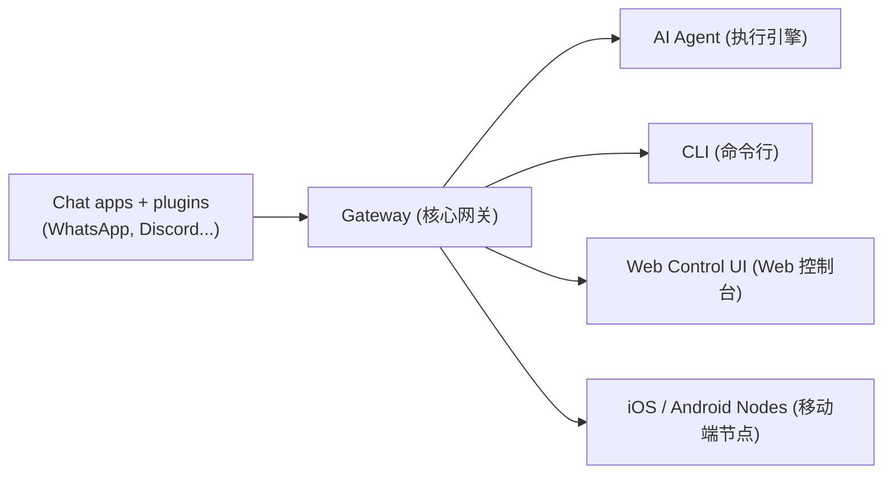

# OpenClaw 学习指南与项目架构剖析

## 1. 项目简介 (Project Overview)

**OpenClaw** 🦞 是一个支持跨平台、多渠道的 **本地私有 AI 助手网关 (Self-hosted Gateway)**。
它的核心目标是让你能够通过日常使用的聊天软件（如 WhatsApp, Telegram, Discord, iMessage, Slack 等）随时随地与你本地计算机上的强大 AI 代理（Agent）进行对话。
与传统的云端对话机器人不同，OpenClaw 将 AI 代理运行在你的私人设备上，因此 AI 可以直接在你的电脑上执行命令、读取文件、甚至通过 Node 客户端操作手机或电脑的相机和麦克风。

**核心亮点**：
*   **私有托管 (Self-hosted)**：运行在自己的硬件上，数据不经过第三方中心服务器，安全可控。
*   **多渠道支持 (Multi-channel)**：一个网关同时支持多个聊天平台。
*   **Agent-native (原生 AI 代理)**：专为能够使用工具、拥有持久会话和记忆、能进行多代理路由的 AI 系统设计。
*   **高度可扩展**：基于插件（Plugins）架构，MCP（Model Context Protocol）支持则通过独立组件解耦。

---

## 2. 核心架构与原理 (Core Architecture & Principles)

OpenClaw 的架构采用了典型的 **网关-路由-代理 (Gateway-Router-Agent)** 模式：

*   **Gateway (网关)**：系统的单一事实来源（Single Source of Truth）。它作为一个守护进程运行，负责接收所有外部渠道（Channels）的消息，管理会话状态，并将任务路由给后端的 Agent 处理。
*   **Agent Workspace (代理工作区)**：Agent 的“大脑”。默认位于 `~/.openclaw/workspace`。在这里，通过一系列 Markdown 文件（如 `AGENTS.md`、`SOUL.md`、`TOOLS.md` 等）定义 AI 的系统提示词、行为准则、可用工具和记忆。
*   **Security (安全与隔离)**：因为 AI 会在你本地执行命令，系统默认采用安全保守策略。例如，必须在配置中通过 `allowFrom` 白名单明确指定允许的发送者号码/ID，以防止外部人员恶意调用你的本地命令。

---

## 3. 目录结构解析 (Directory Structure)

项目主要基于 Node.js，采用 **TypeScript (ESM)** 编写，包管理器推荐使用 `pnpm`。

*   **`src/`**: 核心网关与底层逻辑的源码。
    *   `src/cli/` 和 `src/commands/`: 命令行接口和相关指令逻辑（如 `openclaw onboard`, `openclaw gateway` 等）。
    *   `src/channels/`: 内置的核心渠道集成逻辑。
    *   `src/agents/`: AI 代理的管理、沙盒、工具绑定和会话管理。
    *   `src/config/`: 配置解析和加载逻辑。
    *   `src/browser/`、`src/cron/`、`src/daemon/`: 浏览器控制、定时任务、系统守护进程管理。
*   **`extensions/`**: 官方维护的插件库（Workspace Packages）。非核心功能或特定的平台接入（如 Slack, IRC, LINE）通常以 npm 插件包的形式放在这里。
*   **`apps/`**: 伴随应用程序的源码，包含原生的 `android/`、`ios/` 和 `macos/` 客户端（Nodes）。这些 App 允许 AI 获取你移动设备的硬件能力（如音视频流）。
*   **`skills/`**: 预置的技能包（Skills），供 Agent 使用的工具脚本（如 Github 交互、Trello 管理等）。
*   **`docs/`**: 官方文档库（使用 Mintlify 构建）。
*   **`scripts/`**: 用于打包、测试、环境搭建（如 Docker、k8s 部署脚本）和自动化任务的工具脚本。

---

## 4. 专业名词解释 (Glossary)

*   **Gateway (网关)**: OpenClaw 的核心中枢服务。它监听指定端口，处理鉴权、路由所有传入传出的消息，并管理底层插件。
*   **Channel (渠道)**: 指各种通信平台，如 WhatsApp, Telegram, iMessage 等。用户在这些平台上发消息，Channel 将其转换为标准格式传给 Gateway。
*   **Agent (代理)**: 实际处理用户意图、调用 LLM（大语言模型）、执行工具命令的核心逻辑实体。
*   **Workspace (工作区)**: 代理运行时依赖的文件夹，包含引导代理的系统级 Prompt 文件：
    *   `AGENTS.md`: 定义代理的主要角色和任务目标。
    *   `SOUL.md`: 定义代理的语气、性格或道德准则。
    *   `TOOLS.md`: 声明代理可用的系统工具和权限。
    *   `MEMORY.md`: 用于存放持久化记忆。
*   **Node (节点)**: 运行在移动设备或桌面上的伴随应用（Companion Apps），可以与网关配对，赋予 AI 获取外界信息的“感官”（视觉、听觉）。
*   **Control UI (控制面板)**: 网关自带的一个基于 Web 的管理界面，用于查看聊天记录、调整设置、监控 Agent 状态。
*   **MCPorter**: 由于 OpenClaw 倾向于保持核心精简，对于 **MCP (Model Context Protocol)** 协议的支持由独立的工具 `mcporter` 来提供桥接。
*   **Onboarding**: 首次初始化的引导流程。使用 `openclaw onboard` 命令可以向导式地完成网关搭建、手机配对和基础设置。

---

## 5. 进阶学习路线 (Learning Path)

如果你想从零开始掌握并能够对 OpenClaw 进行二次开发，建议按照以下路线进行：

### 阶段一：使用与跑通 (User Level)
1. **环境准备**：安装 Node.js (v24推荐) 和 pnpm。
2. **初始化网关**：全局安装项目（或在源码中运行 `pnpm install` 然后使用 `pnpm openclaw`），执行 `openclaw onboard`，跟随向导完成基本配置。
3. **命令行交互**：熟悉基础命令，如 `openclaw gateway --port 18789` 启动网关，`openclaw message send` 发送测试消息，`openclaw agent` 在终端直接与 AI 交互。
4. **控制台体验**：打开 Control UI (`openclaw dashboard`) 熟悉 Web 端管理。

### 阶段二：打通 Channel 与 Workspace 配置 (Power User)
1. **配置 Channel**：阅读 `docs/channels/` 目录下的文档，尝试将你的测试 WhatsApp 或 Telegram 接入网关（例如使用 `openclaw channels login`）。
2. **安全隔离设置**：学习如何在 `~/.openclaw/openclaw.json` 中配置 `allowFrom` 白名单，确保只有你的设备能触发 Agent 操作。
3. **定制 Agent**：探索 Workspace 目录 (`~/.openclaw/workspace`)，手动编辑 `AGENTS.md` 和 `TOOLS.md`，测试如何改变 AI 的响应风格和赋予它本地文件读写权限。

### 阶段三：源码阅读与调试 (Developer Level)
1. **理解启动流程**：从 `package.json` 的 `bin` 字段开始，找到 `openclaw.mjs`，顺藤摸瓜阅读 `src/cli/run-main.ts` 和各个 CLI 命令（`src/cli/`）。
2. **研究网关路由机制**：阅读 `src/channels/` 目录下的逻辑，理解不同通信协议如何被抽象、标准化并分发给 Agent 处理的。
3. **Agent 执行流程**：重点阅读 `src/agents/` 目录，了解 AI 代理是如何加载 Workspace、调用 LLM 并安全地解析、执行本地工具指令的（Sandbox 机制）。

### 阶段四：二次开发与插件编写 (Contributor Level)
1. **插件机制开发**：阅读 `VISION.md` 和 `docs/tools/plugin.md`，了解 OpenClaw 插件的开发规范。尝试在 `extensions/` 目录下创建一个简单的自定义 Channel 或能力插件。
2. **Skill 编写**：学习 `skills/` 目录下的实现，编写一个自定义工具集，让你的 Agent 具备操作特定第三方服务（如你自己的业务系统）的能力。
3. **PR 贡献**：如果想回馈社区，需遵循 `CONTRIBUTING.md` 的规范：单一职责 PR、良好的 TypeScript 类型标注（避免 `any`），并通过 `pnpm test` 和 `pnpm check` 的严格校验。
