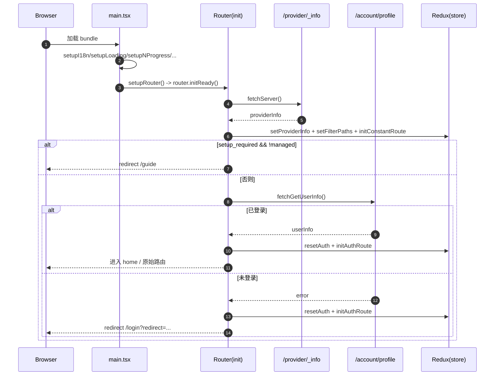

# Coco Server 后台管理平台（Web）代码结构与业务架构说明

## 1. 技术栈与关键约束

### 1.1 技术栈（从 package.json 可验证）

- 构建：Vite 5（`vite`）、TypeScript（`tsc`）
- UI：Ant Design 5（`antd`）+ ProComponents（`@ant-design/pro-components`）
- 状态管理：Redux Toolkit（`@reduxjs/toolkit`）+ React Redux（`react-redux`）
- 路由：`@sa/simple-router`（基于 React Router v6）+ `@ohh-889/react-auto-route`（构建期生成路由）
- 样式：UnoCSS（`@unocss/*`）+ SCSS/Less
- 网络：Axios（通过工作区包 `@sa/axios` 封装）
- i18n：i18next + react-i18next
- 页面 keep-alive：keepalive-for-react

源码位置：[package.json](/coco-server/web/package.json#L1-L105)

### 1.2 重要约束/假设（从实现反推）

- 请求默认带 cookie：`@sa/axios` 在模块初始化阶段设置 `axios.defaults.withCredentials = true`，意味着该管理台天然支持“cookie session / httpOnly cookie”这类认证方式，而不是强依赖前端拼接 `Authorization` header。  
  源码位置：[web/packages/axios/src/index.ts](/coco-server/web/packages/axios/src/index.ts#L1-L21)
- 路由与菜单是“文件路由 + 元信息”驱动：构建期插件扫描 `src/pages` 与布局定义生成 `src/router/elegant/*`，运行时再根据登录态/权限把路由注入 router。

---

## 2. 代码目录结构（按职责分层）

### 2.1 顶层（/web）

- `vite.config.ts`：构建输出、依赖拆包、代理、别名、插件装配  
  入口：[vite.config.ts](/coco-server/web/vite.config.ts#L1-L75)
- `build/`：Vite 插件与 build-time 配置（代理、HTML 注入、路由生成等）  
  入口：[build/plugins/index.ts](/coco-server/web/build/plugins/index.ts#L1-L26)
- `src/`：业务与运行时代码（启动、路由、状态、服务、页面）

### 2.2 运行时核心（/web/src）

- 启动入口：`src/main.tsx`  
  [main.tsx](/coco-server/web/src/main.tsx#L1-L54)
- 应用壳：`src/App.tsx`（主题/水印/路由容器）  
  [App.tsx](/coco-server/web/src/App.tsx#L1-L82)
- 路由：`src/router/*`（router 实例、guard、routes 装配）
- 状态：`src/store/*`（Redux Toolkit slices）
- 请求：`src/service/request/*` + `src/service/api/*`（统一 request + API 封装）
- 页面：`src/pages/*`（按业务域拆分）
- 布局：`src/layouts/*`（菜单、头部、内容、keep-alive、tab 等）
- 多语言：`src/locales/*`
- 微前端适配：`src/components/micro/*`

---

## 3. 构建与开发时架构（Vite + 插件体系）

### 3.1 Vite 配置关键点

- `base`：来自 `VITE_BASE_URL`
- 构建产物：输出到 `../.public`，用于与后端/同仓库静态目录对接  
  [vite.config.ts](/coco-server/web/vite.config.ts#L18-L34)
- 手动拆包：把 `@ant-design/pro-*` 打到 `vendor-antd-pro`，其余 node_modules 打到 `vendor-core`，降低首次加载/缓存失效率  
  [vite.config.ts](/coco-server/web/vite.config.ts#L22-L33)
- Dev server 代理：由 `createViteProxy(viteEnv, enableProxy)` 决定是否启用（要求 `serve` 且 `VITE_HTTP_PROXY === 'Y'`）  
  [vite.config.ts](/coco-server/web/vite.config.ts#L63-L74)

### 3.2 代理与 Service BaseURL 原理

这套代码同时满足两类运行方式：

1. 本地开发时，通过 Vite proxy 把前端请求转发到后端（避免跨域/简化 baseURL 配置）。
2. 生产部署时，前端通常与后端同域（或由网关统一转发），`baseURL` 直接是当前站点的 `origin + pathname` 或微前端注入的 proxy endpoint。

#### 3.2.1 代理路由前缀的生成规则

- 默认服务：`/proxy-default`
- 多服务：`/proxy-${key}`（`key` 若以 `/` 开头则原样视为 pattern）

实现：[createServiceConfig](/coco-server/web/src/utils/service.ts#L8-L41) + [createProxyPattern](/coco-server/web/src/utils/service.ts#L64-L78)

#### 3.2.2 Vite proxy 的 rewrite 规则

`rewrite` 用正则去掉 `proxyPattern` 前缀；当 `key` 本身以 `/` 开头时保留 pattern（用于更自由的路径拼接）。

实现：[createViteProxy](/coco-server/web/build/config/proxy.ts#L11-L25) / [createProxyItem](/coco-server/web/build/config/proxy.ts#L27-L38)

### 3.3 构建期路由生成（Elegant Router / react-auto-route）

构建期插件 `setupElegantRouter()` 会：

- 声明布局入口（base/blank）
- 从文件路由生成 routeName，并自动生成基础 meta（`i18nKey` / `title` / `constant`）
- 输出生成物到 `src/router/elegant/*`（例如 `imports.ts`、`routes.ts`）

入口：[build/plugins/router.ts](/coco-server/web/build/plugins/router.ts#L1-L46)

生成物示例：

- 页面懒加载映射：[src/router/elegant/imports.ts](/coco-server/web/src/router/elegant/imports.ts#L14-L58)
- 路由树 + 权限 meta：[src/router/elegant/routes.ts](/coco-server/web/src/router/elegant/routes.ts#L7-L632)

### 3.4 HTML 注入：buildTime 元信息

生产构建时会在 `index.html` 的 `<head>` 注入 `<meta name="buildTime" content="...">`，用于运行时做“版本更新检测”（见 `setupAppVersionNotification`：通过重新拉取 `index.html` 解析该 meta，并与编译期常量 `BUILD_TIME` 比对）。

- 注入逻辑：[build/plugins/html.ts](/coco-server/web/build/plugins/html.ts#L1-L13)
- 运行时检测：[plugins/app.ts](/coco-server/web/src/plugins/app.ts#L6-L78)

---

## 4. 运行时启动链路（从 main.tsx 到可用页面）

### 4.1 启动顺序（关键初始化）

`setupApp()` 的顺序基本体现“用户可感知优先级”：

1. i18n 初始化（否则 loading 文案/错误文案不稳定）
2. Loading HTML 注入（首屏骨架）
3. NProgress 注入到 window（路由切换/请求阶段）
4. Iconify 离线源配置（可选）
5. Router 初始化（包含 init/guard，决定跳转到 guide/login/home）
6. dayjs locale plugin
7. 判断是否微前端（Wujie）：微前端走 mount/unmount；非微前端开启版本更新提示

实现：[main.tsx](/coco-server/web/src/main.tsx#L29-L52)

### 4.2 App 壳层能力（主题/水印/路由容器）

`App.tsx` 核心职责：

- 读取主题设置（Redux）并通过 `AConfigProvider` 注入 AntD theme 与 locale
- 设置 CSS 变量与暗色模式开关
- 全局水印（可开关）
- 渲染 `RouterProvider`，并提供路由 fallback loading

实现：[App.tsx](/coco-server/web/src/App.tsx#L26-L79)

### 4.3 微前端（Wujie）适配点

当 `window.__POWERED_BY_WUJIE__` 为真：

- `main.tsx` 不调用版本更新检测，改走 `setupMicro(root, renderRoot)`
- `setupMicro` 暴露 `__WUJIE_MOUNT/__WUJIE_UNMOUNT` 并调用 `window.__WUJIE.mount()`
- 克隆子应用的本地 SVG sprite 到父文档，避免图标丢失
- hook `history.pushState/replaceState` 通知宿主 `onRouteChange`

实现：[components/micro/index.tsx](/coco-server/web/src/components/micro/index.tsx#L1-L55)

请求域名/代理端点在微前端中也可由宿主注入：

- `getProxyEndpoint()` 读取 `window.$wujie.props.proxy_endpoint`

实现：[components/micro/utils.ts](/coco-server/web/src/components/micro/utils.ts#L1-L8)

---

## 5. 路由系统：生成路由 + 运行时注入 + Guard

### 5.1 router 实例如何创建

`src/router/index.ts` 使用 `@sa/simple-router` 创建 router，并把“Elegant 路由”转换为 React Router v6 的 RouteObject：

- `layouts/pages` 来源于构建期生成的 `src/router/elegant/imports.ts`
- `transformElegantRouteToReactRoute(...)` 负责把 `component: 'layout.base$view.xxx'` 这类表达式转成真正的 lazy import
- `init` / `beforeEach` / `afterEach` 用于 guard 与标题设置
- `builtinRoutes` 提供 root / 404 / logout 等基础路由

实现：[router/index.ts](/coco-server/web/src/router/index.ts#L1-L32) + [routes/builtin.ts](/coco-server/web/src/router/routes/builtin.ts#L11-L57)

### 5.2 init 阶段：决定“去 guide / 去 login / 去 home”

`guard.init` 是应用启动后第一次“全局判定”：

1. `fetchServer()` 拉取 `/provider/_info`，写入 `serverSlice.providerInfo`
2. 根据 providerInfo 决定要“屏蔽哪些路径”（`filterPaths`）：
   - `setup_required` 相关：未初始化且非托管 -> 必须走 `/guide`
   - `search_settings.enabled` 相关：关闭 search -> 屏蔽 `/search`
3. `initConstantRoute()`：注入常量路由（静态或后端下发）
4. 若需 setup：直接返回 `{ name: 'guide' }`
5. 否则拉取 `fetchGetUserInfo()` 判定登录态：
   - 已登录：写本地 `userInfo`，`resetAuth()`，`initAuthRoute()`，必要时从 `/login` 或 `/guide` 跳回 `/`
   - 未登录：清理本地 `userInfo`，`resetAuth()`，`initAuthRoute()`，并对受保护路由重定向到 `/login?redirect=...`

实现：[router/guard/index.ts:init](/coco-server/web/src/router/guard/index.ts#L26-L91)

### 5.3 beforeEach 阶段：权限判断与 403/404 分流

核心判断维度：

- 是否常量路由（`to.meta.constant`）：常量路由不要求登录
- 是否登录：取 `authSlice.selectUserInfo`
- 权限匹配：`to.meta.permissions` + `to.meta.permissionLogic`（默认 and；`or` 表示任一权限即可）
- “超级角色”（仅静态路由模式生效）：`isStaticSuper()` 由 `VITE_STATIC_SUPER_ROLE` 决定

关键分流：

- 登录态访问 `/login`（且满足特定 path 规则）会 `window.location.href='/'` 强制刷新回根
- 未登录访问受保护路由：跳转 login 并带 redirect
- 已登录但无权限：跳转 403

实现：[router/guard/index.ts:createRouteGuard](/coco-server/web/src/router/guard/index.ts#L98-L195)

### 5.4 静态/动态路由模式（Route Slice）

路由注入由 `routeSlice` 完成，受两个 env 控制：

- `VITE_CONSTANT_ROUTE_MODE`：常量路由来源（`static` 或从后端 `fetchGetConstantRoutes` 拉取）
- `VITE_AUTH_ROUTE_MODE`：鉴权路由来源（`static`：本地生成路由按权限过滤；`dynamic`：后端下发 user routes）

实现：[store/slice/route/index.ts](/coco-server/web/src/store/slice/route/index.ts#L182-L260)

静态鉴权路由按权限过滤的核心算法：

- `filterAuthRoutesByPermissions(routes, permissions)` 递归过滤并支持 `permissionLogic=or`

实现：[store/slice/route/shared.ts](/coco-server/web/src/store/slice/route/shared.ts#L43-L68)

---

## 6. 状态管理与全局能力注入（Redux + AntD App）

### 6.1 Store 组成

Store 以 slice 组合为主（无手写 combineReducers）：

- `routeSlice`：路由注入、菜单排序、keep-alive cache key、屏蔽路径等
- `authSlice`：登录、用户信息、登出清理
- `themeSlice`：主题色/暗黑/布局设置，负责把 CSS 变量写到 HTML
- `tabSlice`：多标签页（GlobalTab）
- `appSlice`：响应式、sider 折叠、reload flag 等
- `serverSlice`：providerInfo（后端能力/部署形态）与根路由联动

入口：[store/index.ts](/coco-server/web/src/store/index.ts#L1-L27)

### 6.2 AntD message/modal/notification 的全局挂载

`AppProvider` 使用 `App.useApp()` 把 `message/modal/notification` 挂载到 `window.$message/$modal/$notification`，使 service/request 层也能弹错误提示或登出弹窗。

实现：[components/stateful/AppProvider.tsx](/coco-server/web/src/components/stateful/AppProvider.tsx#L8-L40)

---

## 7. 页面渲染与 keep-alive（布局层的核心职责）

### 7.1 BaseLayout：统一骨架与微前端裁剪

BaseLayout 基于 `@sa/materials` 的 `AdminLayout`：

- 非微前端：显示 Header/Sider/Breadcrumb/Tab/Footer
- 微前端：将这些“宿主已提供的能力”置空，只渲染内容区
- 在微前端场景下还会把 `nav` 与 `logout` 能力回传给宿主（`onMicroMounted`）

实现：[layouts/base-layout/BaseLayout.tsx](/coco-server/web/src/layouts/base-layout/BaseLayout.tsx#L34-L171)

### 7.2 GlobalContent：按路由 key 做 keep-alive

keep-alive 关键点：

- `cacheKey = (pathname + search)` 去掉前缀 `/` 并把 `/` 替换为 `_`，保证每个页面实例可唯一标识
- `include={cacheKeys}`：cacheKeys 来自 `routeSlice`（从 route meta keepAlive 推导）
- 支持 “指定 key 销毁缓存” 与 “reload 刷新缓存”

实现：[layouts/modules/global-content/index.tsx](/coco-server/web/src/layouts/modules/global-content/index.tsx#L14-L61)

---

## 8. 请求层：统一 request、错误处理、登出与 token 刷新

### 8.1 request 实例的核心配置

`request` 使用 `createFlatRequest` 封装，返回 `{ data, error, response }` 的扁平结构，页面层可用 `if (!error)` 模式处理。

关键配置点：

- `baseURL`：dev 代理时用 `/proxy-default` 之类的 pattern；否则走 `getProxyEndpoint()`（微前端注入）或当前 origin/pathname
- `onRequest`：dev 模式可注入 `X-API-TOKEN`（便于本地绕过登录）
- `isBackendSuccess`：以 `response.status === 200` 判成功
- `transformBackendResponse`：直接返回 `response.data`

实现：[service/request/index.ts](/coco-server/web/src/service/request/index.ts#L9-L46)

### 8.2 “后端失败”与“网络失败”的处理分工

- 后端失败（HTTP 200 但业务失败语义）：走 `onBackendFail` -> `backEndFail`
- 网络失败/HTTP 错误：走 `onError` -> `handleError`

实现：

- [service/request/error.ts](/coco-server/web/src/service/request/error.ts#L28-L87)
- [service/request/error.ts](/coco-server/web/src/service/request/error.ts#L90-L130)

### 8.3 登出与重定向策略（与搜索模式联动）

登出时会根据当前 hash 路径与 providerInfo 的 search 集成情况，决定回到 `/search` 还是 `/login`。

实现：[service/request/error.ts:handleLogout](/coco-server/web/src/service/request/error.ts#L14-L25) + [server/shared.ts:getRootRouteIfSearch](/coco-server/web/src/store/slice/server/shared.ts#L1-L9)

### 8.4 过期 token 刷新（并发折叠）

当业务错误码命中 `VITE_SERVICE_EXPIRED_TOKEN_CODES`：

1. `handleExpiredRequest` 只允许同时存在一个 refresh promise（`state.refreshTokenFn`）
2. refresh 成功后重放原请求

实现：

- [service/request/shared.ts](/coco-server/web/src/service/request/shared.ts#L21-L47)
- [service/request/error.ts](/coco-server/web/src/service/request/error.ts#L74-L84)

补充：`@sa/axios` 默认 `withCredentials=true`，因此平台既支持 cookie session，也可以在需要时通过自定义 header/refresh token 方案扩展；当前 `request` 的默认 `onRequest` 并不拼接 `Authorization`，更偏向“同域 cookie”工作方式。  
参考：[web/packages/axios/src/index.ts](/coco-server/web/packages/axios/src/index.ts#L1-L21)

### 8.5 登录态与 token：当前实现的“主路径”与“备用路径”

从代码可见，这个管理台同时具备两类认证/会话路径：

- 主路径更偏向 cookie session：`@sa/axios` 全局启用 `withCredentials=true`，而 `service/request/index.ts` 的默认 `onRequest` 并不会为每个请求拼接 `Authorization: Bearer ...`。  
  参考：[web/packages/axios/src/index.ts](/coco-server/web/packages/axios/src/index.ts#L1-L21) + [service/request/index.ts](/coco-server/web/src/service/request/index.ts#L35-L44)
- 代码里也存在 refresh token 与 Bearer token 的能力，但与当前登录 slice 的“写入方式”并不完全闭环：
  - 登录接口返回 `access_token`（`/account/login`），登录成功后 `authSlice` 把 token 放进 Redux state，并把 userInfo 写入 local storage；但看不到把 `token/refreshToken` 写入 local storage 的逻辑（`getToken()` 也是从 local storage 读）。  
    参考：[service/api/auth.ts:fetchLogin](/coco-server/web/src/service/api/auth.ts#L8-L19) + [authSlice.login](/coco-server/web/src/store/slice/auth/index.ts#L18-L50) + [auth/shared.ts:getToken](/coco-server/web/src/store/slice/auth/shared.ts#L1-L10)
  - refresh token 流程依赖 `localStg.get('refreshToken')`，并在 refresh 成功后写回 `token/refreshToken`；这更像是“另一条认证路径”或遗留实现（例如某些部署/网关模式需要前端显式维护 token）。  
    参考：[service/request/shared.ts](/coco-server/web/src/service/request/shared.ts#L21-L33) + [service/api/auth.ts:fetchRefreshToken](/coco-server/web/src/service/api/auth.ts#L47-L60)

结论上，描述这套平台时更准确的表述是：它优先按“同域 cookie session”工作，同时保留了 token/refresh token 的扩展能力（以及 dev 环境 `X-API-TOKEN` 注入作为调试入口）。

---

## 9. 业务模块划分（页面即边界）

下面按“路由 + 页面目录”把后台核心能力分组（可直接在生成路由映射中验证）。

路由/页面映射入口：[router/elegant/imports.ts](/coco-server/web/src/router/elegant/imports.ts#L19-L58)

### 9.1 初始化与登录

- 初始化向导：`/guide`  
  入口：[pages/guide/index.tsx](/coco-server/web/src/pages/guide/index.tsx)（由 init 阶段 `setup_required` 决定是否强制跳转）
- 登录页：`/login`（托管模式下支持 SSO 外跳）  
  入口：[pages/login/index.tsx](/coco-server/web/src/pages/login/index.tsx)  
  关键表单：[LoginForm.tsx](/coco-server/web/src/pages/login/modules/LoginForm.tsx#L18-L114)

### 9.2 AI/LLM 配置域

- AI Assistant：`/ai-assistant/*`（列表/新增/编辑）  
  列表页实现示例：[ai-assistant/list/index.tsx](/coco-server/web/src/pages/ai-assistant/list/index.tsx#L1-L40)  
  路由权限：`coco#assistant/*`  
  路由定义：[router/elegant/routes.ts](/coco-server/web/src/router/elegant/routes.ts#L41-L91)
- 模型提供商（LLM Provider）：`/model-provider/*`（列表/新增/编辑）  
  路由权限：`coco#model_provider/*`
- MCP Server：`/mcp-server/*`（列表/新增/编辑）  
  路由权限：`coco#mcp_server/*`

这些模块通常共同决定“Agent 能力的输入侧配置”，其 CRUD API 统一在 `src/service/api/*`。

### 9.3 数据接入与内容域

- 数据源：`/data-source/*`（列表/新增/编辑/详情）  
  列表权限：`coco#datasource/search`  
  详情模块示例（文档列表/映射管理等）：  
  [FileManagement.tsx](/coco-server/web/src/pages/data-source/detail/modules/FileManagement.tsx#L1-L30) / [MappingManagement.tsx](/coco-server/web/src/pages/data-source/detail/modules/MappingManagement.tsx#L1-L10)
- 连接器（Connector）：`/connector/*`（隐藏菜单，作为 settings 的子能力）  
  路由权限：`coco#connector/*`（permissionLogic=or）  
  新建页示例：[connector/new/index.tsx](/coco-server/web/src/pages/connector/new/index.tsx#L1-L20)

### 9.4 安全域（用户/角色/授权与 API Token）

- 用户/角色/授权：`/security` + `/user/*` + `/role/*` + `/auth/*`  
  权限 key 前缀：`generic#security:*`（permissionLogic=or 组合显示）
- API Token：`/api-token/list`  
  页面实现：[api-token/list/index.tsx](/coco-server/web/src/pages/api-token/list/index.tsx#L1-L25)  
  对应 API：[service/api/api-token.ts](/coco-server/web/src/service/api/api-token.ts#L1-L39)

### 9.5 系统与集成域

- Settings：`/settings`（system/connector 等能力入口的聚合）  
  路由权限：`coco#system/read` 或 `coco#connector/search`
- Integration：`/integration/*`（列表/新增/编辑）  
  路由权限：`coco#integration/*`
- Webhook：`/webhook/*`（路由树存在但当前 meta 未声明 permissions，具体访问控制可能由后端接口鉴权兜底）  
  路由定义：[router/elegant/routes.ts](/coco-server/web/src/router/elegant/routes.ts#L596-L631)

---

## 10. 典型流程拆解（端到端“发生了什么”）

### 10.1 应用冷启动（首次进入站点）

对应实现：[main.tsx](/coco-server/web/src/main.tsx#L29-L52) + [guard.init](/coco-server/web/src/router/guard/index.ts#L26-L91)

### 10.2 路由与菜单如何“按权限可见”

静态路由模式下（`VITE_AUTH_ROUTE_MODE=static`）：

1. 构建期生成完整路由树（含 meta.permissions）
2. 登录后读取 `userInfo.permissions`
3. `filterAuthRoutesByPermissions` 递归裁剪路由树
4. `router.addReactRoutes(sortRoutes)` 注入可访问的路由
5. 菜单/Tab/keep-alive 都基于这棵“已裁剪”的路由树工作

关键实现链路：

- [initAuthRoute](/coco-server/web/src/store/slice/route/index.ts#L249-L260)
- [filterAuthRoutesByPermissions](/coco-server/web/src/store/slice/route/shared.ts#L43-L68)
- [createRouteGuard 权限判断](/coco-server/web/src/router/guard/index.ts#L123-L176)

### 10.3 列表页常见的“搜索 + 表格 + 批量操作”模式

多个业务模块采用类似的数据模型与交互：

- UI 层发起 `_search` 请求（通常带分页、filter）
- 后端返回 ES 风格的 `{ hits: { hits: [...] } }` 时，统一用 `formatESSearchResult` 抹平为 `{ data, total, took, aggregations }`
- 表格组件直接消费 `data/total`，并把 filter/keyword 同步到 query string（`useQueryParams`）

通用转换：[formatESSearchResult](/coco-server/web/src/service/request/es.ts#L1-L43)

示例页面（任取一类即可看到类似结构）：

- [ai-assistant/list](/coco-server/web/src/pages/ai-assistant/list/index.tsx)
- [model-provider/list](/coco-server/web/src/pages/model-provider/list/index.tsx)
- [api-token/list](/coco-server/web/src/pages/api-token/list/index.tsx)

---

## 11. 与后端能力的耦合点（从前端可见的“契约”）

### 11.1 权限 key 命名与路由 meta.permissions

路由 meta 中出现的权限 key（例如 `coco#assistant/search`、`generic#security:user/search`）是前端“可见性/可访问性”的第一道门槛；真正的安全边界仍应由后端接口鉴权兜底。

可见位置：[router/elegant/routes.ts](/coco-server/web/src/router/elegant/routes.ts#L41-L555)

### 11.2 ProviderInfo 驱动的 UI 模式切换

providerInfo 至少影响：

- 是否必须走初始化向导（`setup_required` / `managed`）
- 是否开放 `/search`（`search_settings.enabled`）
- 根路由是否切换为 `search`（`search_settings.integration`）

实现：[guard.init](/coco-server/web/src/router/guard/index.ts#L26-L52) + [serverSlice](/coco-server/web/src/store/slice/server/index.ts#L17-L46)

---

## 12. 快速定位问题的导航（从现象到文件）

- 首屏进了 guide / login / home？看：[router/guard/index.ts:init](/coco-server/web/src/router/guard/index.ts#L26-L91)
- 某个菜单不显示/路由进不去？看：
  - 路由 meta.permissions：[router/elegant/routes.ts](/coco-server/web/src/router/elegant/routes.ts)
  - 静态过滤逻辑：[route/shared.ts](/coco-server/web/src/store/slice/route/shared.ts#L43-L68)
  - beforeEach 权限判断：[router/guard/index.ts](/coco-server/web/src/router/guard/index.ts#L123-L176)
- API 请求 baseURL 不对/跨域？看：
  - baseURL 推导：[service/request/index.ts](/coco-server/web/src/service/request/index.ts#L9-L14)
  - dev proxy：[build/config/proxy.ts](/coco-server/web/build/config/proxy.ts#L11-L38)
  - 微前端 proxy_endpoint：[components/micro/utils.ts](/coco-server/web/src/components/micro/utils.ts#L1-L8)
