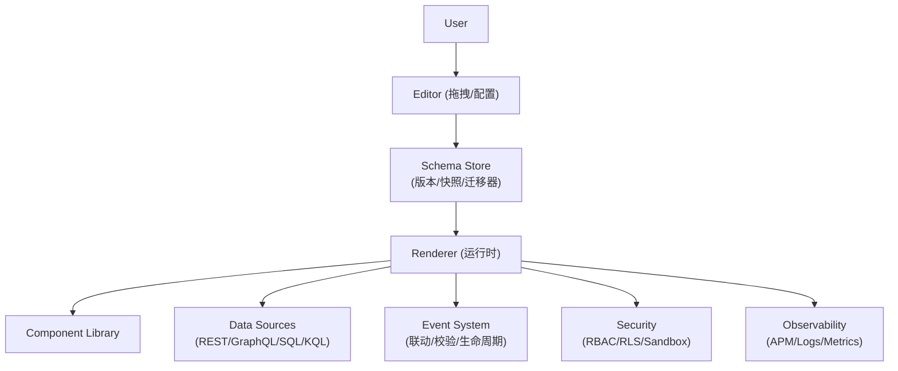

# 低代码平台（核心/难点/架构/话术）

## 1. 一句话与价值主张

- 一句话：低代码不是“拖拖拽拽做页面”，而是用**Schema/DSL**抽象产品能力，把“配置→代码生成→安全运行→可观测”做成闭环平台，让业务以分钟级交付、工程以制度化治理。
- 价值主张：提升交付效率（复用）、保证口径一致（治理）、降低技术门槛（平台化），同时保持扩展性与安全性。

## 2. 核心理念（Platform Thinking）

- Schema/DSL：用统一的结构化描述承载页面/组件/数据/交互。强调版本化、校验、兼容迁移。
- 双引擎：编辑器（Editor）负责**配置**，运行时（Renderer）负责**渲染**。两端共享同一份 Schema。
- 组件生态：以原子组件 + 复合组件为单位封装能力，强约束输入输出（Props/Events/DataBinding）。
- 数据与事件：统一数据源接口（REST/GraphQL/SQL/KQL），统一事件总线（表单提交、联动、校验、生命周期）。
- 权限与发布：RBAC/租户/行列级权限；灰度/快照/回滚；审计与变更追踪。

## 3. 总体架构



## 4. 关键难点与解决方案（STAR）

- 难点一：Schema 设计与演进兼容
  - S：平台不断演进，老版本 Schema 需要在新运行时正确渲染；直改容易“炸库”
  - T：保证**向后兼容**与**可迁移**，避免配置成为技术债
  - A：引入 Schema 版本字段；编写迁移器（migrator）做逐版本变换；建立 JSON Schema 校验与默认值填充；增量读写（避免全量重写）
  - R：线上迁移可控，历史配置可复用；发布无感升级

- 难点二：拖拽/画布性能与复杂交互
  - S：画布存在大量选中/对齐/缩放/吸附操作，列表与树渲染卡顿
  - T：保证编辑器 60fps，复杂组件仍可顺滑操作
  - A：画布采用 Canvas/WebGL + 局部重绘；列表用虚拟化与窗口化；事件合并与节流；使用选择框区域索引（Quadtree）加速命中；重计算下沉 WebWorker
  - R：编辑器在复杂布局下保持 55–60fps，可视化操作流畅

- 难点三：表达式/公式引擎的安全与可维护
  - S：允许用户在配置里写条件与公式，易引入安全与性能问题
  - T：提供能力同时保证沙箱隔离与可调试性
  - A：表达式语言使用受限 DSL；运行在 Sandbox（禁止访问全局对象/IO）；提供可视化调试器（输入/输出/中间值），并做缓存与预算（超时/递归深度）
  - R：零逃逸安全事故，复杂联动可视化可调试

- 难点四：多租户与细粒度权限
  - S：同一平台服务多个租户，要求到组件/数据的细粒度控制
  - T：实现 RBAC + RLS（行级安全）+ 列级脱敏；配置按租户隔离
  - A：在数据源层注入租户/用户上下文；后端做行列过滤与脱敏；前端做可视化的权限提示与“无权即不可见”
  - R：合规通过审计，跨租户复用不泄露

- 难点五：插件生态与隔离
  - S：要让外部团队扩展组件/数据源/动作，但不能污染宿主
  - T：设计插件 API 与生命周期，并保证隔离与版本兼容
  - A：插件运行时沙箱（iframe/postMessage 或 Module Sandboxing）；定义稳定的接口契约（类型/事件/数据）；版本与能力检查，灰度发布与回滚；错误边界包裹
  - R：生态扩展不破主干，第三方上线可控

## 5. Schema 示例（简化）

```json
{
  "version": "2.1",
  "page": {
    "id": "dashboard-001",
    "layout": { "cols": 12, "rowHeight": 8 }
  },
  "components": [
    {
      "type": "Chart.Line",
      "id": "c1",
      "data": { "source": "sales", "query": "SELECT date, sum(amount) AS v GROUP BY date" },
      "binding": { "x": "date", "y": "v" },
      "events": [{ "on": "click", "do": [{ "action": "setFilter", "target": "table1", "params": { "date": "{{event.date}}" } }] }]
    }
  ],
  "datasources": [{ "name": "sales", "kind": "sql", "conn": "postgres://..." }]
}
```

## 6. 工程化与交付

- Monorepo 管理（编辑器/运行时/组件库/数据源适配）；手动分包与按需加载
- 质量门禁：Schema 校验、插件能力检查、产物扫描（禁止宿主私有依赖泄露）
- E2E 测试：Playwright（画布拖拽/联动/发布流程）
- 发布策略：灰度 + 快照回滚；变更审计（谁改了什么、何时生效）

## 7. 指标与可观测

- 编辑器：帧率/FPS、操作响应时间、崩溃率、长任务占比
- 运行时：TTFB/LCP/INP、错误率、图表渲染耗时、数据源请求预算与超时率
- 平台：Schema 体积、复用率、发布成功率、插件故障隔离率

## 8. 面试话术模板（可直接复述）

- 30 秒电梯陈述：
  - “我做的是 Schema/DSL 驱动的低代码平台：编辑器生成配置，运行时渲染执行，配套表达式引擎、数据源适配、权限治理与灰度回滚。在复杂拖拽画布与大数据场景下，通过虚拟化、局部重绘与预算熔断保证体验与稳定性。”
- 3 分钟 STAR 展开（选 2 个难点）：
  - Schema 演进兼容：版本化 + 迁移器 + 校验 → 旧配置稳态运行
  - 表达式引擎沙箱与调试：受限 DSL + Sandbox + 可视化调试器 → 零逃逸且可维护
- 深挖主题（任选）：
  - 组件生态与隔离、拖拽画布性能、数据源治理与权限、灰度与回滚体系
- 反问：
  - 平台 Schema 版本策略、插件隔离模型、数据源权限口径、观测指标与上线形态

## 9. 调试与排障（方法论）

- 画布：开启渲染边界显示、统计重绘区域、长任务分析
- 运行时：事件回放（录制/重放）、数据绑定可视化（观察值变化）
- 配置：Schema 校验器/迁移器的 CLI；快照比对与差异可视化
- 平台：APM/日志/报警；预算熔断与降级策略验证

## 10. 反模式与避坑

- 无版本 Schema；表达式随意执行 JS；插件与宿主强耦合；无审计与回滚；无监控与预算  
- 忽视数据源口径与权限导致“看起来能用但不可交付”
