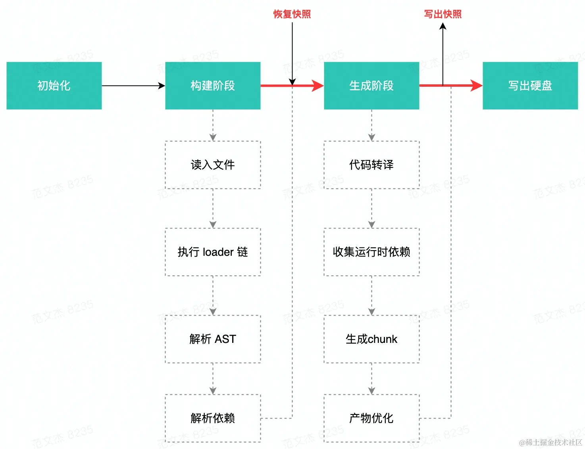

# Webpack 5

## Webpack 配置项

### Webpack 的打包过程


- `输入`：从文件系统读入代码文件；
- `模块递归处理`：调用 Loader 转译 Module 内容，并将结果转换为 AST，从中分析出模块依赖关系，进一步递归调用模块处理过程，直到所有依赖文件都处理完毕；
- `后处理`：所有模块递归处理完毕后开始执行后处理，包括模块合并、注入运行时、产物优化等，最终输出 Chunk 集合；
- `输出`：将 Chunk 写出到外部文件系统；

从上述打包流程角度，**Webpack 配置项大体上可分为两类**：

- `流程类`：作用于打包流程某个或若干个环节，直接影响编译打包效果的配置项
- `工具类`：打包主流程之外，提供更多工程化工具的配置项

### 与打包流程强相关的配置项

- 输入输出：
  - `entry`：用于定义项目入口文件，Webpack 会从这些入口文件开始按图索骥找出所有项目文件；
  - `context`：项目执行上下文路径；
  - `output`：配置产物输出路径、名称等；
- 模块处理：
  - `resolve`：用于配置模块路径解析规则，可用于帮助 Webpack 更精确、高效地找到指定模块
  - `module`：用于配置模块加载规则，例如针对什么类型的资源需要使用哪些 Loader 进行处理
  - `externals`：用于声明外部资源，Webpack 会直接忽略这部分资源，跳过这些资源的解析、打包操作
- 后处理：
  - `optimization`：用于控制如何优化产物包体积，内置 Dead Code Elimination、Scope Hoisting、代码混淆、代码压缩等功能
  - `target`：用于配置编译产物的目标运行环境，支持 web、node、electron 等值，不同值最终产物会有所差异
  - `mode`：编译模式短语，支持 development、production 等值，可以理解为一种声明环境的短语

1. Webpack 首先需要根据输入配置(`entry/context`) 找到项目入口文件；
2. 之后根据按模块处理(`module/resolve/externals` 等) 所配置的规则逐一处理模块文件，处理过程包括转译、依赖分析等；
3. 模块处理完毕后，最后再根据后处理相关配置项(`optimization/target` 等)合并模块资源、注入运行时依赖、优化产物结构等。

### 工具类配置项

- 开发效率类：
  - `watch`：用于配置持续监听文件变化，持续构建
  - `devtool`：用于配置产物 Sourcemap 生成规则
  - `devServer`：用于配置与 HMR 强相关的开发服务器功能
- 性能优化类：
  - `cache`：Webpack 5 之后，该项用于控制如何缓存编译过程信息与编译结果
  - `performance`：用于配置当产物大小超过阈值时，如何通知开发者
- 日志类：
  - `stats`：用于精确地控制编译过程的日志内容，在做比较细致的性能调试时非常有用
  - `infrastructureLogging`：用于控制日志输出方式，例如可以通过该配置将日志输出到磁盘文件
- 等等


### 配置结构详解

Webpack 还支持以`数组、函数`方式配置运行参数，以适配不同场景应用需求，它们之间大致上区别：

- `单个配置对象`：比较常用的一种方式，逻辑简单，适合大多数业务项目；
- `配置对象数组`：每个数组项都是一个完整的配置对象，每个对象都会触发一次单独的构建，通常用于需要为同一份代码构建多种产物的场景，如 Library；
- `函数`：Webpack 启动时会执行该函数获取配置，我们可以在函数中根据环境参数(如 NODE_ENV)动态调整配置对象。

**使用数组方式时**，Webpack 会在启动后创建多个 `Compilation` 实例，并行执行构建工作，但需要注意，`Compilation` 实例间基本上不作通讯，这意味着这种并行构建对运行性能并没有任何正向收益，例如某个 Module 在 Compilation 实例 A 中完成解析、构建后，在其它 Compilation 中依然需要完整经历构建流程，无法直接复用结果。

数组方式主要用于应对 **“同一份代码打包出多种产物”** 的场景，例如在`构建 Library` 时，我们通常需要同时构建出 `ESM/CMD/UMD` 等模块方案的产物。

**配置函数方式**要求在配置文件中导出一个函数，并在函数中返回 Webpack 配置对象，或配置数组，或 Promise 对象。

```js
module.exports = function(env, argv) {
  // ...
  return {
    entry: './src/index.js',
    // 其它配置...
  }
}
```
- `env`：通过 --env 传递的命令行参数，适用于自定义参数
- `argv`：命令行 Flags 参数，支持 entry/output-path/mode/merge 等

“配置函数”这种方式的意义在于，**允许用户根据命令行参数动态创建配置对象，可用于实现简单的多环境治理策略**。

“配置函数”这种方式缺点：
- 一是因为需要在配置函数内做许多逻辑判断，复杂场景下可能可读性会很低，维护成本高；
- 二是强依赖于命令行参数，可能最终需要写出一串很长的运行命令，应用体验较差。

### 环境治理策略

根据部署环境需求，对同一份代码执行各有侧重的打包策略，例如：
- 开发环境需要使用 `webpack-dev-server` 实现 `Hot Module Replacement`；
- 测试环境需要带上完整的 `Soucemap` 内容，以帮助更好地定位问题；
- 生产环境需要尽可能打包出更快、更小、更好的应用代码，确保用户体验。

### 核心配置项

- `entry`：声明项目入口文件，Webpack 会从这个文件开始递归找出所有文件依赖；
  - `字符串`：指定入口文件路径；
  - `对象`：对象形态功能比较完备，除了可以指定入口文件列表外，还可以指定入口依赖、Runtime 打包方式等；
    - `import`：声明入口文件，支持路径字符串或路径数组(多入口)；
    - `dependOn`：声明该入口的前置依赖 Bundle；
    - `runtime`：设置该入口的 Runtime Chunk，若该属性不为空，Webpack 会将该入口的运行时代码抽离成单独的 Bundle；
    - `filename`：效果与 output.filename 类同，用于声明该模块构建产物路径；
    - `library`：声明该入口的 output.library 配置，一般在构建 NPM Library 时使用；
    - `publicPath`：效果与 output.publicPath 相同，用于声明该入口文件的发布 URL；
    - `chunkLoading`：效果与 output.chunkLoading 相同，用于声明异步模块加载的技术方案，支持 false/jsonp/require/import 等值；
    - `asyncChunks`：效果与 output.asyncChunks 相同，用于声明是否支持异步模块加载，默认值为 true。
  - `函数`：动态生成 Entry 配置信息，函数中可返回字符串、对象或数组；
  - `数组`：指明多个入口文件，数组项可以为上述介绍的文件路径字符串、对象、函数形式，Webpack 会将数组指明的入口全部打包成一个 Bundle。
- `output`：声明构建结果的存放位置；
  - `output.path`：声明产物放在什么文件目录下；
  - `output.filename`：声明产物文件名规则，支持 [name]/[hash] 等占位符；
  - `output.publicPath`：文件发布路径，在 Web 应用中使用率较高；
  - `output.clean`：是否自动清除 path 目录下的内容，调试时特别好用；
  - `output.library`：NPM Library 形态下的一些产物特性，例如：Library 名称、模块化(UMD/CMD 等)规范；
  - `output.chunkLoading`：声明加载异步模块的技术方案，支持 false/jsonp/require 等方式。
- `target`：用于配置编译产物的目标运行环境，支持 web、node、electron 等值，不同值最终产物会有所差异；
  - `node[[X].Y]`：编译为 Node 应用，此时将使用 Node 的 require 方法加载其它 Chunk，支持指定 Node 版本，如：node12.13；
  - `async-node[[X].Y]`：编译为 Node 应用，与 node 相比主要差异在于：async-node 方式将以异步(Promise)方式加载异步模块(node 时直接使用 require)。支持指定 Node 版本，如：async-node12.13；
  - `nwjs[[X].Y]`：编译为 NW.js 应用；
  - `node-webkit[[X].Y]`：同 nwjs；
  - `electron[[X].Y]-main`：构建为 Electron 主进程；
  - `electron[[X].Y]-renderer`：构建为 Electron 渲染进程；
  - `electron[[X].Y]-preload`：构建为 Electron Preload 脚本；
  - `web`：构建为 Web 应用；
  - `esX`：构建为特定版本 ECMAScript 兼容的代码，支持 es5、es2020 等；
  - `browserslist`：根据浏览器平台与版本，推断需要兼容的 ES 特性，数据来源于 Browserslist 项目，用法如：browserslist: 'last 2 major versions'。
- `mode`：编译模式短语，支持 development、production 等值，Webpack 会根据该属性推断默认配置；
  - `production`：默认值，生产模式，使用该值时 Webpack 会自动帮我们开启一系列优化措施：Three-Shaking、Terser 压缩代码、SplitChunk 提起公共代码，通常用于生产环境构建；
  - `development`：开发模式，使用该值时 Webpack 会保留更语义化的 Module 与 Chunk 名称，更有助于调试，通常用于开发环境构建；
  - `none`：关闭所有内置优化规则。
- `optimization`：用于控制如何优化产物包体积，内置 Dead Code Elimination、Scope Hoisting、代码混淆、代码压缩等功能；
- `module`：用于声明模块加载规则，例如针对什么类型的资源需要使用哪些 Loader 进行处理；
- `plugin`：Webpack 插件列表。

## Babel+TS+ESLint

### Babel

Babel 是一个开源 JavaScript 转编译器，它能将高版本 —— 如 ES6 代码等价转译为向后兼容，能直接在旧版 JavaScript 引擎运行的低版本代码。

>Babel 还提供了一个在线版的 REPL 页面， [babeljs.io/repl](https://babeljs.io/repl) 实时体验功能效果。

Babel 提供的语言转译能力，能在确保产物兼容性的同时，让我们大胆使用各种新的 ECMAScript 语言特性。

### TypeScript

时至今日 TypeScript 依然是一项应用广泛的 JavaScript 超集语言。特别适合用于构建多人协作的大型 JavaScript 项目。

TypeScript 提供的类型检查能力，能有效提升应用代码的健壮性。

### ESLint

ESLint 是一种扩展性极佳的 JavaScript 代码风格检查工具，它能够自动识别违反风格规则的代码并予以修复。

ESLint 提供的风格检查能力，能确保多人协作时的代码一致性。

## Webpack 与 CSS

在 Webpack 中处理 CSS 文件，通常需要用到：

- `css-loader`：该 Loader 会将 CSS 等价翻译为形如 `module.exports = "${css}"` 的JavaScript 代码，使得 Webpack 能够如同处理 JS 代码一样解析 CSS 内容与资源依赖；
- `style-loader`：该 Loader 将在产物中注入一系列 runtime 代码，这些代码会将 CSS 内容注入到页面的 `<style>`标签，使得样式生效；
- `mini-css-extract-plugin`：该插件会将 CSS 代码抽离到单独的 .css 文件，并将文件通过 `<link>` 标签方式插入到页面中。


- **开发环境**：使用 `style-loader` 将样式代码注入到页面 `<style>` 标签；
- **生产环境**：使用 `mini-css-extract-plugin` 将样式代码抽离到单独产物文件，并以 `<link>` 标签方式引入到页面中。

经过 `style-loader + css-loader` 处理后，样式代码最终会被写入 Bundle 文件，并在运行时通过 `style` 标签注入到页面。这种将 JS、CSS 代码合并进同一个产物文件的方式有几个问题：

- JS、CSS 资源无法并行加载，从而降低页面性能；
- 资源缓存粒度变大，JS、CSS 任意一种变更都会致使缓存失效。

因此，生产环境中通常会用 `mini-css-extract-plugin` 插件替代 `style-loader`，将样式代码抽离成单独的 CSS 文件。

- `mini-css-extract-plugin` 库同时提供 Loader、Plugin 组件，需要同时使用
- `mini-css-extract-plugin` 不能与 style-loader 混用，否则报错，所以需要判断 process.env.NODE_ENV 环境变量决定使用那个 Loader
- `mini-css-extract-plugin` 需要与 `html-webpack-plugin` 同时使用，才能将产物路径以 `link` 标签方式插入到 html 中

### 预处理器

### post-css

PostCSS 也能在原生 CSS 基础上增加更多表达力、可维护性、可读性更强的语言特性。

PostCSS 并没有定义一门新的语言，而是与 @babel/core 类似，只是实现了一套将 CSS 源码解析为 AST 结构，并传入 PostCSS 插件做处理的流程框架，具体功能都由插件实现。

PostCSS 之于 CSS，则更像 Babel 与 JavaScript。

PostCSS 最大的优势在于其简单、易用、丰富的插件生态，基本上已经能够覆盖样式开发的方方面面。实践中，经常使用的插件有：

- `autoprefixer`：基于 Can I Use 网站上的数据，自动添加浏览器前缀
- `postcss-preset-env`：一款将最新 CSS 语言特性转译为兼容性更佳的低版本代码的插件
- `postcss-less`：兼容 Less 语法的 PostCSS 插件，类似的还有：postcss-sass、poststylus
- `stylelint`：一个现代 CSS 代码风格检查器，能够帮助识别样式代码中的异常或风格问题

## Webpack 与 Vue

### Vue-loader 处理 SFC 代码

Vue SFC(Single File Component) 文件(*.vue)是使用类 HTML 语法描述 Vue 组件的自定义文件格式，文件由四种类型的顶层语法块组成：

- `<template>`：用于指定 Vue 组件模板内容，支持类 HTML、Pug 等语法，其内容会被预编译为 JavaScript 渲染函数；
- `<script>`：用于定义组件选项对象，在 Vue2 版本支持导出普通对象或 defineComponent 值；Vue3 之后还支持 `<script setup>` 方式定义组件的 `setup()` 函数；
- `<style>`：用于定义组件样式，通过配置适当 Loader 可实现 Less、Sass、Stylus 等预处理器语法支持；也可通过添加 `scoped、module` 属性将样式封装在当前组件内；
- `Custom Block`：用于满足领域特定需求而预留的 SFC 扩展模块，例如 `<docs>`；Custom Block 通常需要搭配特定工具使用，详情可参考 [Custom Blocks | Vue Loader](https://vue-loader.vuejs.org/zh/guide/custom-blocks.html#example) 。

原生 Webpack 并不能处理这种内容格式的文件，为此我们需要引入专用于 Vue SFC 的加载器：`vue-loader`。

>提示：vue-loader 库同时提供用于处理 SFC 代码转译的 Loader 组件，与用于处理上下文兼容性的 Plugin 组件，两者需要同时配置才能正常运行。

- `<template>` 内容会被转译为用于构造 Virtual Dom 结构的 render 函数；
- `<script>` 标签导出的对象会被转译为 JavaScript 对象字面量形式。
- `<style>` 模块也将被转译为 JavaScript 内容。

### 运行 vue 页面

接入的 `vue-loader` 使得 Webpack 能够正确理解、翻译 Vue SFC 文件的内容，接下来让页面真正运行起来，这里会用到：

- 使用 `html-webpack-plugin` 自动生成 HTML 页面；
- 使用 `webpack-dev-server` 让页面真正运行起来，并具备热更新能力。

其中 `html-webpack-plugin` 是一款根据编译产物自动生成 HTML 文件的 Webpack 插件，借助这一插件我们无需手动维护产物数量、路径、hash 值更新等问题。

接入 `html-webpack-plugin` 后，还需要使用 `webpack-dev-server` 启动一套本地开发服务器。`webpack-dev-server` 主要提供两种功能：

- 结合 Webpack 工作流，提供基于 HTTP(S) 协议的静态资源服务；
- 提供资源热更新能力，在保持页面状态前提下自动更新页面代码，提升开发效率。

### vue 复用其它编译工具

`vue-loader` 能够复合使用其它 Webpack Loader 的能力处理各个模块内容，包括：

- 使用 `babel-loader、ts-loader` 等处理 SFC 的 `<script>` 模块；
- 使用 `less-loader、sass-loader` 等处理 `<style>` 模块；
- 使用 `pug-plain-loader` 等处理 `<template>` 模块。

为了达到这种效果，用法上我们需要为每种模块配置相应的 Webpack 处理规则，并正确设置模块的 `lang` 属性值。

`<template>` 的处理规则会稍微不同，因为绝大部分 Webpack 模板类 Loader 都会返回一个模板函数，而不是编译好的 HTML 片段，这与 Vue SFC 将 `<template>` 编译为 `render 函数`的规则相冲突，此时通常需要使用一个返回原始的 HTML 字符串的 loader，例如使用 `pug-plain-loader`，而不是 pug-loader。

### vue 使用 SSR

`SPA` 已经能解决许多前后端协作的开发效率、性能、分工、工程化问题，但却很自然地引入一些新的问题：

- **SEO 不友好**：大多数搜索引擎对网页内容的解读都依赖于同步 HTML 内容 —— 假设你的应用最开始只是展示了一个加载动画，然后通过 Ajax 获取异步数据进行渲染，爬虫并不会等待异步操作完成后才解析页面的内容，所以 SPA 应用通常无法向爬虫提供任何有用信息；
- **Time-To-Content 更长**：由于客户端需要等待所有 JavaScript 资源都加载完毕后，才会开始渲染页面真正有意义的内容，所以 TTC 时间相对更长。

`SSR(Server Side Render)` 正是为了解决这些问题而出现的技术。本质上，SSR 是一种在服务端将组件渲染 HTML 字符串并发送到浏览器，最后在浏览器上将这些 HTML 片段“激活”为客户端上可交互的应用技术。

在 Vue 场景下，通常可以选择 `Nuxt.js、Quasar、@vue/server-renderer` 等方案实现 `SSR`，这些技术的底层逻辑都包含三个大的步骤：

1. 编译时，将同一组件构建为适合在客户端、服务器运行的两份副本；
2. 服务端接收到请求时，调用 Render 工具将组件渲染为 HTML 字符串，并返回给客户端；
3. 客户端运行 HTML，并再次执行组件代码，“激活(Hydrate)” 组件。

**Node 服务的核心逻辑在于：**

- 调用 `entry-server.js` 导出的工厂函数渲染出 Vue 组件结构；
- 调用 `@vue/server-renderer` 将组件渲染为 HTML 字符串；
- 拼接 HTML 内容，将组件 HTML 字符串与 `entry-client.js` 产物路径注入到 HTML 中，并返回给客户端。

### vue 使用 SSG

SSR 不是银弹，依然带来了不少新问题：

- 更高的架构复杂度，这意味着更高的维护、扩展、学习成本；
- Node 与浏览器环境不完全匹配，部分浏览器特定的代码，只能在某些生命周期钩子函数中使用；
- 一些外部扩展库 (external library) 可能需要特殊处理，才能在 SSR 中运行；
- 组件要求更高，需要兼容 Node.js Server 运行环境；
- 服务端负载更高，毕竟相较于纯粹提供静态资源的 SPA 形式，SSR 需要在 Node 进程中执行大量 CPU 运算以渲染 HTML 片段。

因此，对于用户不敏感的应用，如公司官网、营销活动页等，还可以使用 `Static Site Generation` (或叫 Pre-renderer) 方式，在编译构建阶段提前生成各页面的静态 HTML 代码，这样技能满足 SEO 需求，又尽可能降低架构、编码复杂度。

### Vue CLI

- `Vue CLI`：基于 Webpack 搭建的 Vue 项目脚手架工具，提供多媒体资源处理、SFC 文件处理、dev-server、HMR、自动化测试、ESLint、Babel 等功能；
- `create-vue`： 基于 Vite 搭建的 Vue 项目脚手架工具，功能与 Vue-cli 基本对齐。

## Webpack 与 React

### Babel 加载 JSX 文件

在 Webpack 中可以借助 `babel-loader`，并使用 React 预设规则集 `@babel/preset-react` ，完成 JSX 到 JavaScript 的转换。

经过 `babel-loader` 处理后，JSX 将被编译为 JavaScript 格式的 `React.createElement` 函数调用。

**JSX 支持新旧两种转换模式：**
- 一是 `React.createElement` 函数，这种模式要求我们在代码中引入 React，如 `import React from "react"；`
- 二是自动帮我们注入运行时代码，此时需要设置 `runtime:automatic`，这种模式会自动导入 `react/jsx-runtime`，不必开发者手动管理 React 依赖。

### 运行 React 页面

接入的 `babel-loader` 使得 Webpack 能够正确理解、翻译 JSX 文件的内容，接下来还需要用 `html-webpack-plugin` 和 `webpack-dev-server` 让页面真正运行起来。

### React 复用其它编译工具

在 React 开发环境中我们也可以搭配其它工程化工具提升开发效率、质量，包括：

- 使用 `babel-loader、ts-loader` 加载 TSX 代码；
- 使用 `less-loader、sass-loader` 预处理样式代码。

**社区有两种主流的 TSX 加载方案：**
- 一是使用 Babel 的 `@babel/preset-typescript` 规则集；
- 二是直接使用 `ts-loader`。

### React 实现 SSR

React 有许多实现 SSR 的方案，例如：`Next.js、egg-react-ssr、ssr（基于egg-react-ssr）` 等。

在 SSR 中，通常由客户端代码提前做好 CSS 资源编译，对服务端而言只需要支持输出构建后的 CSS 文件路径即可，不需要关注 CSS 具体内容，因此通常会用一个简单的自定义 Loader 跳过 CSS 资源。

React 的 SSR 实现逻辑与 Vue 极为相似，都需要搭建对应的 `Client、Server` 端构建环境，之后在 Server 端引入组件代码并将其渲染为 HTML 字符串，配合 `manifest` 记录的产物信息组装出完整的 Web 页面代码，从而实现服务端渲染能力。

### Create React App

- `Create React App`：是官方支持的创建 React 应用程序的方式，提供免配置的现代构建开发环境；
- `Modern JS`：字节跳动开源的现代 Web 工程体系。

## Webpack 与 NPM Library

### 开发一个 NPM 库

```bash
mkdir test-lib && cd test-lib
npm init -y

yarn add -D webpack webpack-cli

mkdir src
touch src/index.js
```

```js
// test-lib/src/index.js
export const add = (a, b) => a + b
```

### Webpack 构建 NPM 库

```js
// webpack.config.js
const path = require("path");

module.exports = {
  mode: "development",
  entry: "./src/index.js",
  output: {
    filename: "[name].js",
    path: path.join(__dirname, "./dist"),
    library: {
      name: "_",
      type: "umd",
   },
  }
};
```

- `output.library.name`：用于定义模块名称，在浏览器环境下使用 script 加载该库时，可直接使用这个名字调用模块。
- `output.library.type`：用于编译产物的模块化方案，可选值有：`commonjs、umd、module、jsonp` 等，通常选用兼容性更强的 `umd` 方案即可。

>提示：JavaScript 最开始并没有模块化方案，这就导致早期 Web 开发需要将许多代码写进同一文件，极度影响开发效率。后来，随着 Web 应用复杂度逐步增高，社区陆陆续续推出了许多适用于不同场景的模块化规范，包括：CommonJS、UMD、CMD、AMD，以及 ES6 推出的 ES Module 方案，不同方案各有侧重点与适用场景，NPM 库作者需要根据预期的使用场景选择适当方案。

### 正确使用第三方包

为解决这一问题，我们需要使用 `externals` 配置项，将第三方依赖排除在打包系统之外：

```js
// webpack.config.js
module.exports = {
  // ...
+  externals: {
+   lodash: {
+     commonjs: "lodash",
+     commonjs2: "lodash",
+     amd: "lodash",
+     root: "_",
+   },
+ },
  // ...
};
```

>提示： Webpack 编译过程会跳过 `externals` 所声明的库，并假定消费场景已经安装了相关依赖，常用于 NPM 库开发场景；在 Web 应用场景下则常被用于优化性能。

Webpack 不再打包 lodash 代码，我们可以顺手将 lodash 声明为 `peerDependencies`：

```json
{
  "name": "6-1_test-lib",
  // ...
+ "peerDependencies": {
+   "lodash": "^4.17.21"
+ }
}
```

方便起见，可以直接使用 `webpack-node-externals` 排除所有 `node_modules` 模块，使用方法：

```js
// webpack.config.js
const nodeExternals = require('webpack-node-externals');

module.exports = {
  // ...
+  externals: [nodeExternals()]
  // ...
};
```

### 抽离 CSS 代码

假设我们开发的 NPM 库中包含了 CSS 代码 —— 这在组件库中特别常见，我们通常需要使用 `mini-css-extract-plugin` 插件将样式抽离成单独文件，由用户自行引入。

这是因为 Webpack 处理 CSS 的方式有很多，例如使用 `style-loader` 将样式注入页面的 `<head>` 标签；使用 `mini-css-extract-plugin` 抽离样式文件。作为 NPM 库开发者，如果我们粗暴地将 CSS 代码打包进产物中，有可能与用户设定的方式冲突。

```js
module.exports = {  
  // ...
+ module: {
+   rules: [
+     {
+       test: /\.css$/,
+       use: [MiniCssExtractPlugin.loader, "css-loader"],
+     },
+   ],
+ },
+ plugins: [new MiniCssExtractPlugin()],
};
```

### 生成 Sourcemap

Sourcemap 是一种代码映射协议，它能够将经过压缩、混淆、合并的代码还原回未打包状态，帮助开发者在生产环境中精确定位问题发生的行列位置，所以一个成熟的 NPM 库除了提供兼容性足够好的编译包外，通常还需要提供 Sourcemap 文件。

### 其它 NPM 配置

可以用一些小技巧优化 test-lib 的项目配置，提升开发效率，包括：

- 使用 `.npmignore` 文件忽略不需要发布到 NPM 的文件；
- 在 `package.json` 文件中，使用 `prepublishOnly` 指令，在发布前自动执行编译命令。
- 在 `package.json` 文件中，使用 `main 指定项目入口`，同时使用 `module 指定 ES Module 模式下的入口`，以允许用户直接使用源码版本。

## Webpack 与 微前端

`Module Federation` 通常译作`“模块联邦”`，是 Webpack 5 新引入的一种远程模块动态加载、运行技术。

MF 有不少实用性强，非常值得学习、使用的特性，包括：

- 应用可按需导出若干模块，这些模块最终会被单独打成模块包，功能上有点像 NPM 模块；
- 应用可在运行时基于 HTTP(S) 协议动态加载其它应用暴露的模块，且用法与动态加载普通 NPM 模块一样简单；
- 与其它微前端方案不同，MF 的应用之间关系平等，没有主应用/子应用之分，每个应用都能导出/导入任意模块；
- 等等。

>推荐一篇相关好文：https://www.lumin.tech/articles/webpack-module-federation/

`Module Federation` 的基本逻辑是一端导出模块，另一端导入、使用模块，实现上两端都依赖于 Webpack 5 内置的 `ModuleFederationPlugin` 插件：

- 对于模块生成方，需要使用 `ModuleFederationPlugin` 插件的 `expose` 参数声明需要导出的模块列表；使用 filename 指定生成的入口文件
- 对于模块使用方，需要使用 `ModuleFederationPlugin` 插件的 `remotes` 参数声明需要从哪些地方导入远程模块；之后在代码中使用异步导入语法 import("module") 引入模块。

>推荐一系列实用 MF 示例：https://github.com/module-federation/module-federation-examples/

## Webpack 与 PWA

`PWA 全称 Progressive Web Apps (渐进式 Web 应用)`，原始定义很复杂，可以简单理解为 **一系列将网页如同独立 APP 般安装到本地的技术集合**。
- 即可以保留普通网页轻量级、可链接(SEO 友好)、低门槛（只要有浏览器就能访问）等优秀特点，
- 又同时具备独立 APP 离线运行、可安装等优势。

PWA 与普通 Web 应用的开发方法大致相同，都是用 CSS、JS、HTML 定义应用的样式、逻辑、结构，两者主要区别在于，PWA 需要用一些新技术实现离线与安装功能：
- `ServiceWorker`： 可以理解为一种介于网页与服务器之间的本地代理，主要实现 PWA 应用的离线运行功能。例如 ServiceWorker 可以将页面静态资源缓存到本地，用户再次运行页面访问这些资源时，ServiceWorker 可拦截这些请求并直接返回缓存副本，即使此时用户处于离线状态也能正常使用页面；
- `manifest 文件`：描述 PWA 应用信息的 JSON 格式文件，用于实现本地安装功能，通常包含应用名、图标、URL 等内容，例如：

我们可以选择自行开发、维护 `ServiceWorker 及 manifest 文件` ，也可以简单点使用 `Google 开源的 Workbox 套件`自动生成 PWA 应用的壳，首先安装依赖：

```bash
yarn add -D workbox-webpack-plugin webpack-pwa-manifest
```

- `workbox-webpack-plugin`：用于自动生成 ServiceWorker 代码的 Webpack 插件；
- `webpack-pwa-mainifest`：根据 Webpack 编译结果，自动生成 PWA Manifest 文件的 Webpack 插件。

**webpack.config.js**
```js
const HtmlWebpackPlugin = require("html-webpack-plugin");
const { GenerateSW } = require("workbox-webpack-plugin");
const WebpackPwaManifest = require("webpack-pwa-manifest");

module.exports = {
  // ...
  plugins: [
    new HtmlWebpackPlugin({
      title: "Progressive Web Application",
    }),
    // 自动生成 Manifest 文件
    new WebpackPwaManifest({
      name: "My Progressive Web App",
      short_name: "MyPWA",
      description: "My awesome Progressive Web App!",
      publicPath: "/",
      icons: [
        {
          // 桌面图标，注意这里只支持 PNG、JPG、BMP 格式
          src: path.resolve("src/assets/logo.png"),
          sizes: [150],
        },
      ],
    }),
    // 自动生成 ServiceWorker 文件
    new GenerateSW({
      clientsClaim: true,
      skipWaiting: true,
    }),
  ],
};
```

接下来，运行并使用 Chrome 打开页面，打开开发者工具，切换到 Applicatios > Service Workers 面板，可以看到：


这表明 Service Worker 已经正常安装到浏览器上。此外，地址栏右方还会出现一个下载图标：


点击该图标可将应用下载到本地，并在桌面创建应用图标 —— 效果如同安装独立 App 一样。

>提示：PWA 是一种复杂度较高的技术，前文只是介绍了一种 Webpack 构建 PWA 的简单方法，感兴趣的同学可以扩展阅读：
> - [developer.chrome.com/docs/workbo…](https://developer.chrome.com/docs/workbox/modules/workbox-webpack-plugin/)
> - [developers.google.com/web/fundame…](https://developers.google.com/web/fundamentals/primers/service-workers)

## Webpack 与 Electron

与 Web 页面不同，Electron 应用由一个 `主进程` 及若干 `渲染进程` 组成，进程之间以 `IPC 方式通讯`，其中：

- `主进程`是一个 Node 程序，能够使用所有 Node 能力及 Electron 提供的 Native API，主要负责应用窗口的创建与销毁、事件注册分发、版本更新等；
- `渲染进程`本质上是一个 Chromium 实例，负责加载我们编写的页面代码，渲染成 Electron 应用界面。

>提示：Chromium 是一个非常简洁的开源浏览器，许多浏览器都基于 Chromium 二次开发而成，例如 Chrome、Microsoft Edge、Opera 等。


Electron构建主进程时需要注意：

- 需要将 `target` 设置为 `electron-main` ，Webpack 会自动帮我们过滤掉一些 Electron 组件，如 `clipboard、ipc、screen` 等；
- 需要使用 `externals` 属性排除 `node_modules` 模块，简单起见也可以直接使用 `webpack-node-externals` 包；
- 生产环境建议将 `devtools` 设置为 `false`，减少包体积。

```js
// webpack.main.config.js
const path = require("path");
const nodeExternals = require("webpack-node-externals");

module.exports = {
  // 主进程需要将 `target` 设置为 `electron-main`
  target: "electron-main",
  mode: process.env.NODE_ENV || "development",
  // 开发环境使用 `source-map`，保持高保真源码映射，方便调试
  devtool: process.env.NODE_ENV === "production"? false: "source-map",
  entry: {
    main: path.join(__dirname, "./src/main"),
  },
  output: {
    filename: "[name].js",
    path: path.join(__dirname, "./dist"),
  },
  externals: [nodeExternals()],
};
```

我们可以复用大部分普通 Web 页面构建的方式方法，主要差异点：

- 需要将 `Webpack` 的 `target` 配置设置为 `electron-renderer`；
- Electron 应用通常包含多个渲染进程，因此我们经常需要开启多页面构建配置；
- 为实现渲染进程的 `HMR` 功能，需要对主进程代码稍作改造。

>提示：Webpack 为 Electron 提供了三种特殊 `target` 值：`electron-main/electron-renderer/electron-preload`，分别用于主进程、Renderer 进程、Preload 脚本三种场景。

由于 Webpack 的 `HMR` 功能强依赖于 `WebSocket 实现通讯`，但 Electron 主进程常用`文件协议 file://` 打开页面，该协议不支持 WebSocket 接口，为此我们需要改造主进程启动代码，以 HTTP 方式打开页面代码，如：

```js
function createWindow() {
  const win = new BrowserWindow({
    //...
  });

  if (process.env.NODE_ENV === "development") {
    // 开发环境下，加载 http 协议的页面，方便启动 HMR
    win.loadURL("http://localhost:8080/home");
  } else {
    // 生产环境下，依然使用 `file://` 协议
    win.loadFile(path.join(app.getAppPath(), "home.html"));
  }
}
```

>提示：在生产环境中，出于性能考虑，Electron 主进程通常会以 File URL Scheme 方式直接加载本地 HTML 文件，这样我们就不必为了提供 HTML 内容而专门启动一个 HTTP 服务进程。不过，同一份代码，用 File URL Scheme 和用 HTTP 方式打开，浏览器提供的接口差异较大，开发时注意区分测试接口兼容性。

## Webpack 与 图片

### Webpack4 中

Webpack 4 只能处理标准 JavaScript 模块，因此需要借助 Loader —— 例如 `file-loader、url-loader、raw-loader` 等完成图像加载操作。
- `file-loader`：将图像引用转换为 url 语句并生成相应图片文件；
- `url-loader`：有两种表现，对于小于阈值 `limit` 的图像直接转化为 `base64` 编码；大于阈值的图像则调用 `file-loader` 进行加载；
- `raw-loader`：不做任何转译，只是简单将文件内容复制到产物中，适用于 `SVG 场景`；
- `svg-inline-loader`：能够自动删除 SVG 图片中与显式无关的各种原信息，达到压缩效果；
- `svg-url-loader`：以 DataURL 方式导入 SVG 图片，相比于 Base64 更节省空间；
- `react-svg-loader`：导入 SVG 图片并自动转化为 React 组件形态，效果类似 `@svgr/webpack`；
- `vue-svg-loader`：导入 SVG 图片并自动转化为 Vue 组件形态。

### Webpack5 中

原本需要安装、导入 Loader，Webpack5 之后只需要通过 `module.rules.type` 属性指定资源类型即可，对比来看：
- `file-loader` 对标到 `type = "asset/resource"'`
- `url-loader` 对标到 `type = "asset" 或 type = "asset/inline"`
- `raw-loader` 对标到 `type = "asset/source"`

>引入 `module.rules.type` 并不只是为了取代 Loader 那么简单，更重要的目的是在 `JavaScript Module` 之外增加对其它资源 —— `Asset Module` 的原生支持，让 Webpack 有机会介入这些多媒体资源的解析、生成过程，从而有机会实现更标准、高效的资源处理模型。

`Asset Module`：https://webpack.js.org/guides/asset-modules/

目前 module.rules.type 已经支持 `JSON、WebAssemsbly、二进制、文本`等资源类型。

### 图像优化：压缩

为 Web 页面中的图片做各种优化，提升页面性能，常见的优化方法包括：

- `图像压缩`：减少网络上需要传输的流量；
- `雪碧图`：减少 HTTP 请求次数；
- `响应式图片`：根据客户端设备情况下发适当分辨率的图片，有助于减少网络流量；
- `CDN`：减少客户端到服务器之间的物理链路长度，提升传输效率；
- 等等。

在 Webpack 生态中有不少优秀的图像压缩组件，`image-webpack-loader` 组件功能齐全且用法简单，推荐使用。

`image-webpack-loader` 底层依赖于 `imagemin` 及一系列的图像优化工具：

- `mozjpeg`：用于压缩 JPG(JPEG) 图片；
- `optipng`：用于压缩 PNG 图片；
- `pngquant`：同样用于压缩 PNG 图片；
- `svgo`：用于压缩 SVG 图片；
- `gifsicle`：用于压缩 Gif 图；
- `webp`：用于将 JPG/PNG 图压缩并转化为 WebP 图片格式。

>提示：图像压缩是一种非常耗时的操作，建议只在生产环境下开启。

### 图像优化：雪碧图

在 HTTP 2 之前，HTTP 请求-响应是一种性能低下的通讯模型，即使是为了请求一个非常少的数据，也可能需要完整经历：`建立 TCP 连接 => 发送 HTTP 请求 => 服务端处理 => 返回响应数据整个过程`，加之 HTTP 协议的`队首阻塞、浏览器并发请求数限制`等原因，迫使我们必须尽量减少 HTTP 请求数以提升网络通讯效率。

将许多细小的图片合并成一张大图 —— 从而将复数次请求合并为一次请求，之后配合 CSS 的 `background-position` 控制图片的可视区域，这种技术被称作`“雪碧图”`。

在 Webpack 中，我们可以使用 `webpack-spritesmith` 插件自动实现雪碧图效果。

>雪碧图曾经是一种使用广泛的性能优化技术，但 HTTP2 实现 TCP 多路复用之后，雪碧图的优化效果已经微乎其微 —— 甚至是反优化，可以预见随 HTTP2 普及率的提升，未来雪碧图的必要性会越来越低，因此建议读者们了解作用与基本原理即可，不必深究。

### 图像优化：响应式图片

- 同一张图片(主要是位图)在不同设备中，如果显示尺寸大于原始尺寸，最终效果会有明显颗粒感；
- 而如果显示尺寸小于原始尺寸，又会造成带宽浪费。
- 理想的解决方案是为不同设备提供不同的分辨率、不同尺寸的图片 —— 也就是所谓的`响应式图片`。

Webpack 中有不少能够自动生成响应式图片的组件，例如：`resize-image-loader、html-loader-srcset、responsive-loader` 等。

## Webpack 与 性能优化

### 核心流程

Webpack 最最核心的功能：
- 一是使用适当 Loader 将任意类型文件转译为 JavaScript 代码
- 二是将这些经过 Loader 处理的文件资源合并、打包成向下兼容的产物文件。

为了实现这些功能，Webpack 底层的工作流程大致可以总结为这么几个阶段：

1. 初始化阶段：
  - `初始化参数`：从配置文件、 配置对象、Shell 参数中读取，与默认配置结合得出**最终的参数**；
  - `创建编译器对象`：用上一步得到的参数**创建 Compiler 对象**；
  - `初始化编译环境`：包括注入内置插件、注册各种模块工厂、初始化 RuleSet 集合、加载配置的插件等；
  - `开始编译`：执行 `compiler` 对象的 `run` 方法，**创建 Compilation 对象**；
  - `确定入口`：根据配置中的 `entry` 找出所有的入口文件，调用 `compilation.addEntry` 将入口文件转换为 `dependence` 对象。
2. 构建阶段：
  - `编译模块(make)`：从 `entry` 文件开始，调用 `loader` 将模块转译为标准 JS 内容，调用 JS 解析器将内容转换为 AST 对象，从中找出该模块依赖的模块，再 **递归** 处理这些依赖模块，直到所有入口依赖的文件都经过了本步骤的处理；
  - `完成模块编译`：上一步递归处理所有能触达到的模块后，得到了每个模块被翻译后的内容以及它们之间的**依赖关系图**。
3. 封装阶段：
  - `合并(seal)`：根据入口和模块之间的依赖关系，组装成一个个包含多个模块的 `Chunk`；
  - `优化(optimization)`：对上述 Chunk 施加一系列优化操作，包括：`tree-shaking、terser、scope-hoisting、压缩、Code Split` 等；
  - `写入文件系统(emitAssets)`：在确定好输出内容后，根据配置确定输出的路径和文件名，把文件内容写入到文件系统。

在这个过程中有不少可能造成性能问题的地方：

- 构建阶段：
  - 首先需要将文件的相对引用路径转换为绝对路径，这个过程可能涉及多次 IO 操作，执行效率取决于 **文件层次深度**；
  - 找到具体文件后，需要读入文件内容并调用 `loader-runner` 遍历 `Loader` 数组完成内容转译，这个过程需要执行较密集的 CPU 操作，执行效率取决于 **Loader 的数量与复杂度**；
  - 需要将模块内容解析为 AST 结构，并遍历 AST 找出模块的依赖资源，这个过程同样需要较密集的 CPU 操作，执行效率取决于 **代码复杂度**；
  - 递归处理依赖资源，执行效率取决于 **模块数量**。
- 封装阶段：
  - 根据 `splitChunks` 配置、`entry` 配置、动态模块引用语句等，确定模块与 `Chunk` 的映射关系，其中 `splitChunks` 相关的分包算法非常复杂，涉及大量 CPU 计算；
  - 根据 `optimization` 配置执行一系列产物优化操作，特别是 `Terser` 插件需要执行大量 AST 相关的运算，执行效率取决于 **产物代码量**；

Webpack 需要执行非常密集的 IO 与 CPU 操作，计算成本高，再加上 Webpack 以及大多数组件都使用 JavaScript 编写，无法充分利用多核 CPU 能力，所以在中大型项性能通常表现较差。

### 性能分析

如何收集、分析 Webpack 打包过程的性能数据？

收集数据的方法很简单 —— Webpack 内置了 `stats` 接口，专门用于统计模块构建耗时、模块依赖关系等信息，推荐用法：

```js
// webpack.config.js
module.exports = {
  // ...
  profile: true
}
```

```bash
npx webpack --json=stats.json
```

```json
// stats.json
{
  "hash": "2c0b66247db00e494ab8",
  "version": "5.36.1",
  "time": 81,
  "builtAt": 1620401092814,
  "publicPath": "",
  "outputPath": "/Users/rain/learn-webpack/hello-world/dist",
  "assetsByChunkName": { "main": ["index.js"] },
  "assets": [
    // ...
  ],
  "chunks": [
    // ...
  ],
  "modules": [
    // ...
  ],
  "entrypoints": {
    // ...
  },
  "namedChunkGroups": {
    // ...
  },
  "errors": [
    // ...
  ],
  "errorsCount": 0,
  "warnings": [
    // ...
  ],
  "warningsCount": 0,
  "children": [
    // ...
  ]
}
```

stats 对象收集了 Webpack 运行过程中许多值得关注的信息，包括：

- `modules`：本次打包处理的所有模块列表，内容包含模块的大小、所属 chunk、构建原因、依赖模块等，特别是 modules.profile 属性，包含了构建该模块时，解析路径、编译、打包、子模块打包等各个环节所花费的时间，非常有用；
- `chunks`：构建过程生成的 chunks 列表，数组内容包含 chunk 名称、大小、包含了哪些模块等；
- `assets`：编译后最终输出的产物列表、文件路径、文件大小等；
- `entrypoints`：entry 列表，包括动态引入所生产的 entry 项也会包含在这里面；
- `children`：子 Compiler 对象的性能数据，例如 extract-css-chunk-plugin 插件内部就会调用 compilation.createChildCompiler 函数创建出子 Compiler 来做 CSS 抽取的工作。

推荐官网：https://webpack.docschina.org/api/stats/

Webpack 社区还提供了许多优秀的分析工具，能够将这些数据转换各种风格的可视化图表，帮助我们更高效地找出性能卡点，包括：

- `Webbpack Analysis` ：Webpack 官方提供的，功能比较全面的 stats 可视化工具；
- `Statoscope`：主要侧重于模块与模块、模块与 chunk、chunk 与 chunk 等，实体之间的关系分析；
- `Webpack Visualizer`：一个简单的模块体积分析工具，真的很简单！
- `Webpack Bundle Analyzer`：应该是使用率最高的性能分析工具之一，主要实现以 Tree Map 方式展示各个模块的体积占比；
- `Webpack Dashboard`：能够在编译过程实时展示编译进度、模块分布、产物信息等；
- `Unused Webpack Plugin`：能够根据 stats 数据反向查找项目中未被使用的文件。

### Webpack Analysis

官方地址：https://webpack.github.io/analyse/ 

官方的上手难度稍高，信息噪音比较多。

社区版本：https://mshustov.github.io/webpack-deps-tree/static/

社区版本用法简单、信息简洁，但功能相对简单。

### Statoscope

官方地址：https://github.com/statoscope/statoscope

- 完整的依赖关系视图，涵盖 modules/chunks/assets/entrypoints/packages 维度；
- entrypoints/chunks/packages/module 体积分析；
- 重复包检测；
- 多份 stats 数据对比；

### Webpack Bundle Analyzer

官方地址：https://www.npmjs.com/package/webpack-bundle-analyzer


### Webpack Visualizer

官方地址：https://chrisbateman.github.io/webpack-visualizer/


### Webpack Dashboard

官方地址：https://www.npmjs.com/package/webpack-dashboard


### Speed Measure Plugin

官方地址：https://www.npmjs.com/package/speed-measure-webpack-plugin


### UnusedWebpackPlugin

官方地址：https://www.npmjs.com/package/unused-webpack-plugin


## Webpack 与 持久化缓存

`持久化缓存` 算得上是 Webpack 5 最令人振奋的特性之一，它能够将首次构建的过程与结果数据持久化保存到本地文件系统，在下次执行构建时跳过解析、链接、编译等一系列非常消耗性能的操作，直接复用上次的 Module/ModuleGraph/Chunk 对象数据，迅速构建出最终产物。

配置 `babel-loader、eslint-loader` 后，在我机器上测试，未使用 `cache` 特性时构建耗时大约在 `11000ms 到 18000ms` 之间；启动 cache 功能后，第二次构建耗时降低到 `500ms 到 800ms` 之间，两者相差接近 **50 倍**！

而这接近 50 倍的性能提升，仅仅需要在 Webpack5 中设置 `cache.type = 'filesystem'` 即可开启：

```js
module.exports = {
    //...
    cache: {
        type: 'filesystem'
    },
    //...
};
```

此外，cache 还提供了若干用于配置缓存效果、缓存周期的配置项，包括：

- `cache.type`：缓存类型，支持 `'memory' | 'filesystem'`，需要设置为 `filesystem` 才能开启持久缓存；
- `cache.cacheDirectory`：缓存文件路径，默认为 `node_modules/.cache/webpack`；
- `cache.buildDependencies`：额外的依赖文件，当这些文件内容发生变化时，缓存会完全失效而执行完整的编译构建，通常可设置为各种配置文件，如：

```js
module.exports = {
  cache: {
    type: 'filesystem',
    buildDependencies: {
      config: [
        path.join(__dirname, 'webpack.dll_config.js'),
        path.join(__dirname, '.babelrc')
      ],
    },
  },
};
```

- `cache.managedPaths`：受控目录，Webpack 构建时会跳过新旧代码哈希值与时间戳的对比，直接使用缓存副本，默认值为 ['./node_modules']；
- `cache.profile`：是否输出缓存处理过程的详细日志，默认为 `false`；
- `cache.maxAge`：缓存失效时间，默认值为 5184000000 。

### 缓存原理

Webpack5 会将首次构建出的 `Module、Chunk、ModuleGraph` 等对象序列化后保存到硬盘中，后面再运行的时候，就可以跳过许多耗时的编译动作，直接复用缓存数据。


- 初始化，主要是根据配置信息设置内置的各类插件。
- Make - 构建阶段，从 entry 模块开始，执行：
  - 读入文件内容；
  - 调用 Loader 转译文件内容；
  - 调用 acorn 生成 AST 结构；
  - 分析 AST，确定模块依赖列表；
  - 遍历模块依赖列表，对每一个依赖模块重新执行上述流程，直到生成完整的模块依赖图 —— ModuleGraph 对象。
- Seal - 生成阶段，过程：
  - 遍历模块依赖图，对每一个模块执行：
    - 代码转译，如 import 转换为 require 调用；
    - 分析运行时依赖。
  - 合并模块代码与运行时代码，生成 chunk；
  - 执行产物优化操作，如 Tree-shaking；
  - 将最终结果写出到产物文件。

过程中存在许多 CPU 密集型操作，例如调用 Loader 链加载文件时，遇到 babel-loader、eslint-loader、ts-loader 等工具时可能需要重复生成 AST；分析模块依赖时则需要遍历 AST，执行大量运算；Seal 阶段也同样存在大量 AST 遍历，以及代码转换、优化操作，等等。假设业务项目中有 1000 个文件，则每次执行 npx webpack 命令时，都需要从 0 开始执行 1000 次构建、生成逻辑。

而 Webpack5 的持久化缓存功能则将构建结果保存到文件系统中，在下次编译时对比每一个文件的内容哈希或时间戳，未发生变化的文件跳过编译操作，直接使用缓存副本，减少重复计算；发生变更的模块则重新执行编译流程。缓存执行时机如下图：



如图，Webpack 在首次构建完毕后将 Module、Chunk、ModuleGraph 三类对象的状态序列化并记录到缓存文件中；在下次构建开始时，尝试读入并恢复这些对象的状态，从而跳过执行 Loader 链、解析 AST、解析依赖等耗时操作，提升编译性能。

### Webpack4：使用 cache-loader

Webpack4 只能借助一些第三方组件实现持久化缓存的类似效果，包括：

- 使用 [cache-loader](https://www.npmjs.com/package/cache-loader)；
- 使用 [hard-source-webpack-plugin](https://github.com/mzgoddard/hard-source-webpack-plugin)；
- 使用 Loader（如 babel-loader、eslint-loader)）自带的缓存能力。

`cache-loader` 能够将 Loader 处理结果保存到硬盘，下次运行时若文件内容没有发生变化则直接返回缓存结果。

`cache-loader` 只缓存了 Loader 执行结果，缓存范围与精度不如 Webpack5 内置的缓存功能，所以性能效果相对较低，以 ThreeJS 为例，production 模式下构建耗时从 10602ms 降低到 1540ms；development 模式从 11130ms 降低到 4247ms，多次测试性能提升稳定在 60% ~ 80% 之间。虽然比不上 Webpack5 的持久化缓存，但在 Webpack4 中不失为一种简单而有效的性能优化手段。

此外，`cache-loader` 还提供了一系列控制缓存逻辑的配置属性，特别是 `read/write` 可以用于改变缓存数据的持久化逻辑，借助这两个属性我们甚至能够实现多台机器间的缓存共享：

```js
const redis = require("redis");
const client = redis.createClient();

// 读数据
async function read(key, callback) {
  // ...
  const result = await client.get(key);
  const data = JSON.parse(result);
  callback(null, data);
}

// 写数据
async function write(key, data, callback) {
  // ...
  await client.set(key, JSON.stringify(data));
  callback();
}

module.exports = {
  // ...
  module: {
    rules: [
      {
        test: /\.js$/,
        use: [
          {
            loader: "cache-loader",
            // 传入 read、write 函数
            options: { read, write },
          },
          "babel-loader",
        ],
      },
    ],
  },
};
```

借助这种能力，我们可以打通本地与线上 CI/CD 环境，实现开发与生产环境构建的构建性能优化。

### Webpack4：使用 hard-source-webpack-plugin

`hard-source-webpack-plugin` 也是一种实现缓存功能的第三方组件，与 `cache-loader` 不同的是，它并不仅仅缓存了 Loader 运行结果，还保存了 Webpack 构建过程中许多中间数据，包括：`模块、模块关系、模块 Resolve 结果、Chunks、Assets` 等，效果几乎与 Webpack5 自带的 Cache 对齐。

### 使用组件自带的缓存功能

我们还可以使用 Webpack 组件自带的缓存能力提升特定领域的编译性能，这一类组件有：

- babel-loader；
- eslint-loader：旧版本 ESLint Webpack 组件，官方推荐使用 eslint-webpack-plugin 代替；
- eslint-webpack-plugin；
- stylelint-webpack-plugin。

## Webpack 与 并行构建

社区出现了一些以多进程方式运行 Webpack，或 Webpack 构建过程某部分工作的方案(从而提升单位时间利用率)，例如：

- `HappyPack`：多进程方式运行资源加载(Loader)逻辑；
- `Thread-loader`：Webpack 官方出品，同样以多进程方式运行资源加载逻辑；
- `Parallel-Webpack`：多进程方式运行多个 Webpack 构建实例；
- `TerserWebpackPlugin`：支持多进程方式执行代码压缩、uglify 功能。

这些方案的核心设计都很类似：针对某种计算任务创建子进程，之后将运行所需参数通过 IPC 传递到子进程并启动计算操作，计算完毕后子进程再将结果通过 IPC 传递回主进程，寄宿在主进程的组件实例，再将结果提交给 Webpack。

### 使用 HappyPack

`HappyPack` 能够将耗时的文件加载（Loader）操作拆散到多个子进程中并发执行，子进程执行完毕后再将结果合并回传到 Webpack 进程，从而提升构建性能。不过，HappyPack 的用法稍微有点难以理解，需要同时：

- 使用 `happypack/loader` 代替原本的 Loader 序列；
- 使用 `HappyPack` 插件注入代理执行 Loader 序列的逻辑。

但默认情况下，HappyPack 插件实例 自行管理 自身所消费的进程，需要导致频繁创建、销毁进程实例 —— 这是非常昂贵的操作，反而会带来新的性能损耗。

为此，HappyPack 提供了一套简单易用的共享进程池接口，只需要创建 HappyPack.ThreadPool 对象，并通过 size 参数限定进程总量，之后将该例配置到各个 HappyPack 插件的 threadPool 属性上即可。

```js
const os = require('os')
const HappyPack = require('happypack');
const happyThreadPool = HappyPack.ThreadPool({
  // 设置进程池大小
  size: os.cpus().length - 1
});

module.exports = {
  // ...
  plugins: [
    new HappyPack({
      id: 'js',
      // 设置共享进程池
      threadPool: happyThreadPool,
      loaders: ['babel-loader', 'eslint-loader']
    }),
    new HappyPack({
      id: 'styles',
      threadPool: happyThreadPool,
      loaders: ['style-loader', 'css-loader', 'less-loader']
    })
  ]
};
```

使用 `HappyPack.ThreadPool` 接口后，HappyPack 会预先创建好一组工作进程，所有插件实例的资源转译任务会通过内置的 `HappyThread` 对象转发到空闲进程做处理，避免频繁创建、销毁进程。

HappyPack 的执行流程：


核心步骤：

- `happlypack/loader` 接受到转译请求后，从 Webpack 配置中读取出相应 HappyPack 插件实例；
- 调用插件实例的 `compile` 方法，创建 `HappyThread` 实例（或从 `HappyThreadPool` 取出空闲实例）；
- `HappyThread` 内部调用 `child_process.fork` 创建子进程，并执行 `HappyWorkerChannel` 文件；
- `HappyWorkerChannel` 创建 HappyWorker ，开始执行 Loader 转译逻辑；

中间流程辗转了几层，最终由 `HappyWorker` 类重新实现了一套与 `Webpack Loader` 相似的转译逻辑，代码复杂度较高，大家稍作了解即可。

`HappyPack` 虽然确实能有效提升 Webpack 的打包构建速度，但它有一些明显的缺点：

- 作者已经明确表示不会继续维护，扩展性与稳定性缺乏保障，随着 Webpack 本身的发展迭代，可以预见总有一天 HappyPack 无法完全兼容 Webpack；
- `HappyPack` 底层以自己的方式重新实现了加载器逻辑，源码与使用方法都不如 `Thread-loader` 清爽简单，而且会导致一些意想不到的兼容性问题，如 `awesome-typescript-loader`；
- `HappyPack` 主要作用于文件加载阶段，并不会影响后续的产物生成、合并、优化等功能，性能收益有限。

### 使用 Thread-loader

`Thread-loader` 与 `HappyPack` 功能类似，都是以多进程方式加载文件的 Webpack 组件，两者主要区别：

- `Thread-loader` 由 Webpack 官方提供，目前还处于持续迭代维护状态，理论上更可靠；
- `Thread-loader` 只提供了一个 Loader 组件，用法简单很多；
- `HappyPack` 启动后会创建一套 Mock 上下文环境 —— 包含 `emitFile` 等接口，并传递给 Loader，因此对大多数 Loader 来说，运行在 HappyPack 与运行在 Webpack 原生环境相比没有太大差异；但 Thread-loader 并不具备这一特性，所以要求 Loader 内不能调用特定上下文接口，兼容性较差。

启动后，`Thread-loader` 会在加载文件时创建新的进程，在子进程中使用 loader-runner 库运行 thread-loader 之后的 Loader 组件，执行完毕后再将结果回传到 Webpack 主进程，从而实现性能更佳的文件加载转译效果。

此外，Thread-loader 还提供了一系列用于控制并发逻辑的配置项，包括：

- `workers`：子进程总数，默认值为 require('os').cpus() - 1；
- `workerParallelJobs`：单个进程中并发执行的任务数；
- `poolTimeout`：子进程如果一直保持空闲状态，超过这个时间后会被关闭；
- `poolRespawn`：是否允许在子进程关闭后重新创建新的子进程，一般设置为 false 即可；
- `workerNodeArgs`：用于设置启动子进程时，额外附加的参数。

与 `HappyPack` 相比，`Thread-loader` 有两个突出的优点，
- 一是产自 Webpack 官方团队，后续有长期维护计划，稳定性有保障；
- 二是用法更简单。

但它不可避免的也存在一些问题：

- 在 Thread-loader 中运行的 Loader 不能调用 `emitAsset` 等接口，这会导致 `style-loader` 这一类加载器无法正常工作，解决方案是将这类组件放置在 `thread-loader` 之前，如 `['style-loader', 'thread-loader', 'css-loader']`；
- Loader 中不能获取 `compilation、compiler` 等实例对象，也无法获取 Webpack 配置。

### 使用 Parallel-Webpack

`Thread-loader、HappyPack` 这类组件所提供的并行能力都仅作用于文件加载过程，对后续 AST 解析、依赖收集、打包、优化代码等过程均没有影响，理论收益还是比较有限的。对此，社区还提供了另一种并行度更高，以多个独立进程运行 Webpack 实例的方案 —— `Parallel-Webpack`。

`Parallel-Webpack` 会为配置文件中导出的每个 Webpack 配置对象启动一个独立的构建进程，从而实现并行编译的效果。底层原理很简单，基本上就是在 Webpack 上套了个壳：

- 根据传入的配置项数量，调用 `worker-farm` 创建复数个工作进程；
- 工作进程内调用 Webpack 执行构建；
- 工作进程执行完毕后，调用 `node-ipc` 向主进程发送结束信号。

这种技术实现，对单 entry 的项目没有任何收益，只会徒增进程创建成本；但特别适合 `MPA 等多 entry 场景`，或者需要`同时编译出 esm、umd、amd 等多种产物`形态的类库场景。

### 并行压缩

Webpack4 默认使用 `Uglify-js` 实现代码压缩，Webpack5 之后则升级为 `Terser` —— 一种性能与兼容性更好的 JavaScript 代码压缩混淆工具，两种组件都原生实现了多进程并行压缩能力。

以 `Terser` 为例，`TerserWebpackPlugin` 插件默认已开启并行压缩，开发者也可以通过 `parallel` 参数（默认值为 `require('os').cpus() - 1`）设置具体的并发进程数量，如：

```js
const TerserPlugin = require("terser-webpack-plugin");

module.exports = {
    optimization: {
        minimize: true,
        minimizer: [new TerserPlugin({
            parallel: 2 // number | boolean
            // 可设定最大并行进程数为 2
        })],
    },
};
```

- 对于 Webpack4 之前的项目，可以使用 `HappyPack` 实现并行文件加载；
- Webpack4 之后则建议使用 `Thread-loader`；
- 多实例并行构建场景建议使用 `Parallel-Webpack` 实现并行；
- 生产环境下还可配合 `terser-webpack-plugin` 的并行压缩功能，提升整体效率。

## 优化构建性能

### 使用最新版本

### 使用 lazyCompilation

Webpack 5.17.0 之后引入实验特性 lazyCompilation，用于实现 entry 或异步引用模块的按需编译，这是一个非常实用的新特性！

启动 `lazyCompilation` 后，代码中通过异步引用语句如 `import('./xxx')` 导入的模块（以及未被访问到的 entry）都不会被立即编译，而是直到页面正式请求该模块资源（例如切换到该路由）时才开始构建，效果与 Vite 相似，能够极大提升冷启速度。

此外，`lazyCompilation` 支持如下参数：

- `backend`：设置后端服务信息，一般保持默认值即可；
- `entries`：设置是否对 entry 启动按需编译特性；
- `imports`：设置是否对异步模块启动按需编译特性；
- `test`：支持正则表达式，用于声明对那些异步模块启动按需编译特性。

### 约束 Loader 执行范围

 Loader 组件用于将各式文件资源转换为可被 Webpack 理解、构建的标准 JavaScript 代码，正是这一特性支撑起 Webpack 强大的资源处理能力。不过，Loader 在执行内容转换的过程中可能需要比较密集的 CPU 运算，如 `babel-loader、eslint-loader、vue-loader` 等，需要反复执行代码到 AST，AST 到代码的转换。

因此开发者可以根据实际场景，使用 `module.rules.include、module.rules.exclude` 等配置项，限定 Loader 的执行范围 —— 通常可以排除 node_module 文件夹，如：

```js
// webpack.config.js
module.exports = {
  // ...
  module: {
    rules: [
      {
        test: /\.js$/,
        exclude: /node_modules/,
        use: ["babel-loader", "eslint-loader"],
      },
    ],
  },
};
```

配置 exclude: /node_modules/ 属性后，Webpack 在处理 node_modules 中的 js 文件时会直接跳过这个 rule 项，不会为这些文件执行 Loader 逻辑。

此外，exclude 与 include 还支持类似 MongoDB 参数风格的值，也就是通过 and/not/or 属性配置组合过滤逻辑，如：

```js
const path = require("path");
module.exports = {
  // ...
  module: {
    rules: [{
      test: /\.js$/,
      exclude: {
        and: [/node_modules/],
        not: [/node_modules\/lodash/]
      },
      use: ["babel-loader", "eslint-loader"]
    }],
  }
};
```

### 使用 noParse 跳过文件编译

有不少 NPM 库已经提前做好打包处理（文件合并、Polyfill、ESM 转 CJS 等），不需要二次编译就可以直接放在浏览器上运行，例如：

- Vue2 的 `node_modules/vue/dist/vue.runtime.esm.js` 文件；
- React 的 `node_modules/react/umd/react.production.min.js` 文件；
- Lodash 的 `node_modules/lodash/lodash.js` 文件。

对我们来说，这些资源文件都是独立、内聚的代码片段，没必要重复做代码解析、依赖分析、转译等操作，此时可以使用 `module.noParse` 配置项跳过这些资源，例如：

```js
// webpack.config.js
module.exports = {
  //...
  module: {
    noParse: /lodash|react/,
  },
};
```

配置后，所有匹配该正则的文件都会跳过前置的构建、分析动作，直接将内容合并进 Chunk，从而提升构建速度。不过，使用 `noParse` 时需要注意：

- 由于跳过了前置的 AST 分析动作，构建过程无法发现文件中可能存在的语法错误，需要到运行（或 `Terser` 做压缩）时才能发现问题，所以必须确保 `noParse` 的文件内容正确性；
- 由于跳过了依赖分析的过程，所以文件中，建议不要包含 `import/export/require/define` 等模块导入导出语句 —— 换句话说，`noParse` 文件不能存在对其它文件的依赖，除非运行环境支持这种模块化方案；
- 由于跳过了内容分析过程，Webpack 无法标记该文件的导出值，也就无法实现 `Tree-shaking`。

### 开发模式禁用产物优化

开发模式下建议关闭这一类优化功能，具体措施：

- 确保 `mode='development'` 或 `mode = 'none'`，关闭默认优化策略；
- `optimization.minimize` 保持默认值或 `false`，关闭代码压缩；
- `optimization.concatenateModules` 保持默认值或 `false`，关闭模块合并；
- `optimization.splitChunks` 保持默认值或 `false`，关闭代码分包；
- `optimization.usedExports` 保持默认值或 `false`，关闭 `Tree-shaking` 功能；

### 最小化 watch 监控范围

在 `watch` 模式下（通过 `npx webpack --watch` 命令启动），Webpack 会持续监听项目目录中所有代码文件，发生变化时执行 `rebuild` 命令。

不过，通常情况下前端项目中部分资源并不会频繁更新，例如 `node_modules` ，此时可以设置 `watchOptions.ignored` 属性忽略这些文件，例如：

```js
// webpack.config.js
module.exports = {
  //...
  watchOptions: {
    ignored: /node_modules/
  },
};
```

### 跳过 TS 类型检查

类型检查涉及 AST 解析、遍历以及其它非常消耗 CPU 的操作，会给工程化流程带来比较大的性能负担，因此我们可以选择关闭 `ts-loader` 的类型检查功能：

```js
module.exports = {
  // ...
  module: {
    rules: [{
      test: /\.ts$/,
      use: [
        {
          loader: 'ts-loader',
          options: {
            // 设置为“仅编译”，关闭类型检查
            transpileOnly: true
          }
        }
      ],
    }],
  }
};
```

- 可以借助编辑器的 TypeScript 插件实现代码检查；
- 使用 `fork-ts-checker-webpack-plugin` 插件将类型检查能力剥离到 子进程 执行，例如：

```js
const ForkTsCheckerWebpackPlugin = require('fork-ts-checker-webpack-plugin');

module.exports = {
  // ...
  module: {
    rules: [{
      test: /\.ts$/,
      use: [
        {
          loader: 'ts-loader',
          options: {
            transpileOnly: true
          }
        }
      ],
    }, ],
  },
  plugins:[
    // fork 出子进程，专门用于执行类型检查
    new ForkTsCheckerWebpackPlugin()
  ]
};
```

### 优化 ESLint 性能

ESLint 能帮助我们极低成本发现代码风格问题，维护代码质量，但若使用不当 —— 例如在开发模式下使用 `eslint-loader` 实现实时代码检查，会带来比较高昂且不必要的性能成本，我们可以选择其它更聪明的方式接入 ESLint。

例如，使用新版本组件 `eslint-webpack-plugin` 替代旧版 `eslint-loader`，两者差异在于，`eslint-webpack-plugin` 在模块构建完毕（`compilation.hooks.succeedModule` 钩子）后执行检查，不会阻断文件加载流程，性能更优。

或者，可以选择在特定条件、场景下执行 ESLint，减少对构建流程的影响，如：

- 使用编辑器插件完成 `ESLint` 检查、错误提示、自动 Fix，如 VS Code 的 `dbaeumer.vscode-eslint` 插件；
- 使用 `husky`，仅在代码提交前执行 ESLint 代码检查；
- 仅在 `production` 构建中使用 `ESLint`，能够有效提高开发阶段的构建效率。

### 慎用 source-map

`source-map` 是一种将经过编译、压缩、混淆的代码映射回源码的技术，它能够帮助开发者迅速定位到更有意义、更结构化的源码中，方便调试。不过，`source-map` 操作本身也有很大构建性能开销，建议读者根据实际场景慎重选择最合适的 `source-map` 方案。

针对 `source-map` 功能，Webpack 提供了 `devtool` 选项，可以配置 `eval、source-map、cheap-source-map` 等值，不考虑其它因素的情况下，最佳实践：

- 开发环境使用 `eval` ，确保最佳编译速度；
- 生产环境使用 `source-map`，获取最高质量。

### 设置 resolve 缩小搜索范围

Webpack 默认提供了一套同时兼容 `CMD、AMD、ESM` 等模块化方案的资源搜索规则 —— `enhanced-resolve`，它能将各种模块导入语句准确定位到模块对应的物理资源路径。例如：

- `import 'lodash'` 这一类引入 NPM 包的语句会被 `enhanced-resolve` 定位到对应包体文件路径 `node_modules/lodash/index.js` ；
- `import './a'` 这类不带文件后缀名的语句，则可能被定位到 `./a.js` 文件；
- `import '@/a'` 这类化名路径的引用，则可能被定位到 `$PROJECT_ROOT/src/a.js` 文件。

需要注意，这类增强资源搜索体验的特性背后涉及许多 IO 操作，本身可能引起较大的性能消耗，开发者可根据实际情况调整 `resolve` 配置，缩小资源搜索范围，包括：

1. `resolve.extensions` 配置：

例如，当模块导入语句未携带文件后缀时，如 `import './a'` ，Webpack 会遍历 `resolve.extensions` 项定义的后缀名列表，尝试在 `'./a'` 路径追加后缀名，搜索对应物理文件。

在 Webpack5 中，`resolve.extensions` 默认值为 `['.js', '.json', '.wasm']` ，这意味着 Webpack 在针对不带后缀名的引入语句时，可能需要执行三次判断逻辑才能完成文件搜索，针对这种情况，可行的优化措施包括：

- 修改 `resolve.extensions` 配置项，减少匹配次数；
- 代码中尽量补齐文件后缀名；
- 设置 `resolve.enforceExtension = true` ，强制要求开发者提供明确的模块后缀名，不过这种做法侵入性太强，不太推荐。

2. `resolve.modules` 配置：

类似于 Node 模块搜索逻辑，当 Webpack 遇到 `import 'lodash'` 这样的 npm 包导入语句时，会先尝试在当前项目 `node_modules` 目录搜索资源，如果找不到，则按目录层级尝试逐级向上查找 `node_modules` 目录，如果依然找不到，则最终尝试在全局 `node_modules` 中搜索。

在一个依赖管理良好的系统中，我们通常会尽量将 NPM 包安装在有限层级内，因此 Webpack 这一逐层查找的逻辑大多数情况下实用性并不高，开发者可以通过修改 `resolve.modules` 配置项，主动关闭逐层搜索功能。

3. `resolve.mainFiles` 配置：

与 `resolve.extensions` 类似，`resolve.mainFiles` 配置项用于定义文件夹默认文件名，例如对于 `import './dir'` 请求，假设 `resolve.mainFiles = ['index', 'home']` ，Webpack 会按依次测试 `./dir/index` 与 `./dir/home` 文件是否存在。

因此，实际项目中应控制 `resolve.mainFiles` 数组数量，减少匹配次数。

## SplitChunks

Webpack 默认会将尽可能多的模块代码打包在一起，优点是能减少最终页面的 HTTP 请求数，但缺点也很明显：

- 页面初始代码包过大，影响首屏渲染性能；
- 无法有效应用浏览器缓存，特别对于 NPM 包这类变动较少的代码，业务代码哪怕改了一行都会导致 NPM 包缓存失效。

为此，Webpack 提供了 `SplitChunksPlugin` 插件，专门用于根据产物包的体积、引用次数等做分包优化，规避上述问题，特别适合生产环境使用。

### 深入理解 Chunk

`Chunk` 是 Webpack 内部一个非常重要的底层设计，用于组织、管理、优化最终产物，在构建流程进入生成(Seal)阶段后：

1. Webpack 首先根据 `entry` 配置创建若干 `Chunk` 对象；
2. 遍历构建(Make)阶段找到的所有 Module 对象，同一 Entry 下的模块分配到 Entry 对应的 Chunk 中；
3. 遇到异步模块则创建新的 Chunk 对象，并将异步模块放入该 Chunk；
4. 分配完毕后，根据 `SplitChunksPlugin` 的启发式算法进一步对这些 Chunk 执行裁剪、拆分、合并、代码调优，最终调整成运行性能(可能)更优的形态；
5. 最后，将这些 Chunk 一个个输出成最终的产物(Asset)文件，编译工作到此结束。

Chunk 在构建流程中起着承上启下的关键作用:
- 一方面作为 `Module 容器`，根据一系列默认 分包策略 决定哪些模块应该合并在一起打包；
- 另一方面根据 `splitChunks` 设定的 策略 优化分包，决定最终输出多少产物文件。

Chunk 分包结果的好坏直接影响了最终应用性能，Webpack 默认会将以下三种模块做分包处理：

- `Initial Chunk`：entry 模块及相应子模块打包成 Initial Chunk；
- `Async Chunk`：通过 `import('./xx')` 等语句导入的异步模块及相应子模块组成的 Async Chunk；
- `Runtime Chunk`：运行时代码抽离成 Runtime Chunk，可通过 entry.runtime 配置项实现。

1. 模块重复打包：

假如多个 Chunk 同时依赖同一个 Module，那么这个 Module 会被不受限制地重复打包进这些 Chunk。

2. 资源冗余 & 低效缓存：

Webpack 会将 Entry 模块、异步模块所有代码都打进同一个单独的包，这在小型项目通常不会有明显的性能问题，但伴随着项目的推进，包体积逐步增长可能会导致应用的响应耗时越来越长。归根结底这种将所有资源打包成一个文件的方式存在两个弊端：

- `资源冗余`：客户端必须等待整个应用的代码包都加载完毕才能启动运行，但可能用户当下访问的内容只需要使用其中一部分代码
- `缓存失效`：将所有资源打成一个包后，所有改动 —— 即使只是修改了一个字符，客户端都需要重新下载整个代码包，缓存命中率极低

这两个问题都可以通过更科学的分包策略解决，例如：

- 将被多个 Chunk 依赖的包分离成独立 Chunk，防止资源重复；
- `node_modules` 中的资源通常变动较少，可以抽成一个独立的包，业务代码的频繁变动不会导致这部分第三方库资源缓存失效，被无意义地重复加载。

为此，Webpack 专门提供了 `SplitChunksPlugin` 插件，用于实现更灵活、可配置的分包，提升应用性能。

### SplitChunksPlugin 简介

`SplitChunksPlugin` 是 Webpack 4 之后内置实现的最新分包方案，与 Webpack3 时代的 `CommonsChunkPlugin` 相比，它能够基于一些更灵活、合理的启发式规则将 `Module` 编排进不同的 Chunk，最终构建出性能更佳，缓存更友好的应用产物。

`SplitChunksPlugin` 的用法比较抽象，算得上 Webpack 的一个难点，主要能力有：

- `SplitChunksPlugin` 支持根据 Module 路径、Module 被引用次数、Chunk 大小、Chunk 请求数等决定是否对 Chunk 做进一步拆解，这些决策都可以通过 `optimization.splitChunks` 相应配置项调整定制，基于这些能力我们可以实现：
  - 单独打包某些特定路径的内容，例如 `node_modules` 打包为 `vendors`；
  - 单独打包使用频率较高的文件；
- `SplitChunksPlugin` 还提供了 `optimization.splitChunks.cacheGroup` 概念，用于对不同特点的资源做分组处理，并为这些分组设置更有针对性的分包规则；
- `SplitChunksPlugin` 还内置了 `default` 与 `defaultVendors` 两个 `cacheGroup`，提供一些开箱即用的分包特性：
  - `node_modules` 资源会命中 `defaultVendors` 规则，并被单独打包；
  - 只有包体超过 20kb 的 Chunk 才会被单独打包；
  - 加载 Async Chunk 所需请求数不得超过 30；
  - 加载 Initial Chunk 所需请求数不得超过 30。

`splitChunks` 主要有两种类型的配置：

- `minChunks/minSize/maxInitialRequest` 等分包条件，满足这些条件的模块都会被执行分包；
- `cacheGroup` ：用于为特定资源声明特定分包条件，例如可以为 `node_modules` 包设定更宽松的分包条件。

### 设置分包范围

`SplitChunksPlugin` 默认情况下只对 Async Chunk 生效，我们可以通过 `splitChunks.chunks` 调整作用范围，该配置项支持如下值：

- 字符串 `'all'` ：对 Initial Chunk 与 Async Chunk 都生效，建议优先使用该值；
- 字符串 `'initial'` ：只对 Initial Chunk 生效；
- 字符串 `'async'` ：只对 Async Chunk 生效；
- 函数 `(chunk) => boolean` ：该函数返回 true 时生效；

### 根据 Module 使用频率分包

`SplitChunksPlugin 支持按 Module 被 Chunk 引用的次数决定是否分包，借助这种能力我们可以轻易将那些被频繁使用的模块打包成独立文件，减少代码重复。

### 限制分包数量

在 `minChunks` 基础上，为防止最终产物文件数量过多导致 HTTP 网络请求数剧增，反而降低应用性能，Webpack 还提供了 `maxInitialRequest/maxAsyncRequest` 配置项，用于限制分包数量：

- `maxInitialRequest`：用于设置 Initial Chunk 最大并行请求数；
- `maxAsyncRequests`：用于设置 Async Chunk 最大并行请求数。

这里所说的“请求数”，是指加载一个 Chunk 时所需要加载的所有分包数。例如对于一个 Chunk A，如果根据分包规则(如模块引用次数、第三方包)分离出了若干子 Chunk A[¡]，那么加载 A 时，浏览器需要同时加载所有的 A[¡]，此时并行请求数等于 ¡ 个分包加 A 主包，即 ¡+1。

并行请求数关键逻辑总结如下：

- Initial Chunk 本身算一个请求；
- Async Chunk 不算并行请求；
- 通过 `runtimeChunk` 拆分出的 `runtime` 不算并行请求；
- 如果同时有两个 Chunk 满足拆分规则，但是 `maxInitialRequests(或 maxAsyncRequest)` 的值只能允许再拆分一个模块，那么体积更大的模块会被优先拆解。

### 限制分包体积

当包体过大时尝试对 Chunk 再做拆解 —— 避免单个 Chunk 过大。这一规则相关的配置项有：

- `minSize`： 超过这个尺寸的 Chunk 才会正式被分包；
- `maxSize`： 超过这个尺寸的 Chunk 会尝试进一步拆分出更小的 Chunk；
- `maxAsyncSize`： 与 maxSize 功能类似，但只对异步引入的模块生效；
- `maxInitialSize`： 与 maxSize 类似，但只对 entry 配置的入口模块生效；
- `enforceSizeThreshold`： 超过这个尺寸的 Chunk 会被强制分包，忽略上述其它 Size 限制。

那么，结合前面介绍的两种规则，`SplitChunksPlugin` 的主体流程如下：

1. `SplitChunksPlugin` 尝试将命中 `minChunks` 规则的 Module 统一抽到一个额外的 Chunk 对象；
2. 判断该 Chunk 是否满足 `maxInitialRequests` 阈值，若满足则进行下一步；
3. 判断该 Chunk 资源的体积是否大于上述配置项 `minSize` 声明的下限阈值；
  - 如果体积小于 `minSize` 则取消这次分包，对应的 Module 依然会被合并入原来的 Chunk
  - 如果 Chunk 体积大于 `minSize` 则判断是否超过 `maxSize、maxAsyncSize、maxInitialSize` 声明的上限阈值，如果超过则尝试将该 Chunk 继续分割成更小的部分

>提示：虽然 maxSize 等阈值规则会产生更多的包体，但缓存粒度会更小，命中率相对也会更高，配合持久缓存与 HTTP2 的多路复用能力，网络性能反而会有正向收益。

>提示：注意，这些条件的优先级顺序为： `maxInitialRequest/maxAsyncRequests < maxSize < minSize`。而命中 `enforceSizeThreshold` 阈值的 Chunk 会直接跳过这些条件判断，强制进行分包。

### 缓存组 cacheGroups 简介

`SplitChunksPlugin` 还提供了 `cacheGroups` 配置项用于为不同文件组设置不同的规则，例如：

```JS
module.exports = {
  //...
  optimization: {
    splitChunks: {
      cacheGroups: {
        vendors: {
            test: /[\\/]node_modules[\\/]/,
            minChunks: 1,
            minSize: 0
        }
      },
    },
  },
};
```

示例通过 `cacheGroups` 属性设置 `vendors` 缓存组，所有命中 `vendors.test` 规则的模块都会被归类 `vendors` 分组，优先应用该组下的 `minChunks、minSize` 等分包配置。

`cacheGroups` 支持上述 `minSice/minChunks/maxInitialRequest` 等条件配置，此外还支持一些与分组逻辑强相关的属性，包括：

- `test`：接受正则表达式、函数及字符串，所有符合 test 判断的 Module 或 Chunk 都会被分到该组；
- `type`：接受正则表达式、函数及字符串，与 test 类似均用于筛选分组命中的模块，区别是它判断的依据是文件类型而不是文件名，例如 `type = 'json'` 会命中所有 JSON 文件；
- `idHint`：字符串型，用于设置 Chunk ID，它还会被追加到最终产物文件名中，例如 `idHint = 'vendors'` 时，输出产物文件名形如 `vendors-xxx-xxx.js` ；
- `priority`：数字型，用于设置该分组的优先级，若模块命中多个缓存组，则优先被分到 `priority` 更大的组。

缓存组的作用在于能为不同类型的资源设置更具适用性的分包规则，一个典型场景是将所有 `node_modules` 下的模块统一打包到 `vendors` 产物，从而实现第三方库与业务代码的分离。

Webpack 提供了两个开箱即用的 `cacheGroups`，分别命名为 `default` 与 `defaultVendors`，默认配置：

```JS
module.exports = {
  //...
  optimization: {
    splitChunks: {
      cacheGroups: {
        default: {
          idHint: "",
          reuseExistingChunk: true,
          minChunks: 2,
          priority: -20
        },
        defaultVendors: {
          idHint: "vendors",
          reuseExistingChunk: true,
          test: /[\\/]node_modules[\\/]/i,
          priority: -10
        }
      },
    },
  },
};
```

这两个配置组能帮助我们：

- 将所有 `node_modules` 中的资源单独打包到 `vendors-xxx-xx.js` 命名的产物
- 对引用次数大于等于 2 的模块 —— 也就是被多个 Chunk 引用的模块，单独打包

开发者也可以将默认分组设置为 false，关闭分组配置。

### 配置项与最佳实践

`SplitChunksPlugin` 支持的配置项：

- `minChunks`：用于设置引用阈值，被引用次数超过该阈值的 Module 才会进行分包处理；
- `maxInitialRequest/maxAsyncRequests`：用于限制 Initial Chunk(或 Async Chunk) 最大并行请求数，本质上是在限制最终产生的分包数量；
- `minSize`： 超过这个尺寸的 Chunk 才会正式被分包；
- `maxSize`： 超过这个尺寸的 Chunk 会尝试继续做分包；
- `maxAsyncSize`： 与 maxSize 功能类似，但只对异步引入的模块生效；
- `maxInitialSize`： 与 maxSize 类似，但只对 entry 配置的入口模块生效；
- `enforceSizeThreshold`： 超过这个尺寸的 Chunk 会被强制分包，忽略上述其它 size 限制；
- `cacheGroups`：用于设置缓存组规则，为不同类型的资源设置更有针对性的分包策略。

结合这些特性，业界已经总结了许多惯用的最佳分包策略，包括：

- 针对 `node_modules` 资源：
  - 可以将 `node_modules` 模块打包成单独文件(通过 `cacheGroups` 实现)，防止业务代码的变更影响 NPM 包缓存，同时建议通过 `maxSize` 设定阈值，防止 `vendor` 包体过大；
  - 更激进的，如果生产环境已经部署 HTTP2/3 一类高性能网络协议，甚至可以考虑将每一个 NPM 包都打包成单独文件；
- 针对业务代码：
  - 设置 `common` 分组，通过 `minChunks` 配置项将使用率较高的资源合并为 `Common` 资源；
  - 首屏用不上的代码，尽量以异步方式引入；
  - 设置 `optimization.runtimeChunk` 为 true，将运行时代码拆分为独立资源。

## Webpack 与 代码压缩

**代码压缩** 是指在不改变代码功能的前提下，从声明式（HTML、CSS）或命令式（JavaScript）语言中删除所有不必要的字符（备注、变量名压缩、逻辑语句合并等），减少代码体积的过程，这在 Web 场景中能够有效减少浏览器从服务器获取代码资源所需要消耗的传输量，降低网络通讯耗时，提升页面启动速度，是一种非常基础且性价比特别高的应用性能优化方案。

### 代码压缩原理

代码压缩”最关键的问题是：如何用`“更精简”`的代码表达`“同一套”`程序逻辑？这并不是什么黑魔法，底层逻辑简单的甚至有点粗暴，拆开来看：

`“更精简”`意味着可以适当 —— 甚至完全牺牲可读性、语义、优雅度而力求用最少字符数的方式书写代码。比如说 `const name = 'tecvan'`;，这个看起来非常简单的赋值语句就有不少可以精简的字符：

1. 变量名 `name` 语义很明确，大多数“人”看到就基本明白是干什么用的，但这对计算机并没有什么意义，我们完全可以将 `name` 修改为 `a` —— 从 4 个字符精简为 1 个字符，但仍保持改动前后逻辑、功能效果完全一致；
2. 赋值操作符 `=` 前后都有空格，这种格式对阅读代码的“人”很友好，视觉效果非常舒适、整齐，但对计算机而言同样毫无意义，我们可以将这前后两个空格删掉 —— 精简了两个字符；
3. 虽然 `const` 与 `let `关键词的功能不同，但特定情况下我们同样能牺牲一部分功能性，用 `let` 替换 `const`，从 5 个字符精简为 1 个字符。

经过上面三个步骤之后，代码从 `const name = 'tecvan'`; —— 22 个字符，精简为 `let a='tecvan'`; —— 18 个字符，往大了说是节省了 18% 的代码体积。其它语言的代码压缩规则也基本都是按照上面这种套路实现的。

其次，`“同一套”`意味着修改前后必须保持一致的代码逻辑、执行流程、功能效果等，例如：

```js
const a = 1;
const b = 2;
const c = a + b;
```

代码中，`a/b` 都是字面量常量，那么整段代码完全可以精简为 `const c = 3` ，省略掉 `a/b` 变量的声明语句，前后还能保持功能完全一致。

为了应对这两个挑战，很自然的我们可以先将字符串形态的代码转换为结构化、容易分析处理的 AST（抽象语法树）形态，之后在 AST 上应用上面的规则做各种语法、语义、逻辑推理与简化替换，最后按精简过的 AST 生成结果代码。

### 使用 TerserWebpackPlugin 压缩 JS

`Terser` 是当下 最为流行 的 ES6 代码压缩工具之一，支持 `Dead-Code Eliminate、删除注释、删除空格、代码合并、变量名简化`等等一系列代码压缩功能。Terser 的前身是大名鼎鼎的 `UglifyJS`，它在 UglifyJS 基础上增加了 ES6 语法支持，并重构代码解析、压缩算法，使得执行效率与压缩率都有较大提升。

Webpack5.0 后默认使用 `Terser` 作为 JavaScript 代码压缩器，简单用法只需通过 `optimization.minimize` 配置项开启压缩功能即可：

```js
module.exports = {
  //...
  optimization: {
    minimize: true
  }
};
```

>提示：使用 `mode = 'production'` 启动生产模式构建时，默认也会开启 Terser 压缩。

Terser 支持许多压缩 配置：

- `dead_code`：是否删除不可触达的代码 —— 也就是所谓的死代码；
- `booleans_as_integers`：是否将 Boolean 值字面量转换为 0、1；
- `join_vars`：是否合并连续的变量声明，如 var a = 1; var b = 2; 合并为 var a=1,b=2;；
等等。

多数情况下使用默认 Terser 配置即可，必要时也可以手动创建 `terser-webpack-plugin` 实例并传入压缩配置实现更精细的压缩功能，例如：

```js
const TerserPlugin = require("terser-webpack-plugin");

module.exports = {
  // ...
  optimization: {
    minimize: true,
    minimizer: [
      new TerserPlugin({
        terserOptions: {
          compress: {
            reduce_vars: true,
            pure_funcs: ["console.log"],
          },
          // ...
        },
      }),
    ],
  },
};
```

>提示：示例中的 minimize 用于控制是否开启压缩，只有 minimize = true' 时才会调用 minimizer 声明的压缩器数组（没错，这是数组形式）执行压缩操作。

>另外，Webpack4 默认使用 uglifyjs-webpack-plugin 压缩代码，也可以通过 minimizer 数组替换为 Terser 插件。

`terser-webpack-plugin` 是一个颇为复杂的 Webpack 插件，提供下述 配置项：

- `test`：只有命中该配置的产物路径才会执行压缩，功能与 `module.rules.test` 相似；
- `include`：在该范围内的产物才会执行压缩，功能与 `module.rules.include` 相似；
- `exclude`：与 include 相反，不在该范围内的产物才会执行压缩，功能与 `module.rules.exclude` 相似；
- `parallel`：是否启动并行压缩，默认值为 true，此时会按 `os.cpus().length - 1` 启动若干进程并发执行；
- `minify`：用于配置压缩器，支持传入自定义压缩函数，也支持 `swc/esbuild/uglifyjs` 等值，下面我们再展开讲解；
- `terserOptions`：传入 `minify` —— “压缩器”函数的配置参数；
- `extractComments`：是否将代码中的备注抽取为单独文件，可配合特殊备注如 `@license` 使用。

这些配置项总结下来有两个值得关注的逻辑：

1. 可以通过 `test/include/exclude` 过滤插件的执行范围，这个功能配合 `minimizer` 的数组特性，可以实现针对不同产物执行不同的压缩策略，例如：

```js
const TerserPlugin = require("terser-webpack-plugin");

module.exports = {
  entry: { foo: "./src/foo.js", bar: "./src/bar.js" },
  output: {
    filename: "[name].js",
    // ...
  },
  optimization: {
    minimize: true,
    minimizer: [
      new TerserPlugin({
        test: /foo\.js$/i,
        extractComments: "all",
      }),
      new TerserPlugin({
        test: /bar\.js/,
        extractComments: false,
      }),
    ],
  },
};
```

示例中，针对 `foo.js` 产物文件会执行 `exctractComments` 逻辑，将备注信息抽取为单独文件；而针对 `bar.js`，由于 extractComments = false，不单独抽取备注内容。

2. `terser-webpack-plugin` 插件并不只是 `Terser` 的简单包装，它更像是一个代码压缩功能骨架，底层还支持使用 `SWC、UglifyJS、ESBuild` 作为压缩器，使用时只需要通过 `minify` 参数切换即可，例如：

```js
module.exports = {
  optimization: {
    minimize: true,
    minimizer: [
      new TerserPlugin({
        minify: TerserPlugin.swcMinify,
        // `terserOptions` 将被传递到 `swc` (`@swc/core`) 工具
        // 具体配置参数可参考：https://swc.rs/docs/config-js-minify
        terserOptions: {},
      }),
    ],
  },
};
```

`TerserPlugin` 内置如下压缩器：

- `TerserPlugin.terserMinify`：依赖于 `terser` 库；
- `TerserPlugin.uglifyJsMinify`：依赖于 `uglify-js`，需要手动安装 `yarn add -D uglify-js`；
- `TerserPlugin.swcMinify`：依赖于 `@swc/core`，需要手动安装 `yarn add -D @swc/core`；
- `TerserPlugin.esbuildMinify`：依赖于 `esbuild`，需要手动安装 `yarn add -D esbuild`。

另外，`terserOptions` 配置也不仅仅专供 `terser` 使用，而是会透传给具体的 `minifier`，因此使用不同压缩器时支持的配置选项也会不同。

### 使用 CssMinimizerWebpackPlugin 压缩 CSS

```css
h1::before,
h1:before {
  /* 下面各种备注都可以删除 */
  /* margin 值可简写 */
  margin: 10px 20px 10px 20px; 
  /* 颜色值也可以简写 */
  color: #ff0000; 
  /* 删除重复属性 */
  font-weight: 400;
  font-weight: 400; 
  /* position 字面量值可简化为百分比 */
  background-position: bottom right;
  /* 渐变参数可精简 */
  background: linear-gradient(
    to bottom,
    #ffe500 0%,
    #ffe500 50%,
    #121 50%,
    #121 100%
  ); 
  /* 初始值也可精简 */
  min-width: initial;
}
```

上述代码就有不少地方可以精简优化，使用 `cssnano` 压缩后大致上可简化为：

```css
h1:before {
  margin: 10px 20px;
  color: red;
  font-weight: 400;
  background-position: 100% 100%;
  quotes: "«" "»";
  background: linear-gradient(180deg, #ffe500, #ffe500 50%, #121 0, #121);
  min-width: 0;
}
```

从原来的 422 个字符精简为 212 个字符，接近 50%，我们日常编写的 CSS 语句也跟上述示例类似，通常都会有不少可以优化压缩的地方。

### 使用 HtmlMinifierTerser 压缩 HTML

`html-minifier-terser` 是一个基于 JavaScript 实现的、高度可配置的 HTML 压缩器，支持一系列 压缩特性 如：

- `collapseWhitespace`：删除节点间的空字符串
- `removeComments`：删除备注
- `collapseBooleanAttributes`：删除 HTML 的 Boolean 属性值

## 其它性能优化技巧

### 动态加载

Webpack 默认会将同一个 Entry 下的所有模块全部打包成一个产物文件 —— 包括那些与页面 `关键渲染路径` 无关的代码，这会导致页面初始化时需要花费多余时间去下载这部分暂时用不上的代码，影响首屏渲染性能。

动态加载是 Webpack 内置能力之一，我们不需要做任何额外配置就可以通过动态导入语句(import、require.ensure)轻易实现。但请 注意，这一特性有时候反而会带来一些新的性能问题：
- 一是过度使用会使产物变得过度细碎，产物文件过多，运行时 HTTP 通讯次数也会变多，在 HTTP 1.x 环境下这可能反而会降低网络性能，得不偿失；
- 二是使用时 Webpack 需要在客户端注入一大段用于支持动态加载特性的 Runtime。

### HTTP 缓存优化

注意，Webpack 只是一个工程化构建工具，没有能力决定应用最终在网络分发时的缓存规则，但我们可以调整产物文件的名称(通过 Hash)与内容(通过 Code Splitting)，使其更适配 HTTP 持久化缓存策略。

Webpack 提供了一种模板字符串(Template String)能力，用于根据构建情况动态拼接产物文件名称(output.filename)，规则稍微有点复杂，但从性能角度看，比较值得关注的是其中的几个 Hash 占位符，包括：

- `[fullhash]`：整个项目的内容 Hash 值，项目中任意模块变化都会产生新的 fullhash；
- `[chunkhash]`：产物对应 Chunk 的 Hash，Chunk 中任意模块变化都会产生新的 chunkhash；
- `[contenthash]`：产物内容 Hash 值，仅当产物内容发生变化时才会产生新的 contenthash，因此实用性较高。

建议至少为生成环境启动 `[contenthash]` 功能，并搭配 `optimization.runtimeChunk` 将运行时代码抽离为单独产物文件。

### 使用外置依赖

externals 的主要作用是将部分模块排除在 Webpack 打包系统之外，例如：

```js
module.exports = {
  // ...
  externals: {
    lodash: "_",
  },
};
```

结合 CDN 系统特性，
- 一是能够就近获取资源，缩短网络通讯链路；
- 二是能够将资源分发任务前置到节点服务器，减轻原服务器 QPS 负担；
- 三是用户访问不同站点能共享同一份 CDN 资源副本。

所以网络性能效果往往会比重复打包好很多。

### 使用 Tree-Shaking 删除多余模块导出

`Tree-Shaking` 是一种基于 ES Module 规范的 `Dead Code Elimination` 技术，它会在运行过程中静态分析模块之间的导入导出，判断哪些模块导出值没有被其它模块使用 —— 相当于模块层面的 Dead Code，并将其删除。

在 Webpack 中，启动 Tree Shaking 功能必须同时满足两个条件：

- 配置 `optimization.usedExports` 为 true，标记模块导入导出列表；
- 启动代码优化功能，可以通过如下方式实现：
  - 配置 `mode = production`
  - 配置 `optimization.minimize = true`
  - 提供 `optimization.minimizer` 数组

### 使用 Scope Hoisting 合并模块

Webpack 提供了 `Scope Hoisting` 功能，用于 将符合条件的多个模块合并到同一个函数空间 中，从而减少产物体积，优化性能。

Webpack 提供了三种开启 `Scope Hoisting` 的方法：

- 使用 `mode = 'production'` 开启生产模式；
- 使用 `optimization.concatenateModules` 配置项；
- 直接使用 `ModuleConcatenationPlugin` 插件。

与 Tree-Shaking 类似，Scope Hoisting 底层基于 ES Module 方案的 静态特性，推断模块之间的依赖关系，并进一步判断模块与模块能否合并，因此在以下场景下会失效：

1. 非 ESM 模块

- 遇到 AMD、CMD 一类模块时，由于导入导出内容的动态性，Webpack 无法确保模块合并后不会产生意料之外的副作用，因此会关闭 Scope Hoisting 功能。这一问题在导入 NPM 包尤其常见，许多框架都会自行打包后再上传到 NPM，并且默认导出的是兼容性更佳的 CommonJS 包，因而无法使用 Scope Hoisting 功能，此时可通过 mainFileds 属性尝试引入框架的 ESM 版本：

```js
module.exports = {
  resolve: {
    // 优先使用 jsnext:main 中指向的 ES6 模块化语法的文件
    mainFields: ['jsnext:main', 'browser', 'main']
  },
};
```

2. 模块被多个 Chunk 引用

如果一个模块被多个 Chunk 同时引用，为避免重复打包，Scope Hoisting 同样会失效。

### 监控产物体积

Webpack 专门为此提供了一套 性能监控方案，当构建生成的产物体积超过阈值时抛出异常警告，以此帮助我们时刻关注资源体积，避免因项目迭代增长带来过大的网络传输，用法：

```js
module.exports = {
  // ...
  performance: {    
    // 设置所有产物体积阈值
    maxAssetSize: 172 * 1024,
    // 设置 entry 产物体积阈值
    maxEntrypointSize: 244 * 1024,
    // 报错方式，支持 `error` | `warning` | false
    hints: "error",
    // 过滤需要监控的文件类型
    assetFilter: function (assetFilename) {
      return assetFilename.endsWith(".js");
    },
  },
};
```

## Loader 开发

>Webpack5 之后增加了 Parser 对象，事实上已经内置支持图片、JSON 等格式的内容。

实现上，Loader 通常是一种 `mapping 函数`形式，接收原始代码内容，返回翻译结果。

在 Webpack 进入构建阶段后，首先会通过 IO 接口读取文件内容，之后调用 LoaderRunner 并将文件内容以 `source` 参数形式传递到 Loader 数组，`source` 数据在 Loader 数组内可能会经过若干次形态转换，最终以标准 JavaScript 代码提交给 Webpack 主流程，以此实现内容翻译功能。

Loader 接收三个参数，分别为：

- `source`：资源输入，对于第一个执行的 Loader 为资源文件的内容；后续执行的 Loader 则为前一个 Loader 的执行结果，可能是字符串，也可能是代码的 AST 结构；
- `sourceMap`: 可选参数，代码的 `sourcemap` 结构；
- `data`: 可选参数，其它需要在 Loader 链中传递的信息，比如 `posthtml/posthtml-loader` 就会通过这个参数传递额外的 AST 对象。

其中 `source` 是最重要的参数，大多数 Loader 要做的事情就是将 `source` 转译为另一种形式的 `output`。

### Loader 简单示例

```js
loader-custom
├─ src
│  ├─ cjs.js
│  ├─ index.js
│  └─ options.json
├─ package.json
└─ babel.config.js
```

```js
// src/index.js
import { validate } from "schema-utils";
import schema from "./options.json";

export default function loader(source) {
  const { version, webpack } = this;
  const options = this.getOptions();

  validate(schema, options, "Loader");

  const newSource = `
  /**
   * Loader API Version: ${version}
   * Is this in "webpack mode": ${webpack}
   */
  /**
   * Original Source From Loader
   */
  ${source}`;

  return newSource;
}
```

代码逻辑很简单，核心功能只是在原来 `source` 上拼接了一些文本，但该有的东西也都有了：

- 通过 `this.getOptions` 接口获取 Loader 配置对象；
- 使用 `schema-utils` 的 `validate` 接口校验 Loader 配置是否符合预期，配置 Schema 定义在 `src/options.json` 文件；
- 返回经过修改的内容。

开发完成后，可以通过 `module.rules` 测试该 Loader，如：

```js
const path = require("path");

module.exports = {
  // ...
  module: {
    rules: [
      {
        test: /\.js$/,
        use: [{ 
          // 传入示例 Loader 的绝对路径
          loader: path.resolve(__dirname, "../dist/index.js") 
        }],
      },
    ],
  },
};
```

也可以将 `resolveLoader.modules` 配置指向到 Loader 所在目录，Webpack 会在该目录查找加载器，如：

```js
const path = require('path');

module.exports = {
  //...
  resolveLoader: {
    modules: ['node_modules', path.resolve(__dirname, 'loaders')],
  },
};
```

### 使用上下文接口

除了作为内容转换器外，Loader 运行过程还可以通过一些上下文接口，`有限制`地影响 Webpack 编译过程，从而产生内容转换之外的副作用。上下文接口将在运行 Loader 时以 this 方式注入到 Loader 函数。


Webpack 官网对 `Loader Context` 已经有比较详细的说明，这里简单介绍几个比较常用的接口：

- `fs`：Compilation 对象的 inputFileSystem 属性，我们可以通过这个对象获取更多资源文件的内容；
- `resource`：当前文件路径；
- `resourceQuery`：文件请求参数，例如 `import "./a?foo=bar"` 的 `resourceQuery` 值为 `?foo=bar`；
- `callback`：可用于返回多个结果；
- `getOptions`：用于获取当前 Loader 的配置对象；
- `async`：用于声明这是一个异步 Loader，开发者需要通过 async 接口返回的 callback 函数传递处理结果；
- `emitWarning`：添加警告；
- `emitError`：添加错误信息，注意这不会中断 Webpack 运行；
- `emitFile`：用于直接写出一个产物文件，例如 `file-loader` 依赖该接口写出 Chunk 之外的产物；
- `addDependency`：将 dep 文件添加为编译依赖，当 dep 文件内容发生变化时，会触发当前文件的重新构建；

### 取消 Loader 缓存

需要注意，Loader 中执行的各种资源内容转译操作通常都是 CPU 密集型 —— 这放在 JavaScript 单线程架构下可能导致性能问题；又或者异步 Loader 会挂起后续的加载器队列直到异步 Loader 触发回调，稍微不注意就可能导致整个加载器链条的执行时间过长。

为此，Webpack 默认会缓存 Loader 的执行结果直到资源或资源依赖发生变化，开发者需要对此有个基本的理解，必要时可以通过 `this.cachable` 显式声明不作缓存。

### 在 Loader 中返回多个结果

```js
export default function loader(content, map) {
  // ...
  linter.printOutput(linter.lint(content));
  this.callback(null, content, map);
}
```

通过 `this.callback(null, content, map)` 语句，同时返回转译后的内容与 `sourcemap` 内容。`callback` 的完整签名如下：

```js
this.callback(
    // 异常信息，Loader 正常运行时传递 null 值即可
    err: Error | null,
    // 转译结果
    content: string | Buffer,
    // 源码的 sourcemap 信息
    sourceMap?: SourceMap,
    // 任意需要在 Loader 间传递的值
    // 经常用来传递 ast 对象，避免重复解析
    data?: any
);
```

### 在 Loader 返回异步结果

涉及到异步或 CPU 密集操作时，Loader 中还可以以异步形式返回处理结果，例如 `webpack-contrib/less-loader` 的核心逻辑：

```js
import less from "less";

async function lessLoader(source) {
  // 1. 获取异步回调函数
  const callback = this.async();
  // ...

  let result;

  try {
    // 2. 调用less 将模块内容转译为 css
    result = await (options.implementation || less).render(data, lessOptions);
  } catch (error) {
    // ...
  }

  const { css, imports } = result;

  // ...

  // 3. 转译结束，返回结果
  callback(null, css, map);
}

export default lessLoader;
```

在 `less-loader` 中，包含三个重要逻辑：

- 调用 `this.async` 获取异步回调函数，此时 Webpack 会将该 Loader 标记为异步加载器，会挂起当前执行队列直到 `callback` 被触发；
- 调用 `less` 库将 `less` 资源转译为标准 css；
- 调用异步回调 `callback` 返回处理结果。

### 在 Loader 中直接写出文件

Loader Context 的 `emitFile` 接口可用于直接写出新的产物文件，例如在 `file-loader` 中：

```js
export default function loader(content) {
  const options = getOptions(this);

  validate(schema, options, {
    name: 'File Loader',
    baseDataPath: 'options',
  });
  // ...

  if (typeof options.emitFile === 'undefined' || options.emitFile) {
    // ...
    this.emitFile(outputPath, content, null, assetInfo);
  }

  const esModule =
    typeof options.esModule !== 'undefined' ? options.esModule : true;

  return `${esModule ? 'export default' : 'module.exports ='} ${publicPath};`;
}

export const raw = true;
```

借助 `emitFile` 接口，我们能够在 Webpack 构建主流程之外提交更多产物，这有时候是必要的，除上面提到的 `file-loader` 外，`response-loader` 、`mermaid-loader` 等也依赖于 `emitFile` 实现构建功能。

### 在 Loader 中添加额外依赖

Loader Context 的 `addDependency` 接口用于添加额外的文件依赖，当这些依赖发生变化时，也会触发重新构建，例如在 `less-loader` 中包含这样一段代码：

```js
try {
  result = await (options.implementation || less).render(data, lessOptions);
} catch (error) {
  // ...
}

const { css, imports } = result;

imports.forEach((item) => {
  // ...
  this.addDependency(path.normalize(item));
});
```

代码中首先调用 `less` 库编译文件内容，之后遍历所有 `@import` 语句(`result.imports` 数组)，调用 `this.addDependency `函数将 `import` 到的文件都注册为依赖，此后这些资源文件发生变化时都会触发重新编译。

为什么 `less-loader` 需要这么处理？因为 `less` 工具本身已经会递归所有 `Less` 文件树，一次性将所有 `.less` 文件打包在一起，例如在 `a.less` 中 `@import (less) './b.less'` ，a、b 文件会被 less 打包在一起。这里面的文件依赖对 Webpack 来说是无感知的，如果不用 `addDependency` 显式声明依赖，后续 b.less 文件的变化不会触发 a.less 重新构建，不符合预期啊。

所以，`addDependency` 接口适用于那些 Webpack 无法理解隐式文件依赖的场景。除上例 `less-loader，babel-loader` 也是一个特别经典的案例。在 `babel-loader` 内部会添加对 Babel 配置文件如 `.babelrc` 的依赖，当 `.babelrc` 内容发生变化时，也会触发 `babel-loader` 重新运行。

此外，Loader Context 还提供了下面几个与依赖处理相关的接口：

- `addContextDependency(directory: String)`：添加文件目录依赖，目录下内容变更时会触发文件变更；
- `addMissingDependency(file: String)`：用于添加文件依赖，效果与 addDependency 类似；
- `clearDependencies()`：清除所有文件依赖。

### 处理二进制资源

有时候我们期望以二进制方式读入资源文件，例如在 `file-loader、image-loader` 等场景中，此时只需要添加 `export const raw = true` 语句即可，如：

```js
export default function loader(source) {/* ... */}

export const raw = true;
```

### 在 Loader 中正确处理日志

Webpack 内置了一套 infrastructureLogging 接口，专门用于处理 Webpack 内部及各种第三方组件的日志需求，与 log4js、winston 等日志工具类似，infrastructureLogging 也提供了根据日志分级筛选展示功能，从而将日志的写逻辑与输出逻辑解耦。

因此，在编写 Loader 时也应该尽可能复用 Webpack 内置的这套 Logging 规则，方法很简单，只需使用 Loader Context 的 getLogger 接口，如：

```js
export default function loader(source) {
  const logger = this.getLogger("xxx-loader");
  // 使用适当的 logging 接口
  // 支持：verbose/log/info/warn/error
  logger.info("information");

  return source;
}
```

`getLogger` 返回的 `logger` 对象支持 `verbose/log/info/warn/error` 五种级别的日志，最终用户可以通过 `infrastructureLogging.level` 配置项筛选不同日志内容，例如：

```js
module.exports = {
  // ...
  infrastructureLogging: {
    level: 'warn',
  },
  // ...
};
```

### 在 Loader 中正确上报异常

Webpack Loader 中有多种上报异常信息的方式：

- 使用 `logger.error`，仅输出错误日志，不会打断编译流程。
- 使用 ·this.emitError· 接口，同样不会打断编译流程。

与 `logger.error` 相比，`emitError` 不受 `infragstrustureLogging` 规则控制，必然会强干扰到最终用户；其次，`emitError` 会抛出异常的 Loader 文件、代码行、对应模块，更容易帮助定位问题。

- 使用 `this.callback` 接口提交错误信息，但注意导致当前模块编译失败，效果与直接使用 throw 相同。

总的来说，这些方式各自有适用场景，我个人会按如下规则择优选用：

- 一般应尽量使用 `logger.error`，减少对用户的打扰；
- 对于需要明确警示用户的错误，优先使用 `this.emitError`；
- 对于已经严重到不能继续往下编译的错误，使用 `callback` 。

### 为 Loader 编写单元测试

在 Loader 中编写单元测试收益非常高，
- 一方面对开发者来说，不用重复手动测试各种特性；
- 一方面对于最终用户来说，带有一定测试覆盖率的项目通常意味着更高、更稳定的质量。

常规的 Webpack Loader 单元测试流程大致如下：

1. 创建在 Webpack 实例，并运行 Loader；
2. 获取 Loader 执行结果，比对、分析判断是否符合预期；
3. 判断执行过程中是否出错。

**如何运行 Loader？**

有两种办法，
- 一是在 node 环境下运行调用 Webpack 接口，用代码而非命令行执行编译，很多框架都会采用这种方式，例如 `vue-loader、stylus-loader、babel-loader` 等，优点是运行效果最接近最终用户，缺点是运行效率相对较低（可以忽略）。
- 另外一种方法是编写一系列 `mock` 方法，搭建起一个模拟的 Webpack 运行环境，例如 `emaphp/underscore-template-loader` ，优点是运行速度更快，缺点是开发工作量大通用性低，了解即可。

**如何校验 Loader 执行结果？**

运行结束之后会以 `resolve(stats)` 方式返回执行结果，`stats` 对象中几乎包含了编译过程所有信息，包括：`耗时、产物、模块、chunks、errors、warnings` 等等，我们可以从 `stats` 对象中读取编译最终输出的产物。

接下来，有两种分析内容的方法：

- 调用 `Jest` 的 `expect(xxx).toMatchSnapshot()` 断言，判断当前运行结果是否与之前的运行结果一致，从而确保多次修改的结果一致性，很多框架都大量用了这种方法；
- 解读资源内容，判断是否符合预期，例如 `less-loader` 的单元测试中会对同一份代码跑两次 `less` 编译，一次由 Webpack 执行，一次直接调用 less 库，之后分析两次运行结果是否相同。

>对此有兴趣的同学，强烈建议看看 `less-loader` 的 `test` 目录。

**如何判断执行过程是否触发异常？**

最后，还需要判断编译过程是否出现异常，同样可以从 `stats` 对象解析：

大多数情况下都希望编译没有错误，此时只要判断结果数组是否为空即可。某些情况下可能需要判断是否抛出特定异常，此时可以 `expect(xxx).toMatchSnapshot()` 断言，用快照对比更新前后的结果。

### 链式调用模型详解

举个例子，为了读取 `less` 文件，我们通常需要同时配置多个加载器：

```js
module.exports = {
  module: {
    rules: [
      {
        test: /\.less$/i,
        use: ["style-loader", "css-loader", "less-loader"],
      },
    ],
  },
};
```

示例针对 `.less` 后缀的文件设定了 `less、css、style` 三个 Loader，Webpack 启动后会以一种所谓“链式调用”的方式按 use 数组顺序从后到前调用 Loader：

- 首先调用 `less-loader` 将 Less 代码转译为 CSS 代码；
- 将 `less-loader` 结果传入 `css-loader`，进一步将 CSS 内容包装成类似 `module.exports = "${css}"` 的 JavaScript 代码片段；
- 将 css-loader 结果传入 `style-loader`，在运行时调用 `injectStyle` 等函数，将内容注入到页面的 `<style>` 标签。


三个 Loader 分别完成内容转化工作的一部分，形成从左到右的执行链条。链式调用这种设计有两个好处，
- 一是保持单个 Loader 的单一职责，一定程度上降低代码的复杂度；
- 二是细粒度的功能能够被组装成复杂而灵活的处理链条，提升单个 Loader 的可复用性。

不过，这只是链式调用的一部分，这里面有两个问题：

- Loader 链条一旦启动之后，需要所有 Loader 都执行完毕才会结束，没有中断的机会 —— 除非显式抛出异常；
- 某些场景下并不需要关心资源的具体内容，但 Loader 需要在 source 内容被读取出来之后才会执行。

为了解决这两个问题，Webpack 在 Loader 基础上叠加了 `pitch` 的概念。

```js
function pitch(
    remainingRequest: string, previousRequest: string, data = {}
): void {
}
```

- `remainingRequest` : 当前 loader 之后的资源请求字符串；
- `previousRequest` : 在执行当前 loader 之前经历过的 loader 列表；
- `data` : 与 Loader 函数的 data 相同，用于传递需要在 Loader 传播的信息。

Pitch 翻译成中文是_`抛、球场、力度、事物最高点`_等，它背后折射的是`一整套 Loader 被执行的生命周期概念`。

实现上，Loader 链条执行过程分三个阶段：`pitch、解析资源、执行`，设计上与 DOM 的事件模型非常相似，pitch 对应到捕获阶段；执行对应到冒泡阶段；而两个阶段之间 Webpack 会执行资源内容的读取、解析操作，对应 DOM 事件模型的 AT_TARGET 阶段：


`pitch` 阶段按配置顺序从左到右逐个执行 `loader.pitch` 函数(如果有的话)，开发者可以在 `pitc`h 返回任意值中断后续的链路的执行：


**那么为什么要设计 pitch 这一特性呢？**

为了`阻断`！

回顾一下前面提到过的 less 加载链条：

- `less-loader` ：将 less 规格的内容转换为标准 css；
- `css-loader` ：将 css 内容包裹为 JavaScript 模块；
- `style-loader` ：将 JavaScript 模块的导出结果以 link 、style 标签等方式挂载到 html 中，让 css 代码能够正确运行在浏览器上。

实际上， `style-loader` 只是负责让 CSS 在浏览器环境下跑起来，并不需要关心具体内容，很适合用 pitch 来处理，核心代码：

```js
// ...
// Loader 本身不作任何处理
const loaderApi = () => {};

// pitch 中根据参数拼接模块代码
loaderApi.pitch = function loader(remainingRequest) {
  //...

  switch (injectType) {
    case 'linkTag': {
      return `${
        esModule
          ? `...`
          // 引入 runtime 模块
          : `var api = require(${loaderUtils.stringifyRequest(
              this,
              `!${path.join(__dirname, 'runtime/injectStylesIntoLinkTag.js')}`
            )});
            // 引入 css 模块
            var content = require(${loaderUtils.stringifyRequest(
              this,
              `!!${remainingRequest}`
            )});

            content = content.__esModule ? content.default : content;`
      } // ...`;
    }

    case 'lazyStyleTag':
    case 'lazySingletonStyleTag': {
        //...
    }

    case 'styleTag':
    case 'singletonStyleTag':
    default: {
        // ...
    }
  }
};

export default loaderApi;
```

关键点：

- `loaderApi` 为空函数，不做任何处理；
- `loaderApi.pitch` 中拼接结果，导出的代码包含：
  - 引入运行时模块 `runtime/injectStylesIntoLinkTag.js；`
  - 复用 `remainingRequest` 参数，重新引入 css 文件。

运行后，关键结果大致如：

```js
var api = require('xxx/style-loader/lib/runtime/injectStylesIntoLinkTag.js')
var content = require('!!css-loader!less-loader!./xxx.less');
```

注意了，到这里 style-loader 的 pitch 函数返回这一段内容，后续的 Loader 就不会继续执行，当前调用链条中断了：


之后，Webpack 继续解析、构建 style-loader 返回的结果，遇到 inline loader 语句：

```js
var content = require('!!css-loader!less-loader!./xxx.less');
```

以从 Webpack 的角度看，对同一个文件实际调用了两次 loader 链，第一次在 style-loader 的 pitch 中断，第二次根据 inline loader 的内容跳过了 style-loader。

推荐阅读：https://juejin.cn/post/6992754161221632030

### 使用 schema-utils

Webpack，以及 Webpack 生态下的诸多 Loader、Plugin 基本上都会提供若干“配置项”，供用户调整组件的运行逻辑，这些组件内部通常都会使用 `schema-utils` 工具库校验用户传入的配置是否满足要求。

`schema-utils` 的校验能力很强，能够完美支撑起 Webpack 生态下非常复杂的参数校验需求，但官方文档非常语焉不详，翻阅源码后发现，它底层主要依赖于 `ajv` ，这是一个应用广泛、功能强大且性能优异的校验工具：

>提示：`ajv` 在对象校验、JSON 序列化/反序列化方面的性能表现非常突出，许多知名开源框架 如：`ESLint、fast-json-stringify、middy、swagger、tailwind` 等底层都依赖于 `ajv`，值得我们学习、复用到业务项目中。

`ajv` 功能非常完备，基本上已经覆盖了“使用 JSON 描述对象约束”的所有场景。

**ajv 数据描述格式基础知识：**

`schema-utils` 内部使用 `ajv` 的 `JSON-Schema` 模式实现参数校验，而 `JSON-Schema` 是一种以 JSON 格式描述数据结构的 公共规范，使用时至少需要提供 type 参数。

ajv 默认支持七种基本数据类型。

- `number`：数值型，支持整数、浮点数，支持如下校验规则：
  - `maximum、minimum`：属性值必须大于等于 minimum ，且小于等于 maximum；
  - `exclusiveMaximum、exclusiveMinimum`：属性值必须大于 exclusiveMinimum ，且小于 exclusiveMinimum；
  - `multipleOf`：属性值必须为 multipleOf 的整数倍，例如对于 `multipleOf = 5`，则 `10/20/5` 均符合预期，但 `8/9/1` 等不符合预期。
- `interger`：整数型，与 number 类似，也支持上面介绍的 maximum 等校验规则；
- `string`：字符串型，支持如下校验规则：
  - `maxLength、minLength`：限定字符串的最大长度、最小长度；
  - `pattern`：以正则表达式方式限定字符串内容；
  - `format`：声明字符串内容格式，schema-utils 底层调用了 [ajv-formats](https://github.com/ajv-validator/ajv-formats) 插件，开箱支持 `date/ipv4/regex/uuid` 等格式。
- `boolean`：bool 值；
- `array`：数组型，支持如下校验属性：
  - `maxItems、minItems`：限定数组的最多、最少的元素数量；
  - `uniqueItems`：限定数组元素是否必须唯一，不可重复；
  - `items`：声明数组项的 Schema 描述，数组项内可复用 JSON-Schema 的任意规则，从而形成嵌套定义结构；
- `null`：空值，常用于复合 type 类型，如 `type = ['object', 'null']` 支持传入对象结构或 `null` 值；
- `object`：对象结构，这是一个比较负责的结构，支持如下校验属性：
  - `maxProperties / minProperties`：限定对象支持的最多、最少属性数量；
  - `required`：声明哪些属性不可为空，例如 `required = ['name', 'age']` 时，传入的值必须至少提供 `name/age` 属性；
  - `properties`：定义特定属性的 Schema 描述，与 array 的 items 属性类似，支持嵌套规则，例如：

```js
{
  type: "object",
  properties: {
    foo: {type: "string"},
    bar: {
      type: "number",
      minimum: 2
    }
  }
}
```

  - `patternProperties`：同样用于定义对象属性的 Schema，但属性名支持正则表达式形式，例如：

```js
{
  type: "object",
  patternProperties: {
    "^fo.*$": {type: "string"},
    "^ba.*$": {type: "number"}
  }
}
```
  - `additionalProperties`：限定对象是否可以提供除 `properties、patternProperties` 之外的属性；

除此之外，Schema 节点还支持一些通用的规则字段，包括：

- `enum`：枚举数组，属性值必须完全等于(Deep equal)这些值之一
- `const`：静态数值，属性值必须完全等于 const 定义，单独看 const 似乎作用不大，但配合 $data 指令的 JSON-Pointer 能力，可以实现关联相等的效果

除上述介绍的基本类型与基础校验规则外，`ajv 还提供了若干复合校验指令`：

- `not`：数值必须不符合该条件，例如：`{type: "number", not: {minimum: 3}}` 时，传入数值必须小于 3；
- `anyof`：数值必须满足 anyof 条件之一，这是一个非常实用的指令，例如在 css-loader 中
- `oneof`：数值必须满足且只能满足 oneof 条件之一
- `allof`：数值必须满足 allof 指定的所有条件
- `if/then/else`：这是一个稍显复杂的三元组复合条件，大致逻辑为：若传入的数值满足 if 条件，则必须同时满足 then 条件；若不满足 if 则必须同时满足 else，其中 else 可选

Webpack 官方选择 ajv 作用配置参数的校验工具，并将其二次封装为 schema-utils 库，供 Webpack 生态下的诸多 Loader、Plugin 使用。

### 使用 loader-utils

在 Webpack5 之前，`loader-utils` 是一个非常重要的 Loader 开发辅助工具，为开发者提供了诸如 `getOptions/getCurrentRequest/parseQuery` 等核心接口，这些接口被诸多 Loader 广泛使用，到 Webpack5 之后干脆将这部分能力迁移到 `Loader Context`，致使 `loader-utils` 被大幅裁减简化。

被裁减后的 `loader-utils` 仅保留了四个接口：

- `urlToRequest`：用于将模块路径转换为文件路径的工具函数；
- `isUrlRequest`：用于判定字符串是否为模块请求路径；
- `getHashDigest`：用于计算内容 Hash 值；
- `interpolateName`：用于拼接文件名的模板工具；

Webpack 支持以类似 `[path]/[name]-[hash].js` 方式设定 `output.filename` 即输出文件的命名，这一层规则通常不需要关注，但在编写类似 `webpack-contrib/file-loader` 这种自行输出产物文件的 Loader 时，需要由开发者自行处理产物路径逻辑。

此时可以使用 `loader-utils` 提供的 `interpolateName` 方法在 Loader 中以类似 Webpack 的 `output.filename` 规则拼接资源路径及名称

```js
// file-loader/src/index.js
import { interpolateName } from 'loader-utils';

export default function loader(content) {
  const context = options.context || this.rootContext;
  const name = options.name || '[contenthash].[ext]';

  // 拼接最终输出的名称
  const url = interpolateName(this, name, {
    context,
    content,
    regExp: options.regExp,
  });

  let outputPath = url;
  // ...

  let publicPath = `__webpack_public_path__ + ${JSON.stringify(outputPath)}`;
  // ...

  if (typeof options.emitFile === 'undefined' || options.emitFile) {
    // ...

    // 提交、写出文件
    this.emitFile(outputPath, content, null, assetInfo);
  }
  // ...

  const esModule =
    typeof options.esModule !== 'undefined' ? options.esModule : true;

  // 返回模块化内容
  return `${esModule ? 'export default' : 'module.exports ='} ${publicPath};`;
}

export const raw = true;
```

代码的核心逻辑：

- 根据 Loader 配置，调用 `interpolateName` 方法拼接目标文件的完整路径；
- 调用上下文 `this.emitFile` 接口，写出文件；
- 返回 `module.exports = ${publicPath}` ，其它模块可以引用到该文件路径。

`interpolateName` 功能稍弱于 Webpack 的 `Template String` 规则，仅支持如下占位符：

- `[ext]`：原始资源文件的扩展名，如 .js；
- `[name]`：原始文件名；
- `[path]`：原始文件相对 `context` 参数的路径；
- `[hash]`：原始文件的内容 Hash 值，与 `output.file` 类似同样支持 `[hash:length]` 指定 Hash 字符串的长度；
- `[contenthash]`：作用、用法都与上述 `[hash]` 一模一样。

### 综合示例：Vue-loader

vue-loader 是一个综合性很强的示例，它借助 Webpack 与组件的一系列特性巧妙地解决了：如何区分 Vue SFC 不同代码块，并复用其它 Loader 处理不同区块的内容？

先从结构说起，vue-loader 内部实际上包含了三个组件：

- `lib/index.js` 定义的 Normal Loader，负责将 Vue SFC 不同区块转化为 JavaScript import 语句；
- `lib/loaders/pitcher.js` 定义的 Pitch Loader，负责遍历的 rules 数组，拼接出完整的行内引用路径；
- `lib/plugin.js` 定义的插件，负责初始化编译环境，如复制原始 rules 配置等；

三者协作共同完成对 SFC 的处理，使用时需要用户同时注册 Normal Loader 和 Plugin，如：

```js
const VueLoaderPlugin = require("vue-loader/lib/plugin");

module.exports = {
  module: {
    rules: [
      {
        test: /.vue$/,
        use: [{ loader: "vue-loader" }],
      }
    ],
  },
  plugins: [
    new VueLoaderPlugin()
  ],
};
```

vue-loader 运行过程大致上可以划分为两个阶段：

- `预处理阶段`：动态修改 Webpack 配置，注入 vue-loader 专用的一系列 `module.rules`；
- `内容处理阶段`：Normal Loader 配合 `Pitch Loader` 完成文件内容转译。

**预处理阶段**

vue-loader 插件会在 apply 函数中动态修改 Webpack 配置，核心代码如下：

```js
class VueLoaderPlugin {
  apply (compiler) {
    // ...

    const rules = compiler.options.module.rules
    // ...

    const clonedRules = rules
      .filter(r => r !== rawVueRules)
      .map((rawRule) => cloneRule(rawRule, refs))

    // ...

    // global pitcher (responsible for injecting template compiler loader & CSS
    // post loader)
    const pitcher = {
      loader: require.resolve('./loaders/pitcher'),
      resourceQuery: query => {
        if (!query) { return false }
        const parsed = qs.parse(query.slice(1))
        return parsed.vue != null
      }
      // ...
    }

    // replace original rules
    compiler.options.module.rules = [
      pitcher,
      ...clonedRules,
      ...rules
    ]
  }
}

function cloneRule (rawRule, refs) {
    // ...
}

module.exports = VueLoaderPlugin
```

拆开来看，插件主要完成两个任务：

1. 初始化并注册 `Pitch Loader`：代码第 16 行，定义 `pitcher` 对象，指定 loader 路径为 `require.resolve('./loaders/pitcher')` ，并将`pitcher` 注入到 `rules` 数组首位。

这种动态注入的好处是用户不用关注 —— 不去看源码根本不知道还有一个 `pitcher loader`，而且能保证 `pitcher` 能在其他 `rule` 之前执行，确保运行顺序。

2. 复制 `rules` 配置：代码第 8 行遍历 `compiler.options.module.rules` 数组，也就是用户提供的 Webpack 配置中的 `module.rules` 项，对每个 `rule` 执行 `cloneRule` 方法复制规则对象。

之后，将 Webpack 配置修改为 `[pitcher, ...clonedRules, ...rules]` 。感受一下实际效果，例如：

```js
module.exports = {
  module: {
    rules: [
      {
        test: /.vue$/i,
        use: [{ loader: "vue-loader" }],
      },
      {
        test: /\.css$/i,
        use: [MiniCssExtractPlugin.loader, "css-loader"],
      },
      {
        test: /\.js$/i,
        exclude: /node_modules/,
        use: {
          loader: "babel-loader",
          options: {
            presets: [["@babel/preset-env", { targets: "defaults" }]],
          },
        },
      },
    ],
  },
  plugins: [
    new VueLoaderPlugin(),
    new MiniCssExtractPlugin({ filename: "[name].css" }),
  ],
};
```

这里定义了三个 rule，分别对应 vue、js、css 文件。经过 plugin 转换之后的结果大概为：

```js
module.exports = {
  module: {
    rules: [
      {
        loader: "/node_modules/vue-loader/lib/loaders/pitcher.js",
        resourceQuery: () => {},
        options: {},
      },
      {
        resource: () => {},
        resourceQuery: () => {},
        use: [
          {
            loader: "/node_modules/mini-css-extract-plugin/dist/loader.js",
          },
          { loader: "css-loader" },
        ],
      },
      {
        resource: () => {},
        resourceQuery: () => {},
        exclude: /node_modules/,
        use: [
          {
            loader: "babel-loader",
            options: {
              presets: [["@babel/preset-env", { targets: "defaults" }]],
            },
            ident: "clonedRuleSet-2[0].rules[0].use",
          },
        ],
      },
      {
        test: /\.vue$/i,
        use: [
          { loader: "vue-loader", options: {}, ident: "vue-loader-options" },
        ],
      },
      {
        test: /\.css$/i,
        use: [
          {
            loader: "/node_modules/mini-css-extract-plugin/dist/loader.js",
          },
          { loader: "css-loader" },
        ],
      },
      {
        test: /\.vue$/i,
        exclude: /node_modules/,
        use: [
          {
            loader: "babel-loader",
            options: {
              presets: [["@babel/preset-env", { targets: "defaults" }]],
            },
            ident: "clonedRuleSet-2[0].rules[0].use",
          },
        ],
      },
    ],
  },
};
```

转换之后生成 6 个 `rule`，按定义的顺序分别为：

- 针对 `xx.vue&vue` 格式路径生效的规则，只用了 `vue-loader` 的 Pitch 作为 Loader；
- 被复制的 CSS 处理规则，`use` 数组与开发者定义的规则相同；
- 被复制的 JS 处理规则，`use` 数组也跟开发者定义的规则相同；
- 开发者定义的 `vue-loader` 规则，内容及配置都不变；
- 开发者定义的 css 规则，用到 `css-loader、mini-css-extract-plugin loader`；
- 开发者定义的 js 规则，用到 `babel-loader`。

可以看到，第 2、3 项是从开发者提供的配置中复制过来的，内容相似，只是 `cloneRule` 在复制过程会给这些规则重新定义 `resourceQuery` 函数：

```js
function cloneRule (rawRule, refs) {
    const rules = ruleSetCompiler.compileRules(`clonedRuleSet-${++uid}`, [{
      rules: [rawRule]
    }], refs)
  
    const conditions = rules[0].rules
      .map(rule => rule.conditions)
      // shallow flat
      .reduce((prev, next) => prev.concat(next), [])

    // ...
  
    const res = Object.assign({}, rawRule, {
      resource: resources => {
        currentResource = resources
        return true
      },
      resourceQuery: query => {
        if (!query) { return false }
        const parsed = qs.parse(query.slice(1))
        if (parsed.vue == null) {
          return false
        }
        if (!conditions) {
          return false
        }
        // 用import路径的lang参数测试是否适用于当前rule
        const fakeResourcePath = `${currentResource}.${parsed.lang}`
        for (const condition of conditions) {
          // add support for resourceQuery
          const request = condition.property === 'resourceQuery' ? query : fakeResourcePath
          if (condition && !condition.fn(request)) {
            return false
          }
        }
        return true
      }
    })
    // ...
  
    return res
  }
```

`cloneRule` 内部定义的 `resourceQuery` 函数对应 `module.rules.resourceQuery` 配置项，与我们经常用的 test 差不多，都用于判断资源路径是否适用这个 rule。这里 `resourceQuery` 核心逻辑就是取出路径中的 lang 参数，伪造一个以 lang 结尾的路径，传入 rule 的 condition 中测试路径名对该rule 是否生效，例如下面这种会命中 /\.js$/i 规则：

```js
import script from "./index.vue?vue&type=script&lang=js&"
```

vue-loader 正是基于这一规则，为不同内容块 (css/js/template) 匹配、复用用户所提供的 rule 设置。

**内容处理阶段**

插件处理完配置，webpack 运行起来之后，Vue SFC 文件会被多次传入不同的 Loader，经历多次中间形态变换之后才产出最终的 js 结果，大致上可以分为如下步骤：

- 路径命中 `/\.vue$/i` 规则，调用 `vue-loader` 生成中间结果 A；
- 结果 A 命中 `xx.vue?vue` 规则，调用 `vue-loader Pitch Loader` 生成中间结果 B；
- 结果 B 命中具体 Loader，直接调用 Loader 做处理。


举个转换过程的例子：

```js
// 原始代码
import xx from './index.vue';
// 第一步，命中 vue-loader，转换为：
import { render, staticRenderFns } from "./index.vue?vue&type=template&id=2964abc9&scoped=true&"
import script from "./index.vue?vue&type=script&lang=js&"
export * from "./index.vue?vue&type=script&lang=js&"
import style0 from "./index.vue?vue&type=style&index=0&id=2964abc9&scoped=true&lang=css&"

// 第二步，命中 pitcher，转换为：
export * from "-!../../node_modules/vue-loader/lib/loaders/templateLoader.js??vue-loader-options!../../node_modules/vue-loader/lib/index.js??vue-loader-options!./index.vue?vue&type=template&id=2964abc9&scoped=true&"
import mod from "-!../../node_modules/babel-loader/lib/index.js??clonedRuleSet-2[0].rules[0].use!../../node_modules/vue-loader/lib/index.js??vue-loader-options!./index.vue?vue&type=script&lang=js&"; 
export default mod; export * from "-!../../node_modules/babel-loader/lib/index.js??clonedRuleSet-2[0].rules[0].use!../../node_modules/vue-loader/lib/index.js??vue-loader-options!./index.vue?vue&type=script&lang=js&"
export * from "-!../../node_modules/mini-css-extract-plugin/dist/loader.js!../../node_modules/css-loader/dist/cjs.js!../../node_modules/vue-loader/lib/loaders/stylePostLoader.js!../../node_modules/vue-loader/lib/index.js??vue-loader-options!./index.vue?vue&type=style&index=0&id=2964abc9&scoped=true&lang=css&"

// 第三步，根据行内路径规则按序调用loader

```

在运行阶段，根据配置规则， Webpack 首先将原始的 SFC 内容传入 vue-loader，例如对于下面的代码：

```js
// main.js
import xx from 'index.vue';

// index.vue 代码
<template>
  <div class="root">hello world</div>
</template>

<script>
export default {
  data() {},
  mounted() {
    console.log("hello world");
  },
};
</script>

<style scoped>
.root {
  font-size: 12px;
}
</style>
```
此时第一次执行 vue-loader ，执行如下逻辑：

1. 调用 `@vue/component-compiler-utils` 包的 `parse` 函数，将 SFC 文本解析为 AST 对象；
2. 遍历 AST 对象属性，转换为特殊的引用路径；
3. 返回转换结果。

对于上述 index.vue 内容，转换结果为：

```js
import { render, staticRenderFns } from "./index.vue?vue&type=template&id=2964abc9&scoped=true&"
import script from "./index.vue?vue&type=script&lang=js&"
export * from "./index.vue?vue&type=script&lang=js&"
import style0 from "./index.vue?vue&type=style&index=0&id=2964abc9&scoped=true&lang=css&"


/* normalize component */
import normalizer from "!../../node_modules/vue-loader/lib/runtime/componentNormalizer.js"
var component = normalizer(
  script,
  render,
  staticRenderFns,
  false,
  null,
  "2964abc9",
  null
  
)

...
export default component.exports
```

注意，这里并没有真的处理 block 里面的内容，而是简单地针对不同类型的内容块生成 import 语句：

- Script：`"./index.vue?vue&type=script&lang=js&"`
- Template: `"./index.vue?vue&type=template&id=2964abc9&scoped=true&"`
- Style: `"./index.vue?vue&type=style&index=0&id=2964abc9&scoped=true&lang=css&"`

这些路径都对应原始的 `.vue` 路径基础上增加了 vue 标志符及 `type、lang` 等参数。

如前所述，`vue-loader` 插件会在预处理阶段插入带 `resourceQuery` 函数的 `Pitch Loader`：

```js
const pitcher = {
  loader: require.resolve('./loaders/pitcher'),
  resourceQuery: query => {
    if (!query) { return false }
    const parsed = qs.parse(query.slice(1))
    return parsed.vue != null
  }
}
```

其中，`resourceQuery` 函数命中 `xx.vue?vue` 格式的路径，也就是说上面 `vue-loader` 转换后的 `import` 路径会被 `Pitch Loader` 命中，做进一步处理。`Pitch Loader` 的逻辑比较简单，做的事情也只是转换 `import` 路径：

```js
const qs = require('querystring')
...

const dedupeESLintLoader = loaders => {...}

const shouldIgnoreCustomBlock = loaders => {...}

// 正常的loader阶段，直接返回结果
module.exports = code => code

module.exports.pitch = function (remainingRequest) {
  const options = loaderUtils.getOptions(this)
  const { cacheDirectory, cacheIdentifier } = options
  // 关注点1： 通过解析 resourceQuery 获取loader参数
  const query = qs.parse(this.resourceQuery.slice(1))

  let loaders = this.loaders

  // if this is a language block request, eslint-loader may get matched
  // multiple times
  if (query.type) {
    // if this is an inline block, since the whole file itself is being linted,
    // remove eslint-loader to avoid duplicate linting.
    if (/\.vue$/.test(this.resourcePath)) {
      loaders = loaders.filter(l => !isESLintLoader(l))
    } else {
      // This is a src import. Just make sure there's not more than 1 instance
      // of eslint present.
      loaders = dedupeESLintLoader(loaders)
    }
  }

  // remove self
  loaders = loaders.filter(isPitcher)

  // do not inject if user uses null-loader to void the type (#1239)
  if (loaders.some(isNullLoader)) {
    return
  }

  const genRequest = loaders => {
    ... 
  }

  // Inject style-post-loader before css-loader for scoped CSS and trimming
  if (query.type === `style`) {
    const cssLoaderIndex = loaders.findIndex(isCSSLoader)
    if (cssLoaderIndex > -1) {
      ...
      return query.module
        ? `export { default } from  ${request}; export * from ${request}`
        : `export * from ${request}`
    }
  }

  // for templates: inject the template compiler & optional cache
  if (query.type === `template`) {
    .​..
    // console.log(request)
    // the template compiler uses esm exports
    return `export * from ${request}`
  }

  // if a custom block has no other matching loader other than vue-loader itself
  // or cache-loader, we should ignore it
  if (query.type === `custom` && shouldIgnoreCustomBlock(loaders)) {
    return ``
  }

  const request = genRequest(loaders)
  return `import mod from ${request}; export default mod; export * from ${request}`
}
```

核心功能是遍历用户定义的rule数组，拼接出完整的行内引用路径，例如：

```js
// 开发代码：
import xx from 'index.vue'
// 第一步，通过 vue-loader 转换成带参数的路径
import script from "./index.vue?vue&type=script&lang=js&"
// 第二步，在 pitcher 中解读loader数组的配置，并将路径转换成完整的行内路径格式
import mod from "-!../../node_modules/babel-loader/lib/index.js??clonedRuleSet-2[0].rules[0].use!../../node_modules/vue-loader/lib/index.js??vue-loader-options!./index.vue?vue&type=script&lang=js&";
```

通过上面 `vue-loader -> Pitch Loader` 处理后，会得到一个新的行内路径，例如：

```js
import mod from "-!../../node_modules/babel-loader/lib/index.js??clonedRuleSet-2[0].rules[0].use!../../node_modules/vue-loader/lib/index.js??vue-loader-options!./index.vue?vue&type=script&lang=js&";
```

以这个 `import` 语句为例，之后 Webpack 会按照下述逻辑运行：

- 调用 `vue-loader` 处理 `index.js` 文件；
- 调用 `babel-loader` 处理上一步返回的内容。

这就给了 `vue-loader` 第二次执行的机会，再回过头来看看 `vue-loader` 的代码：

```js
module.exports = function (source) {
  // ...

  const {
    target,
    request,
    minimize,
    sourceMap,
    rootContext,
    resourcePath,
    resourceQuery = "",
  } = loaderContext;
  // ...

  const descriptor = parse({
    source,
    compiler: options.compiler || loadTemplateCompiler(loaderContext),
    filename,
    sourceRoot,
    needMap: sourceMap,
  });

  // if the query has a type field, this is a language block request
  // e.g. foo.vue?type=template&id=xxxxx
  // and we will return early
  if (incomingQuery.type) {
    return selectBlock(
      descriptor,
      loaderContext,
      incomingQuery,
      !!options.appendExtension
    );
  }
  //...
  return code;
};

module.exports.VueLoaderPlugin = plugin;
```

第二次运行时由于路径已经带上了 type 参数，会命中上面第26行的判断语句，进入 selectBlock 函数，这个函数的逻辑很简单：

```js
module.exports = function selectBlock (
  descriptor,
  loaderContext,
  query,
  appendExtension
) {
  // template
  if (query.type === `template`) {
    if (appendExtension) {
      loaderContext.resourcePath += '.' + (descriptor.template.lang || 'html')
    }
    loaderContext.callback(
      null,
      descriptor.template.content,
      descriptor.template.map
    )
    return
  }

  // script
  if (query.type === `script`) {
    if (appendExtension) {
      loaderContext.resourcePath += '.' + (descriptor.script.lang || 'js')
    }
    loaderContext.callback(
      null,
      descriptor.script.content,
      descriptor.script.map
    )
    return
  }

  // styles
  if (query.type === `style` && query.index != null) {
    const style = descriptor.styles[query.index]
    if (appendExtension) {
      loaderContext.resourcePath += '.' + (style.lang || 'css')
    }
    loaderContext.callback(
      null,
      style.content,
      style.map
    )
    return
  }

  // custom
  if (query.type === 'custom' && query.index != null) {
    const block = descriptor.customBlocks[query.index]
    loaderContext.callback(
      null,
      block.content,
      block.map
    )
    return
  }
}
```

至此，就可以完成从 Vue SFC 文件中抽取特定 Block 内容，并复用用户定义的其它 Loader 加载这些 Block。

综上，我们可以将 `vue-loader` 的核心逻辑总结为：

1. 首先给原始文件路径增加不同的参数，后续配合 `resourceQuery` 参数就可以分开处理这些内容，这样的实现相比于一次性处理，逻辑更清晰简洁，更容易理解；
1. 经过 `Normal Loader、Pitch Loader` 两个阶段后，SFC 内容会被转化为 `import xxx from '!-babel-loader!vue-loader?xxx'` 格式的引用路径，以此复用用户配置。

我们可以总结一些常用的开发方法论，包括：

- Loader 主要负责将资源内容转译为 Webpack 能够理解、处理的标准 JavaScript 形式，所以通常需要做 Loader 内通过 `return/this.callback` 方式返回翻译结果；
- Loader Context 提供了许多实用接口，我们可以借助这些接口读取上下文信息，或改变 Webpack 运行状态(相当于产生 `Side Effect`，例如通过 `emitFile` 接口)；
- 假若我们开发的 Loader 需要对外提供配置选项，建议使用 `schema-utils` 校验配置参数是否合法；
- 假若 Loader 需要生成额外的资源文件，建议使用 `loader-utils` 拼接产物路径；
- 执行时，Webpack 会按照 `use` 定义的顺序从前到后执行 `Pitch Loader`，从后到前执行 `Normal Loader`，我们可以将一些预处理逻辑放在 Pitch 中(如 vue-loader)；

## Plugin 开发


