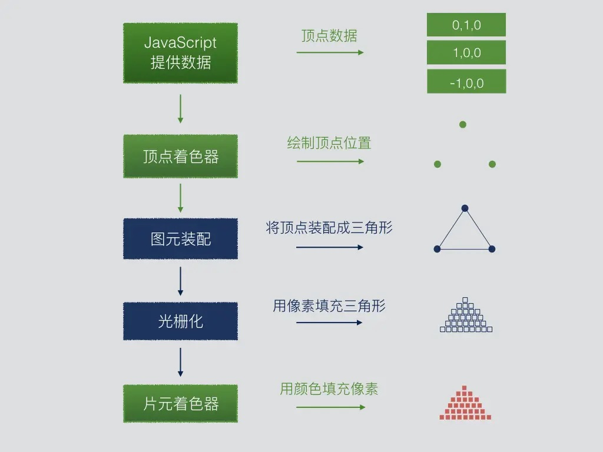

# WebGL

## 1. webgl 概述

WebGL（Web Graphics Library）是一种`用于在浏览器中渲染三维图形的 JavaScript API`。

它是在 HTML5 `<canvas>` 元素上的上下文中实现的，通过与 OpenGL ES 2.0 类似的接口，使得开发者可以在网页上利用 `GPU 加速`进行高性能的图形渲染。

WebGL 的 GPU 部分也有对应的编程语言，简称 `GLSL`。

**一些实际案例：**
- 3D数据可视化：cybermap.kaspersky.com/
- 家居卖场：showroom.littleworkshop.fr/
- 天猫宣传页：shrek.imdevsh.com/show/tmall/
- 汽车模型：ezshine.gitee.io/www/showcas…
- 趣空间：www.3dnest.cn/case/

浏览器有三大线程： `js 引擎线程、GUI 渲染线程、浏览器事件触发线程`。

其中 GUI 渲染线程就是用于渲图的，在这个渲染线程里，有负责不同渲染工作的工人。
- 比如有负责渲染 HTML+css 的工人，
- 有负责渲染二维图形的工人，
- 有负责渲染三维图形的工人。

渲染二维图形的工人和渲染三维图形的工人不是一个国家的，他们说的语言不一样。

渲染二维图形的工人说的是 `js 语言`。

渲染三维图形的工人说的是 `GLSL ES 语言`。

而我们在做 web 项目时，业务逻辑、交互操作都是用 js 写的。

我们在用 js 绘制 canvas 2d 图形的时候，渲染二维图形的工人认识 js 语言，所以它可以正常渲图。

但我们在用 js 绘制 webgl 图形时，渲染三维图形的工人就不认识这个 js 语言了，因为它只认识 GLSL ES 语言。

因此，这个时候我们就需要找人翻译翻译。

这个做翻译的人是谁呢，它就是我们之前提到过的手绘板，它在webgl 里叫`“程序对象”`。

对 WebGL 有了一个整体认识：

- WebGL 是一组图形 API，允许我们使用 JavaScript 控制 GPU 渲染过程，进行 3D 绘图。
- WebGL 应用由 JavaScript 程序和着色器程序构成。
- WebGL 如何将 3D 模型数据显示在 2D 屏幕上。
- WebGL 编程要素：开发者需要针对 CPU 和 GPU 进行编程，CPU 部分是 JavaScript 程序，GPU 部分是着色器程序。

### WebGL 的工作流程如下：

- `创建渲染上下文（WebGLRenderingContext）`：通过调用 WebGL 的 getExtension 方法获取渲染上下文对象，该对象包含了WebGL 的所有 API 和方法。
- `创建缓冲区（Buffer）`：使用 WebGL 的缓冲区 API 创建缓冲区对象，用于存储顶点数据、索引数据等。
- `创建纹理（Texture）`：使用 WebGL 的纹理 API 创建纹理对象，用于存储纹理数据。
- `创建着色器（Shader）`：使用 WebGL 的着色器 API 创建着色器对象，用于编写 GLSL 代码，定义顶点渲染和片段渲染的逻辑。
- `创建程序（Program）`：使用 WebGL 的程序 API 创建程序对象，用于将着色器对象绑定到程序对象中，并链接生成最终的渲染流水线。

### WebGL 工作原理

模型本质上是由一个一个的`点`组成，GPU 将这些点用`三角形图元`绘制成一个个的微小平面，这些平面之间互相连接，从而组成各种各样的立体模型。

GPU 渲染管线的主要处理过程如下：

- 首先进入顶点着色器阶段，利用 GPU 的并行计算优势对顶点逐个进行坐标变换。
- 然后进入图元装配阶段，将顶点按照图元类型组装成图形。
- 接下来来到光栅化阶段，光栅化阶段将图形用不包含颜色信息的像素填充。
- 在之后进入片元着色器阶段，该阶段为像素着色，并最终显示在屏幕上。

### WebGL 中的缓冲区

`WebGL 中的缓冲区是一种存储数据的对象`，用于在 GPU 中进行高效的数据传输。它们被用于存储顶点数据、索引数据、纹理数据等信息。

WebGL 提供了多种类型的缓冲区，如 ArrayBuffer、ElementArrayBuffer、Float32Array等。开发者可以使用 WebGL 的缓冲区 API 来创建、更新、绑定和传输缓冲区数据。

### WebGL 中的帧缓冲区

WebGL 中的帧缓冲区是一种存储图像数据的对象，用于在渲染过程中缓存图像数据。`帧缓冲区包括颜色缓冲区、深度缓冲区、模板缓冲区等`。开发者可以使用 WebGL 的帧缓冲区 API 创建帧缓冲区对象，并绑定到渲染上下文中。在渲染过程中，渲染结果被存储在颜色缓冲区中，然后通过浏览器显示在屏幕上。

### 深度缓冲区

`深度缓冲区是一种存储每个像素点深度信息的对象，用于实现深度测试和消除隐藏面`。在 WebGL 中，深度缓冲区与帧缓冲区相关联，用于存储每个像素点的深度值。当渲染多个几何体时，深度测试可以确保正确的像素被绘制，而隐藏面消除可以减少不必要的绘制操作。深度缓冲区的使用可以通过 WebGL 的 API 进行配置和控制。

### 纹理

`纹理是一种包含图像数据的二维数组，用于在 3D 图形中贴图`。在 WebGL 中，纹理是由纹理对象表示的。开发者可以使用 WebGL 的纹理 API 创建纹理对象，并上传纹理数据到 GPU 中。在渲染过程中，纹理数据被采样并应用于渲染的几何体表面，以实现各种视觉效果。`

### 着色器的概念

webgl 绘图需要两种着色器：
- `顶点着色器（Vertex shader）`：描述顶点的特征，如位置、颜色等。
- `片元着色器（Fragment shader）`：进行逐片元处理，如光照。

`顶点着色器`：作用是计算顶点的位置，即提供顶点在裁剪空间中的坐标值
`片元着色器`：作用是计算图元的颜色值，我们可以将片元着色器大致理解成网页中的像素

`补间动画`：顶点着色器里的顶点就是补间动画里的关键帧，片元着色器里的片元就是关键帧之间以某种算法算出的插值。当然，webgl 里的片元是像素的意思。

两点决定一条直线。顶点着色器里的顶点就是决定这一条直线的两个点，片元着色器里的片元就是把直线画到画布上后，这两个点之间构成直线的每个像素。

WebGL 中的着色器是一种由 GLSL（OpenGL Shading Language）编写的程序，用于在 GPU 中进行顶点渲染和片段渲染。

顶点着色器用于处理顶点数据，计算顶点的位置、颜色等信息，而片段着色器用于处理像素级别的渲染逻辑，如光照、纹理贴图等。

开发者可以使用 WebGL 的着色器 API 创建着色器对象，并编写 GLSL 代码来定义渲染逻辑。

### 在 WebGL 中实现阴影效果

在 WebGL 中实现阴影效果通常需要使用阴影映射技术。阴影映射是一种将光源照射在物体上产生的阴影信息存储在纹理中的技术。在渲染过程中，将该阴影纹理应用到场景中，使得物体呈现出阴影效果。实现阴影效果需要编写相应的 GLSL 代码，并使用 WebGL 的着色器 API 来处理渲染逻辑。

### 多重采样抗锯齿

多重采样抗锯齿（MSAA）是一种提高渲染质量的技术，通过在每个像素点上多次采样来生成更平滑的图像边缘。在 WebGL 中，MSAA 可以通过配置渲染上下文的属性来启用。开发者可以使用WebGL 的 API 来设置 MSAA 的相关参数，如采样率、颜色深度等。启用 MSAA 后，渲染结果将更加平滑，但会占用更多的 GPU 资源。

## 从一个点开始

- `图元`：WebGL 能够绘制的基本图形元素，包含三种：`点、线段、三角形`。
- `片元`：可以理解为像素，像素着色阶段是在片元着色器中。
- `裁剪坐标系`：裁剪坐标系是顶点着色器中的 gl_Position 内置变量接收到的坐标所在的坐标系。
- `设备坐标系`：又名 NDC 坐标系，是裁剪坐标系各个分量对 w 分量相除得到的坐标系，特点是 x、y、z 坐标分量的取值范围都在 【-1，1】之间，可以将它理解为边长为 2 的正方体，坐标系原点在正方体中心。
