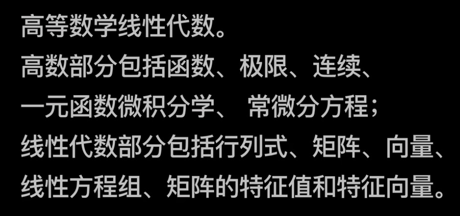

# 数学

- 武忠祥高等数学基础班，
- 李永乐线性代数强化班

考研数学建议越早越好，
- 从`3.4月份`开始可以看上面这两门课程，
- 到`7月份`看完这两门课。之后要开始刷题，武忠祥高数讲义和李永乐线性代数讲义的每一道题都要认真独立做一遍。做完后学有余力的可以刷660。
- 之后`国庆`要开始做05年到21年的数二真题，3天一套题，严格把控时间模拟，不要在乎分数，搞懂知识点。
- 到了`11月份`，可以开始做李林4加6。数学的关键在于重复，复盘。

上述我提到所有资料，你至少得做2遍，第二遍不用重新做，看你之前标注的不懂的地方。总结一个错题本，不用抄题，主要记录页数，题号就可以。很关键！！！！

此外，数学也有套路，一定要总结自己的解题思路，我举个例子。二重积分大题怎么做，我的总结是，首先考虑奇偶性，对称性，之后选直角坐标还是极坐标，需不需要x和y互换，等等…做题是一方面，你更应该内化成自己的功力，解题套路，逐步完善…

## 数学规划

- 满分 150 分，时间 180 分钟。
- 高数 80%，线性代数 20%。
- 单选 10 个 5 分，共 50 分
- 填空 6 个 5 分，共 30 分
- 解答、证明 7 个 10 分，共 70 分

## 前置知识

sin、cos、tan、ln....

## 理解

### 1. 函数的概念

### 2. 复合函数概念

### 3. 分段函数概念

### 4. 无穷小量概念

### 5. 函数连续性的概念（含左连续与右连续）

### 6. 闭区间上连续函数的性质（有界性、最大值、最小值、介值定理）

### 7. 数列极限和函数极限的概念

### 8. 函数左极限与右极限的概念

### 9. 函数极限存在与左极限、右极限之间的关系

### 10. 无穷小量的基本性质

 